<h1 align="center">
    
</h1>

💭 **[Amey's Arc](https://amey-thakur.github.io/)** ⟶ Advancing Ideas & Projects

### 🔗 Connect with me

&nbsp;&nbsp;&nbsp;&nbsp;
&nbsp;&nbsp;&nbsp;&nbsp;
&nbsp;&nbsp;&nbsp;&nbsp;
&nbsp;&nbsp;&nbsp;&nbsp;

&nbsp;&nbsp;&nbsp;&nbsp;
&nbsp;&nbsp;&nbsp;&nbsp;
&nbsp;&nbsp;&nbsp;&nbsp;
&nbsp;&nbsp;&nbsp;&nbsp;

&nbsp;&nbsp;&nbsp;&nbsp;
&nbsp;&nbsp;&nbsp;&nbsp;

---

## 🏆 My Certifications and Achievements

<!-- summary:start -->

**711 credentials from 29 issuers.** 691 carry the certificate itself, 40 carry a digital badge, and **245 can be verified independently** on the issuer's own site. Every row below shows the certificate it describes and links to the original file.

<table>
<tr>
<td align="center" width="33%"></td>
<td align="center" width="33%"></td>
<td align="center" width="33%"></td>
</tr>
<tr>
<td align="center" width="33%"></td>
<td align="center" width="33%"></td>
<td align="center" width="33%"></td>
</tr>
<tr>
<td align="center" width="33%"></td>
<td align="center" width="33%"></td>
<td align="center" width="33%"></td>
</tr>
<tr>
<td align="center" width="33%"></td>
<td align="center" width="33%"></td>
<td align="center" width="33%"></td>
</tr>
<tr>
<td align="center" width="33%"></td>
<td align="center" width="33%"></td>
<td align="center" width="33%"></td>
</tr>
<tr>
<td align="center" width="33%"></td>
<td align="center" width="33%"></td>
<td align="center" width="33%"></td>
</tr>
<tr>
<td align="center" width="33%"></td>
<td align="center" width="33%"></td>
<td align="center" width="33%"></td>
</tr>
<tr>
<td align="center" width="33%"></td>
<td align="center" width="33%"></td>
<td align="center" width="33%"></td>
</tr>
<tr>
<td align="center" width="33%"></td>
<td align="center" width="33%"></td>
<td align="center" width="33%"></td>
</tr>
<tr>
<td align="center" width="33%"></td>
<td align="center" width="33%"></td>
<td align="center" width="33%"></td>
</tr>
</table>

Each badge names the issuer and how many credentials it awarded. Hover any of them for the number that can be verified at the source.

---

### Index

<!-- summary:end -->
 - **[Ankur Warikoo](#ankur-warikoo)**
 - **[Anthropic courses](#anthropic-courses)**
 - **[Apple](#apple)**
 - **[COE Pune](#coe-pune)**
 - **[Colgate Oral Health Network](#colgate-oral-health-network)**
 - **[Coursera](#coursera)**
 - **[Eduonix](#eduonix)**
 - **[Engineering](#engineering)**          ⟶ Throughout Courses
 - **[Experience](#professional-experience)**          ⟶ Work Experience
 - **[Google](#google)**
 - **[Harvard Medical School](#harvard-medical-school)**
 - **[IBM](#ibm)**
 - **[IIT Bombay](#iit-bombay)**
 - **[Intel](#intel)**
 - **[Julia Academy](#julia-academy)**
 - **[Kaggle](#kaggle)**
 - **[Linkedin Learning](#linkedin-learning)**
 - **[LTCE Webinar](#ltce-webinar)**
 - **[MathWorks](#mathworks)**
 - **[Microsoft](#microsoft)**
 - **[NVIDIA Deep Learning Institute](#nvidia-deep-learning-institute)**
 - **[OpenAI Academy](#openai-academy)**
 - **[Projects](#project-engineering--applied-research-portfolio)**          ⟶ Project Work
 - **[Quizzes](#quizzes)**
 - **[Research Papers](#research-papers)**          ⟶ Research Work
 - **[Simplilearn](#simplilearn)**
 - **[Sports](#sports--athletic-achievements)**          ⟶ Sports Activities
 - **[Stanford University](#stanford-university)**
 - **[Stanford University School of Medicine](#stanford-university-school-of-medicine)**
 - **[Terna Engineering College](#terna-engineering-college)**
 - **[Udemy](#udemy)**
 - **[University of Cambridge](#university-of-cambridge)**
 - **[VIA Institute on Character](#via-institute-on-character)**
 
> [!NOTE]
> People no longer trust each other. Why? And how can we fix it? An interactive guide to the game theory of trust: [**The Evolution of Trust**](#-the-evolution-of-trust)

---

### &nbsp;Ankur Warikoo

| # | Preview | Topic | Documentation | Certification |
| :---: | :---: | :---: | :---: | :---: |
| 1 | 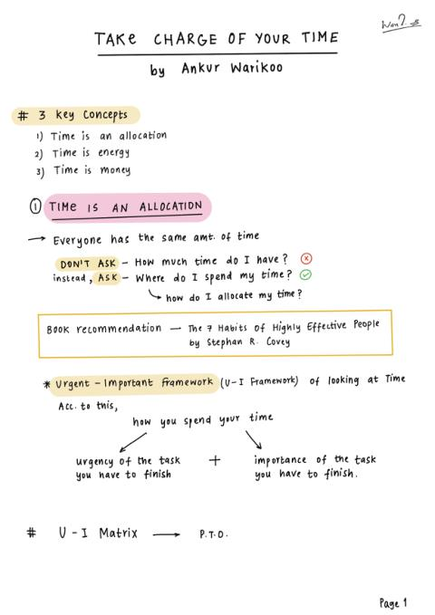  | **Take Charge of Your Time** | [Notes](https://github.com/Amey-Thakur/ACHIEVEMENTS/blob/main/Ankur%20Warikoo/Take%20charge%20of%20your%20time%20by%20Ankur%20Warikoo.pdf) | [Certificate](https://github.com/Amey-Thakur/ACHIEVEMENTS/blob/main/Ankur%20Warikoo/Certificate%20-%20Take%20charge%20of%20your%20time.pdf) |

---

### &nbsp;Anthropic courses

| # | Preview | Topic | Certification | Verification | Academy badge |
| :---: | :---: | :--- | :---: | :---: | :---: |
| 1 | 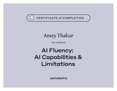  | **AI Capabilities and Limitations** | [Certificate](https://github.com/Amey-Thakur/ACHIEVEMENTS/blob/main/Anthropic%20courses/Certificate%20-%20AI%20Capabilities%20and%20Limitations.pdf) | [Verify](https://verify.skilljar.com/c/csuadcoxmf92) | [Badge](https://github.com/Amey-Thakur/ACHIEVEMENTS/blob/main/Anthropic%20courses/Badge%20-%20AI%20Capabilities%20and%20Limitations.png) · [Verify](https://academy.claude.com/verify/09810945e075b401092e66d40dca790b) |
| 2 | 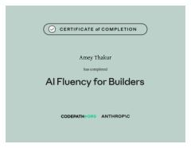  | **AI Fluency for Builders** | [Certificate](https://github.com/Amey-Thakur/ACHIEVEMENTS/blob/main/Anthropic%20courses/Certificate%20-%20AI%20Fluency%20for%20Builders.pdf) | [Verify](https://verify.skilljar.com/c/vtcjxoedi39k) | [Badge](https://github.com/Amey-Thakur/ACHIEVEMENTS/blob/main/Anthropic%20courses/Badge%20-%20AI%20Fluency%20for%20Builders.png) · [Verify](https://academy.claude.com/verify/6b67e458243ba97237de011382e2bedf) |
| 3 | 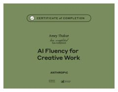  | **AI Fluency for Creative Work** | [Certificate](https://github.com/Amey-Thakur/ACHIEVEMENTS/blob/main/Anthropic%20courses/Certificate%20-%20AI%20Fluency%20for%20Creative%20Work.pdf) | [Verify](https://verify.skilljar.com/c/pgq495ktrqqs) | [Badge](https://github.com/Amey-Thakur/ACHIEVEMENTS/blob/main/Anthropic%20courses/Badge%20-%20AI%20Fluency%20for%20Creative%20Work.png) · [Verify](https://academy.claude.com/verify/15dd1b6eef52c127e4e4111f1d15e72e) |
| 4 | 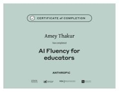  | **AI Fluency for educators** | [Certificate](https://github.com/Amey-Thakur/ACHIEVEMENTS/blob/main/Anthropic%20courses/Certificate%20-%20AI%20Fluency%20for%20educators.pdf) | [Verify](https://verify.skilljar.com/c/qteo2nkjtrhp) | [Badge](https://github.com/Amey-Thakur/ACHIEVEMENTS/blob/main/Anthropic%20courses/Badge%20-%20AI%20Fluency%20for%20educators.png) · [Verify](https://academy.claude.com/verify/3b7797440c1c56ed02ce4311c95313f1) |
| 5 | 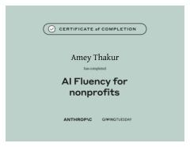  | **AI Fluency for nonprofits** | [Certificate](https://github.com/Amey-Thakur/ACHIEVEMENTS/blob/main/Anthropic%20courses/Certificate%20-%20AI%20Fluency%20for%20nonprofits.pdf) | [Verify](https://verify.skilljar.com/c/i5pueehh68uv) | [Badge](https://github.com/Amey-Thakur/ACHIEVEMENTS/blob/main/Anthropic%20courses/Badge%20-%20AI%20Fluency%20for%20nonprofits.png) · [Verify](https://academy.claude.com/verify/06b8ffc13e282f6c78d810d8a6575579) |
| 6 |   | **AI Fluency for pK-12 Educators** | [Certificate](https://github.com/Amey-Thakur/ACHIEVEMENTS/blob/main/Anthropic%20courses/Certificate%20-%20AI%20Fluency%20for%20pK-12%20Educators.pdf) | [Verify](https://verify.skilljar.com/c/hhc5c3uo3nw3) | [Badge](https://github.com/Amey-Thakur/ACHIEVEMENTS/blob/main/Anthropic%20courses/Badge%20-%20AI%20Fluency%20for%20pK-12%20Educators.png) · [Verify](https://academy.claude.com/verify/e8df6427179f879404b68f93cdbbb1b6) |
| 7 | 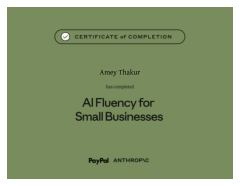  | **AI Fluency for Small Businesses** | [Certificate](https://github.com/Amey-Thakur/ACHIEVEMENTS/blob/main/Anthropic%20courses/Certificate%20-%20AI%20Fluency%20for%20Small%20Businesses.pdf) | [Verify](https://verify.skilljar.com/c/ufedafc4f4ai) | [Badge](https://github.com/Amey-Thakur/ACHIEVEMENTS/blob/main/Anthropic%20courses/Badge%20-%20AI%20Fluency%20for%20Small%20Businesses.png) · [Verify](https://academy.claude.com/verify/bf4fc4c30c02eb1d4aca988a212a44c8) |
| 8 | 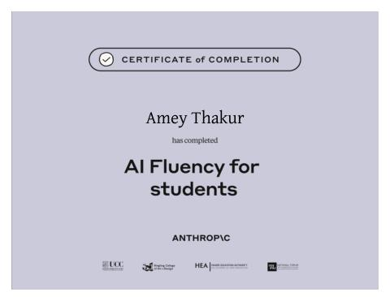  | **AI Fluency for students** | [Certificate](https://github.com/Amey-Thakur/ACHIEVEMENTS/blob/main/Anthropic%20courses/Certificate%20-%20AI%20Fluency%20for%20students.pdf) | [Verify](https://verify.skilljar.com/c/2t46zznf8d6c) | [Badge](https://github.com/Amey-Thakur/ACHIEVEMENTS/blob/main/Anthropic%20courses/Badge%20-%20AI%20Fluency%20for%20students.png) · [Verify](https://academy.claude.com/verify/84c728c31bdfe38efa149672b5477163) |
| 9 |   | **AI Fluency-Framework & Foundations** | [Certificate](https://github.com/Amey-Thakur/ACHIEVEMENTS/blob/main/Anthropic%20courses/Certificate%20-%20AI%20Fluency-Framework%20&%20Foundations.pdf) | [Verify](https://verify.skilljar.com/c/9hxb9b5rtg3p) | [Badge](https://github.com/Amey-Thakur/ACHIEVEMENTS/blob/main/Anthropic%20courses/Badge%20-%20AI%20Fluency-Framework%20&%20Foundations.png) · [Verify](https://academy.claude.com/verify/707d8089647cf8c2a99e833811ef8411) |
| 10 | 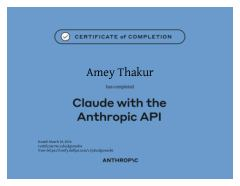  | **Building with the Claude API** | [Certificate](https://github.com/Amey-Thakur/ACHIEVEMENTS/blob/main/Anthropic%20courses/Certificate%20-%20Building%20with%20the%20Claude%20API.pdf) | [Verify](https://verify.skilljar.com/c/ydxcdgiomob6) | [Badge](https://github.com/Amey-Thakur/ACHIEVEMENTS/blob/main/Anthropic%20courses/Badge%20-%20Building%20with%20the%20Claude%20API.png) · [Verify](https://academy.claude.com/verify/f6a1826e7f9054f5e41bf340a402fe58) |
| 11 | 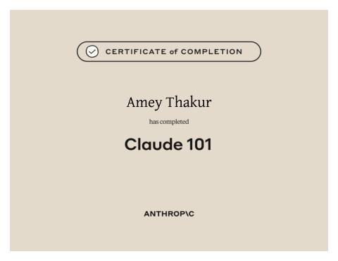  | **Claude 101** | [Certificate](https://github.com/Amey-Thakur/ACHIEVEMENTS/blob/main/Anthropic%20courses/Certificate%20-%20Claude%20101.pdf) | [Verify](https://verify.skilljar.com/c/za6zqtc6jkt6) | [Badge](https://github.com/Amey-Thakur/ACHIEVEMENTS/blob/main/Anthropic%20courses/Badge%20-%20Claude%20101.png) · [Verify](https://academy.claude.com/verify/13103f134da7befe9615ec2adfc8c50e) |
| 12 | 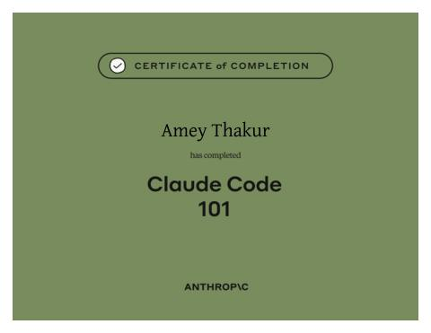  | **Claude Code 101** | [Certificate](https://github.com/Amey-Thakur/ACHIEVEMENTS/blob/main/Anthropic%20courses/Certificate%20-%20Claude%20Code%20101.pdf) | [Verify](https://verify.skilljar.com/c/wbf7fherdhsx) | [Badge](https://github.com/Amey-Thakur/ACHIEVEMENTS/blob/main/Anthropic%20courses/Badge%20-%20Claude%20Code%20101.png) · [Verify](https://academy.claude.com/verify/47482157d8dbc48e39d22aaa49d6d9b1) |
| 13 | 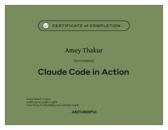  | **Claude Code in Action** | [Certificate](https://github.com/Amey-Thakur/ACHIEVEMENTS/blob/main/Anthropic%20courses/Certificate%20-%20Claude%20Code%20in%20Action.pdf) | [Verify](https://verify.skilljar.com/c/m96ks77aqbfb) | [Badge](https://github.com/Amey-Thakur/ACHIEVEMENTS/blob/main/Anthropic%20courses/Badge%20-%20Claude%20Code%20in%20Action.png) · [Verify](https://academy.claude.com/verify/7f0839f0576b57f38658e8784e4c9a83) |
| 14 | 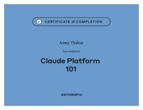  | **Claude Platform 101** | [Certificate](https://github.com/Amey-Thakur/ACHIEVEMENTS/blob/main/Anthropic%20courses/Certificate%20-%20Claude%20Platform%20101.pdf) | [Verify](https://verify.skilljar.com/c/pz4hgm2px76r) | [Badge](https://github.com/Amey-Thakur/ACHIEVEMENTS/blob/main/Anthropic%20courses/Badge%20-%20Claude%20Platform%20101.png) · [Verify](https://academy.claude.com/verify/c916ad7d1190ea2447bb2fcf3809ef16) |
| 15 | 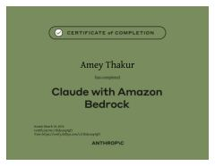  | **Claude with Amazon Bedrock** | [Certificate](https://github.com/Amey-Thakur/ACHIEVEMENTS/blob/main/Anthropic%20courses/Certificate%20-%20Claude%20with%20Amazon%20Bedrock.pdf) | [Verify](https://verify.skilljar.com/c/r5bdeunp9gf3) | [Badge](https://github.com/Amey-Thakur/ACHIEVEMENTS/blob/main/Anthropic%20courses/Badge%20-%20Claude%20with%20Amazon%20Bedrock.png) · [Verify](https://academy.claude.com/verify/8fb5e32058c121d343c34e341f56f375) |
| 16 | 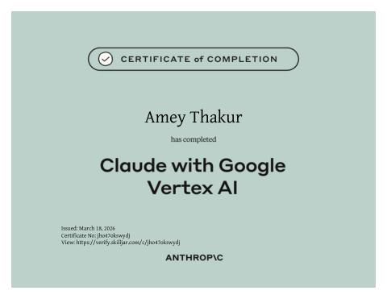  | **Claude with Google Cloud's Vertex AI** | [Certificate](https://github.com/Amey-Thakur/ACHIEVEMENTS/blob/main/Anthropic%20courses/Certificate%20-%20Claude%20with%20Google%20Cloud's%20Vertex%20AI.pdf) | [Verify](https://verify.skilljar.com/c/jho47okswydj) | [Badge](https://github.com/Amey-Thakur/ACHIEVEMENTS/blob/main/Anthropic%20courses/Badge%20-%20Claude%20with%20Google%20Cloud's%20Vertex%20AI.png) · [Verify](https://academy.claude.com/verify/7ba0a150a9136308e1efa4b708fd9815) |
| 17 |  | **Deploying Claude Enterprise with Confidence** | Not issued | Not issued | [Badge](https://github.com/Amey-Thakur/ACHIEVEMENTS/blob/main/Anthropic%20courses/Badge%20-%20Deploying%20Claude%20Enterprise%20with%20Confidence.png) · [Verify](https://academy.claude.com/verify/296e047c54c8ed404a99a7151c65ddf6) |
| 18 |  | **Introduction to agent skills** | [Certificate](https://github.com/Amey-Thakur/ACHIEVEMENTS/blob/main/Anthropic%20courses/Certificate%20-%20Introduction%20to%20agent%20skills.pdf) | [Verify](https://verify.skilljar.com/c/2jxpxwmqdcyp) | Not issued |
| 19 |   | **Introduction to Claude Cowork** | [Certificate](https://github.com/Amey-Thakur/ACHIEVEMENTS/blob/main/Anthropic%20courses/Certificate%20-%20Introduction%20to%20Claude%20Cowork.pdf) | [Verify](https://verify.skilljar.com/c/n63skaqkpxs8) | [Badge](https://github.com/Amey-Thakur/ACHIEVEMENTS/blob/main/Anthropic%20courses/Badge%20-%20Introduction%20to%20Claude%20Cowork.png) · [Verify](https://academy.claude.com/verify/7e0320325938630d9536a61078cc69a9) |
| 20 | 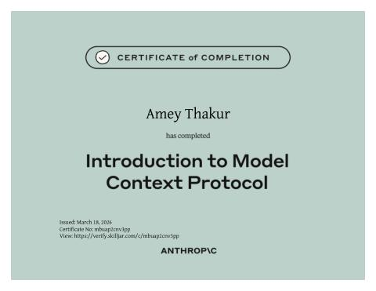  | **Introduction to Model Context Protocol** | [Certificate](https://github.com/Amey-Thakur/ACHIEVEMENTS/blob/main/Anthropic%20courses/Certificate%20-%20Introduction%20to%20Model%20Context%20Protocol.pdf) | [Verify](https://verify.skilljar.com/c/mbuap2cnv3pp) | [Badge](https://github.com/Amey-Thakur/ACHIEVEMENTS/blob/main/Anthropic%20courses/Badge%20-%20Introduction%20to%20Model%20Context%20Protocol.png) · [Verify](https://academy.claude.com/verify/0377c528acb2ecff93695ef9a9b56369) |
| 21 |  | **Introduction to subagents** | [Certificate](https://github.com/Amey-Thakur/ACHIEVEMENTS/blob/main/Anthropic%20courses/Certificate%20-%20Introduction%20to%20subagents.pdf) | [Verify](https://verify.skilljar.com/c/yrz3errg7n2g) | Not issued |
| 22 | 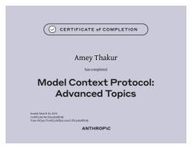  | **Model Context Protocol-Advanced Topics** | [Certificate](https://github.com/Amey-Thakur/ACHIEVEMENTS/blob/main/Anthropic%20courses/Certificate%20-%20Model%20Context%20Protocol-Advanced%20Topics.pdf) | [Verify](https://verify.skilljar.com/c/ktyatn8th58j) | [Badge](https://github.com/Amey-Thakur/ACHIEVEMENTS/blob/main/Anthropic%20courses/Badge%20-%20Model%20Context%20Protocol-Advanced%20Topics.png) · [Verify](https://academy.claude.com/verify/f7904c762c678c6e136bc866545a47e4) |
| 23 | 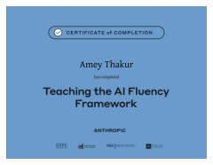  | **Teaching AI Fluency** | [Certificate](https://github.com/Amey-Thakur/ACHIEVEMENTS/blob/main/Anthropic%20courses/Certificate%20-%20Teaching%20AI%20Fluency.pdf) | [Verify](https://verify.skilljar.com/c/qsd5j744a2pc) | [Badge](https://github.com/Amey-Thakur/ACHIEVEMENTS/blob/main/Anthropic%20courses/Badge%20-%20Teaching%20AI%20Fluency.png) · [Verify](https://academy.claude.com/verify/59092b63e1969a2cb07ac14a57bd13ed) |

---

### &nbsp;Apple

| # | Preview | Topic | Report | Certification | Verification |
| :---: | :---: | :--- | :---: | :---: | :---: |
| 1 |  | **Apple Ads Certification** | — | [Certificate](https://github.com/Amey-Thakur/ACHIEVEMENTS/blob/main/Apple/Apple_Ads_Certification.pdf) | [Verify](https://certification-ads.apple.com/certificate/863IXIsY89) |
| 2 | 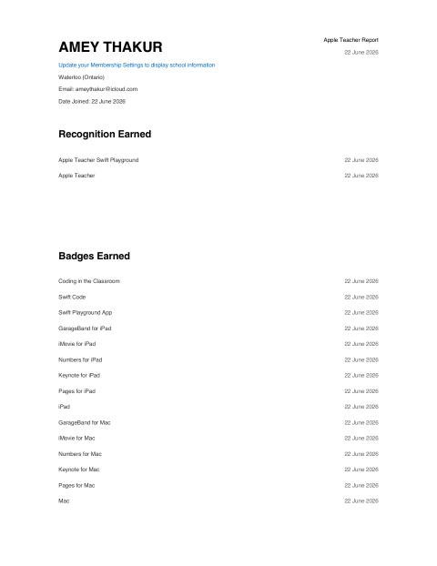 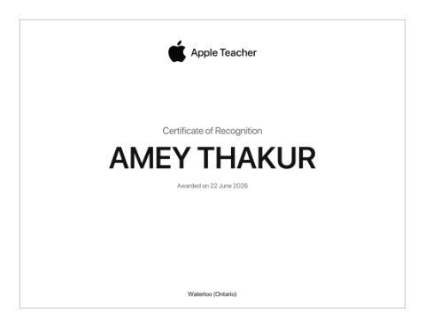 | **Apple Teacher** | [Report](https://github.com/Amey-Thakur/ACHIEVEMENTS/blob/main/Apple/AppleTeacherReport.pdf) | [Certificate](https://github.com/Amey-Thakur/ACHIEVEMENTS/blob/main/Apple/AppleTeacherCertificate.pdf) | — |

---

### &nbsp;COE Pune

| # | Preview | Topic | Certification |
| :---: | :---: | :--- | :---: |
| 1 | 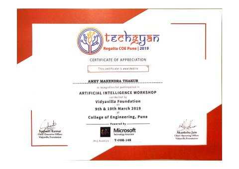 | **Artificial Intelligence Workshop** | [Certificate](https://github.com/Amey-Thakur/ACHIEVEMENTS/blob/main/COE%20Pune/Techgyan%20Pune%20Artificial%20Intelligence.pdf) |

---

### &nbsp;Colgate Oral Health Network

| # | Preview | Topic | ADA CERP® Continuing Education Recognition Program | AGD PACE Academy of General Dentistry Program Approval for Continuing Education |
| :---: | :---: | :--- | :---: | :---: |
| 1 |   | **Aerosol and IC Management in the COVID-19 Era** | [Certificate](https://github.com/Amey-Thakur/ACHIEVEMENTS/blob/main/Colgate%20Oral%20Health%20Network/CE%20Certificate%20AEROSOL%20AND%20IC%20MANAGEMENT%20IN%20THE%20COVID-19%20ERA%20ADA-CERP.pdf) | [Certificate](https://github.com/Amey-Thakur/ACHIEVEMENTS/blob/main/Colgate%20Oral%20Health%20Network/CE%20Certificate%20AEROSOL%20AND%20IC%20MANAGEMENT%20IN%20THE%20COVID-19%20ERA%20AGD-PACE.pdf) |
| 2 | 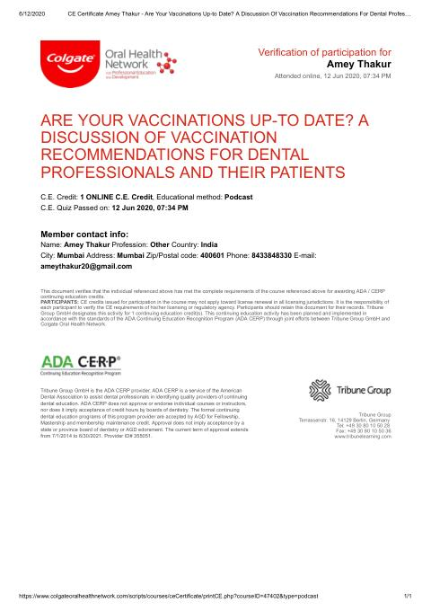 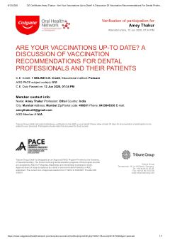 | **Are Your Vaccinations Up-to-Date? A Discussion of Vaccination Recommendations for Dental Professionals and Their Patients** | [Certificate](https://github.com/Amey-Thakur/ACHIEVEMENTS/blob/main/Colgate%20Oral%20Health%20Network/CE%20Certificate%20ARE%20YOUR%20VACCINATIONS%20UP-TO%20DATE%20A%20DISCUSSION%20OF%20VACCINATION%20RECOMMENDATIONS%20FOR%20DENTAL%20PROFESSIONALS%20AND%20THEIR%20PATIENTS%20ADA-CERP.pdf) | [Certificate](https://github.com/Amey-Thakur/ACHIEVEMENTS/blob/main/Colgate%20Oral%20Health%20Network/CE%20Certificate%20ARE%20YOUR%20VACCINATIONS%20UP-TO%20DATE%20A%20DISCUSSION%20OF%20VACCINATION%20RECOMMENDATIONS%20FOR%20DENTAL%20PROFESSIONALS%20AND%20THEIR%20PATIENTS%20AGD-PACE.pdf) |
| 3 | 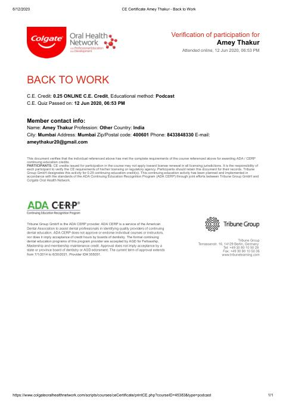  | **Back to Work** | [Certificate](https://github.com/Amey-Thakur/ACHIEVEMENTS/blob/main/Colgate%20Oral%20Health%20Network/CE%20Certificate%20BACK%20TO%20WORK%20ADA-CERP.pdf) | [Certificate](https://github.com/Amey-Thakur/ACHIEVEMENTS/blob/main/Colgate%20Oral%20Health%20Network/CE%20Certificate%20BACK%20TO%20WORK%20AGD-PACE.pdf) |
| 4 | 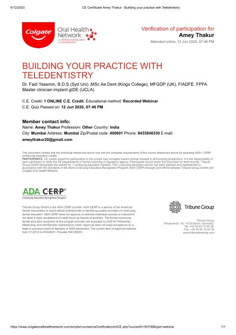  | **Building Your Practice with Teledentistry** | [Certificate](https://github.com/Amey-Thakur/ACHIEVEMENTS/blob/main/Colgate%20Oral%20Health%20Network/CE%20Certificate%20BUILDING%20YOUR%20PRACTICE%20WITH%20TELEDENTISTRY%20ADA-CERP.pdf) | [Certificate](https://github.com/Amey-Thakur/ACHIEVEMENTS/blob/main/Colgate%20Oral%20Health%20Network/CE%20Certificate%20CE%20Certificate%20BUILDING%20YOUR%20PRACTICE%20WITH%20TELEDENTISTRY%20AGD-PACE.pdf) |
| 5 | 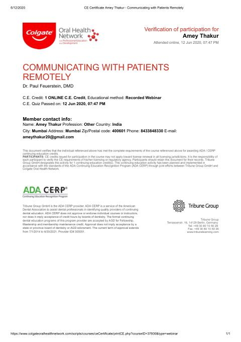  | **Communicating with Patients Remotely** | [Certificate](https://github.com/Amey-Thakur/ACHIEVEMENTS/blob/main/Colgate%20Oral%20Health%20Network/CE%20Certificate%20COMMUNICATING%20WITH%20PATIENTS%20REMOTELY%20ADA-CERP.pdf) | [Certificate](https://github.com/Amey-Thakur/ACHIEVEMENTS/blob/main/Colgate%20Oral%20Health%20Network/CE%20Certificate%20COMMUNICATING%20WITH%20PATIENTS%20REMOTELY%20AGD-PACE.pdf) |
| 6 |  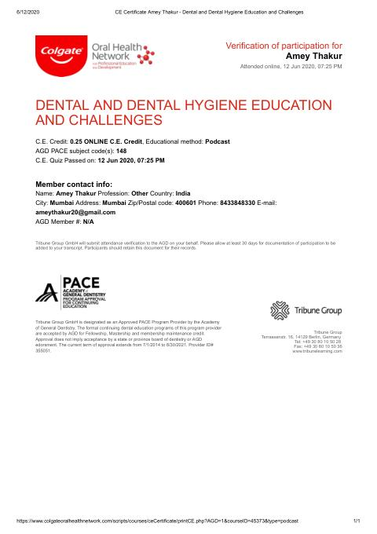 | **Dental and Dental Hygiene Education and Challenges** | [Certificate](https://github.com/Amey-Thakur/ACHIEVEMENTS/blob/main/Colgate%20Oral%20Health%20Network/CE%20Certificate%20DENTAL%20AND%20DENTAL%20HYGIENE%20EDUCATION%20AND%20CHALLENGES%20ADA-CERP.pdf) | [Certificate](https://github.com/Amey-Thakur/ACHIEVEMENTS/blob/main/Colgate%20Oral%20Health%20Network/CE%20Certificate%20DENTAL%20AND%20DENTAL%20HYGIENE%20EDUCATION%20AND%20CHALLENGES%20AGD-PACE.pdf) |
| 7 |   | **Dental Office Restrictions** | [Certificate](https://github.com/Amey-Thakur/ACHIEVEMENTS/blob/main/Colgate%20Oral%20Health%20Network/CE%20Certificate%20DENTAL%20OFFICE%20RESTRICTIONS%20ADA-CERP.pdf) | [Certificate](https://github.com/Amey-Thakur/ACHIEVEMENTS/blob/main/Colgate%20Oral%20Health%20Network/CE%20Certificate%20DENTAL%20OFFICE%20RESTRICTIONS%20AGD-PACE.pdf) |
| 8 |   | **Hand Hygiene and PPE during COVID-19** | [Certificate](https://github.com/Amey-Thakur/ACHIEVEMENTS/blob/main/Colgate%20Oral%20Health%20Network/CE%20Certificate%20HAND%20HYGIENE%20AND%20PPE%20DURING%20COVID-19%20ADA-CERP.pdf) | [Certificate](https://github.com/Amey-Thakur/ACHIEVEMENTS/blob/main/Colgate%20Oral%20Health%20Network/CE%20Certificate%20HAND%20HYGIENE%20AND%20PPE%20DURING%20COVID-19%20AGD-PACE.pdf) |
| 9 |   | **Handling Patient Fears** | [Certificate](https://github.com/Amey-Thakur/ACHIEVEMENTS/blob/main/Colgate%20Oral%20Health%20Network/CE%20Certificate%20HANDLING%20PATIENT%20FEARS%20ADA-CERP.pdf) | [Certificate](https://github.com/Amey-Thakur/ACHIEVEMENTS/blob/main/Colgate%20Oral%20Health%20Network/CE%20Certificate%20HANDLING%20PATIENT%20FEARS%20AGD-PACE.pdf) |
| 10 |  | **Making Decisions for Emergent vs. Urgent Dental Treatment during the COVID-19 Pandemic** | [Certificate](https://github.com/Amey-Thakur/ACHIEVEMENTS/blob/main/Colgate%20Oral%20Health%20Network/CE%20Certificate%20MAKING%20DECISIONS%20FOR%20EMERGENT%20VS.%20URGENT%20DENTAL%20TREATMENT%20DURING%20THE%20COVID-19%20PANDEMIC%20ADA-CERP.pdf) | - |
| 11 |   | **Managing Infectious Diseases in the Dental Office** | [Certificate](https://github.com/Amey-Thakur/ACHIEVEMENTS/blob/main/Colgate%20Oral%20Health%20Network/CE%20Certificate%20MANAGING%20INFECTIOUS%20DISEASES%20IN%20THE%20DENTAL%20OFFICE%20ADA-CERP.pdf) | [Certificate](https://github.com/Amey-Thakur/ACHIEVEMENTS/blob/main/Colgate%20Oral%20Health%20Network/CE%20Certificate%20MANAGING%20INFECTIOUS%20DISEASES%20IN%20THE%20DENTAL%20OFFICE%20AGD-PACE.pdf) |
| 12 | 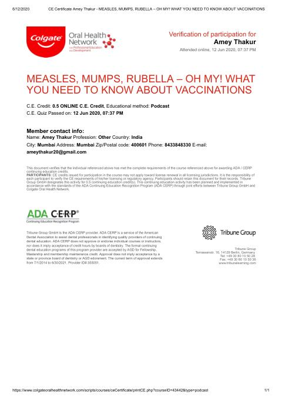  | **Measles, Mumps, Rubella – Oh My! What You Need to Know about Vaccinations** | [Certificate](https://github.com/Amey-Thakur/ACHIEVEMENTS/blob/main/Colgate%20Oral%20Health%20Network/CE%20Certificate%20MEASLES%2C%20MUMPS%2C%20RUBELLA%20%E2%80%93%20OH%20MY!%20WHAT%20YOU%20NEED%20TO%20KNOW%20ABOUT%20VACCINATIONS%20ADA-CERP.pdf) | [Certificate](https://github.com/Amey-Thakur/ACHIEVEMENTS/blob/main/Colgate%20Oral%20Health%20Network/CE%20Certificate%20MEASLES%2C%20MUMPS%2C%20RUBELLA%20%E2%80%93%20OH%20MY!%20WHAT%20YOU%20NEED%20TO%20KNOW%20ABOUT%20VACCINATIONS%20AGD-PACE.pdf) |
| 13 |   | **Pre-Procedural Rinsing to Reduce Aerosolized Microbial Loads** | [Certificate](https://github.com/Amey-Thakur/ACHIEVEMENTS/blob/main/Colgate%20Oral%20Health%20Network/CE%20Certificate%20PRE-PROCEDURAL%20RINSING%20TO%20REDUCE%20AEROSOLIZED%20MICROBIAL%20LOADS%20ADA-CERP.pdf) | [Certificate](https://github.com/Amey-Thakur/ACHIEVEMENTS/blob/main/Colgate%20Oral%20Health%20Network/CE%20Certificate%20PRE-PROCEDURAL%20RINSING%20TO%20REDUCE%20AEROSOLIZED%20MICROBIAL%20LOADS%20AGD-PACE.pdf) |
| 14 |   | **Reviewing the Management of Clinical Contact Surfaces** | [Certificate](https://github.com/Amey-Thakur/ACHIEVEMENTS/blob/main/Colgate%20Oral%20Health%20Network/CE%20Certificate%20REVIEWING%20THE%20MANAGEMENT%20OF%20CLINICAL%20CONTACT%20SURFACES%20ADA-CERP.pdf) | [Certificate](https://github.com/Amey-Thakur/ACHIEVEMENTS/blob/main/Colgate%20Oral%20Health%20Network/CE%20Certificate%20REVIEWING%20THE%20MANAGEMENT%20OF%20CLINICAL%20CONTACT%20SURFACES%20AGD-PACE.pdf) |
| 15 |   | **SARS-COV-2 and COVID-19: What We Know** | [Certificate](https://github.com/Amey-Thakur/ACHIEVEMENTS/blob/main/Colgate%20Oral%20Health%20Network/CE%20Certificate%20SARS-COV-2%20AND%20COVID-19%20%20WHAT%20WE%20KNOW%20ADA-CERP.pdf) | [Certificate](https://github.com/Amey-Thakur/ACHIEVEMENTS/blob/main/Colgate%20Oral%20Health%20Network/CE%20Certificate%20SARS-COV-2%20AND%20COVID-19%20WHAT%20WE%20KNOW%20AGD-PACE.pdf) |
| 16 |  | **Telehealth, Telemedicine and Teledentistry** | [Certificate](https://github.com/Amey-Thakur/ACHIEVEMENTS/blob/main/Colgate%20Oral%20Health%20Network/CE%20Certificate%20TELEHEALTH%2C%20TELEMEDICINE%20AND%20TELEDENTISTRY%20ADA-CERP.pdf) | - |
| 17 |   | **The Clinician’s Guide to Dental Insurance** | [Certificate](https://github.com/Amey-Thakur/ACHIEVEMENTS/blob/main/Colgate%20Oral%20Health%20Network/CE%20Certificate%20THE%20CLINICIAN%E2%80%99S%20GUIDE%20TO%20DENTAL%20INSURANCE%20ADA-CERP.pdf) | [Certificate](https://github.com/Amey-Thakur/ACHIEVEMENTS/blob/main/Colgate%20Oral%20Health%20Network/CE%20Certificate%20THE%20CLINICIAN%E2%80%99S%20GUIDE%20TO%20DENTAL%20INSURANCE%20AGD-PACE.pdf) |
| 18 |   | **What to do with Dental Unit Waterlines if You are/were Closed** | [Certificate](https://github.com/Amey-Thakur/ACHIEVEMENTS/blob/main/Colgate%20Oral%20Health%20Network/CE%20Certificate%20WHAT%20TO%20DO%20WITH%20DENTAL%20UNIT%20WATERLINES%20IF%20YOU%20ARE-WERE%20CLOSED%20ADA-CERP.pdf) | [Certificate](https://github.com/Amey-Thakur/ACHIEVEMENTS/blob/main/Colgate%20Oral%20Health%20Network/CE%20Certificate%20WHAT%20TO%20DO%20WITH%20DENTAL%20UNIT%20WATERLINES%20IF%20YOU%20ARE-WERE%20CLOSED%20AGD-PACE.pdf) |

---

### &nbsp;Coursera

#### &nbsp;Amazon Web Services (AWS)

| # | Preview | Topic | Certification | Verification |
| :---: | :---: | :--- | :---: | :---: |
| 1 | 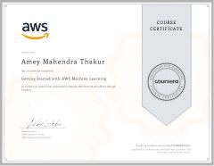 | **Getting Started with AWS Machine Learning** | [Certificate](https://github.com/Amey-Thakur/ACHIEVEMENTS/blob/main/Coursera/Amazon%20Web%20Services%20(AWS)/Coursera%20Getting%20Started%20with%20AWS%20Machine%20Learning.pdf) | [Verify](https://www.coursera.org/account/accomplishments/verify/LTPNNKWZ3U33) |

#### &nbsp;Case Western Reserve University EST.1826

| # | Preview | Topic | Certification | Verification |
| :---: | :---: | :--- | :---: | :---: |
| 1 | 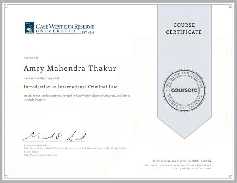 | **Introduction to International Criminal Law** | [Certificate](https://github.com/Amey-Thakur/ACHIEVEMENTS/blob/main/Coursera/Case%20Western%20Reserve%20University%20EST.1826/Coursera%20Introduction%20to%20International%20Criminal%20Law.pdf) | [Verify](https://www.coursera.org/account/accomplishments/verify/PGMJ3JKECV7X) |
  

#### &nbsp;Coursera Project Network

| # | Preview | Topic | Certification | Verification |
| :---: | :---: | :--- | :---: | :---: |
| 1 | 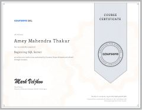 | **Beginning SQL Server** | [Certificate](https://github.com/Amey-Thakur/ACHIEVEMENTS/blob/main/Coursera/Coursera%20Project%20Network/Coursera%20Beginning%20SQL%20Server.pdf) | [Verify](https://www.coursera.org/account/accomplishments/verify/A9P39G7ZC5DS) |
| 2 |  | **Build Random Forests in R with Azure ML Studio** | [Certificate](https://github.com/Amey-Thakur/ACHIEVEMENTS/blob/main/Coursera/Coursera%20Project%20Network/Coursera%20Build%20Random%20Forests%20in%20R%20with%20Azure%20ML%20Studio.pdf) | [Verify](https://www.coursera.org/account/accomplishments/verify/Z872ESQJ5EAX) |
| 3 |  | **Build Your Portfolio Website with HTML and CSS** | [Certificate](https://github.com/Amey-Thakur/ACHIEVEMENTS/blob/main/Coursera/Coursera%20Project%20Network/Coursera%20Build%20Your%20Portfolio%20Website%20with%20HTML%20and%20CSS.pdf) | [Verify](https://www.coursera.org/account/accomplishments/verify/2HDAB9Z43VLF) |
| 4 | 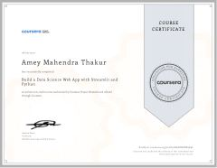 | **Build a Data Science Web App with Streamlit and Python** | [Certificate](https://github.com/Amey-Thakur/ACHIEVEMENTS/blob/main/Coursera/Coursera%20Project%20Network/Coursera%20Build%20a%20Data%20Science%20Web%20App%20with%20Streamlit%20and%20Python.pdf) | [Verify](https://www.coursera.org/account/accomplishments/verify/KA7UBGBV4P9L) |
| 5 | 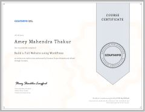 | **Build a Full Website using WordPress** | [Certificate](https://github.com/Amey-Thakur/ACHIEVEMENTS/blob/main/Coursera/Coursera%20Project%20Network/Coursera%20Build%20a%20Full%20Website%20using%20WordPress.pdf) | [Verify](https://www.coursera.org/account/accomplishments/verify/FTB7H97XVD9B) |
| 6 |  | **Build a Simple App in Android Studio with Java** | [Certificate](https://github.com/Amey-Thakur/ACHIEVEMENTS/blob/main/Coursera/Coursera%20Project%20Network/Coursera%20Build%20a%20Simple%20App%20in%20Android%20Studio%20with%20Java.pdf) | [Verify](https://www.coursera.org/account/accomplishments/verify/QGFJ4AA6YEP6) |
| 7 | 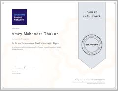 | **Build an E-commerce Dashboard with Figma** | [Certificate](https://github.com/Amey-Thakur/ACHIEVEMENTS/blob/main/Coursera/Coursera%20Project%20Network/Coursera%20Build%20an%20E-commerce%20Dashboard%20with%20Figma.pdf) | [Verify](https://www.coursera.org/account/accomplishments/verify/LCBRG8UVVCGA) |
| 8 | 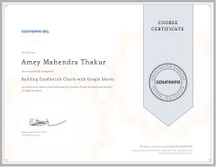 | **Building Candlestick Charts with Google Sheets** | [Certificate](https://github.com/Amey-Thakur/ACHIEVEMENTS/blob/main/Coursera/Coursera%20Project%20Network/Coursera%20Building%20Candlestick%20Charts%20with%20Google%20Sheets.pdf) | [Verify](https://www.coursera.org/account/accomplishments/verify/PJ27769DCZYP) |
| 9 | 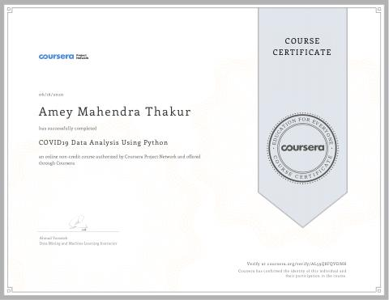 | **COVID19 Data Analysis Using Python** | [Certificate](https://github.com/Amey-Thakur/ACHIEVEMENTS/blob/main/Coursera/Coursera%20Project%20Network/Coursera%20COVID19%20Data%20Analysis%20Using%20Python.pdf) | [Verify](https://www.coursera.org/account/accomplishments/verify/AL59Q8FQVDNH) |
| 10 | 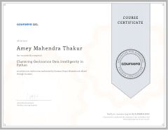 | **Clustering Geolocation Data Intelligently in Python** | [Certificate](https://github.com/Amey-Thakur/ACHIEVEMENTS/blob/main/Coursera/Coursera%20Project%20Network/Coursera%20Clustering%20Geolocation%20Data%20Intelligently%20in%20Python.pdf) | [Verify](https://www.coursera.org/account/accomplishments/verify/Z5EWBXLLHZJC) |
| 11 |  | **Computer Vision - Image Basics with OpenCV and Python** | [Certificate](https://github.com/Amey-Thakur/ACHIEVEMENTS/blob/main/Coursera/Coursera%20Project%20Network/Coursera%20Computer%20Vision%20-%20Image%20Basics%20with%20OpenCV%20and%20Python.pdf) | [Verify](https://www.coursera.org/account/accomplishments/verify/VDZDBTLSKP4U) |
| 12 |  | **Computer Vision - Object Tracking with OpenCV and Python** | [Certificate](https://github.com/Amey-Thakur/ACHIEVEMENTS/blob/main/Coursera/Coursera%20Project%20Network/Coursera%20Computer%20Vision%20-%20Object%20Tracking%20with%20OpenCV%20and%20Python.pdf) | [Verify](https://www.coursera.org/account/accomplishments/certificate/AEC3KYW6XHCB) |
| 13 |  | **Create Informative Presentations with Google Slides** | [Certificate](https://github.com/Amey-Thakur/ACHIEVEMENTS/blob/main/Coursera/Coursera%20Project%20Network/Coursera%20Create%20Informative%20Presentations%20with%20Google%20Slides.pdf) | [Verify](https://www.coursera.org/account/accomplishments/verify/5BMHVF8D6WEU) |
| 14 | 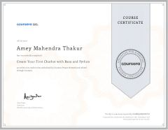 | **Create Your First Chatbot with Rasa and Python** | [Certificate](https://github.com/Amey-Thakur/ACHIEVEMENTS/blob/main/Coursera/Coursera%20Project%20Network/Coursera%20Create%20Your%20First%20Chatbot%20with%20Rasa%20and%20Python.pdf) | [Verify](https://www.coursera.org/account/accomplishments/verify/GAWB9MQKHDYR) |
| 15 |  | **Create Your First Game with Python** | [Certificate](https://github.com/Amey-Thakur/ACHIEVEMENTS/blob/main/Coursera/Coursera%20Project%20Network/Coursera%20Create%20Your%20First%20Game%20with%20Python.pdf) | [Verify](https://www.coursera.org/account/accomplishments/verify/MWUY3799TVXY) |
| 16 |  | **Create Your First Python Program** | [Certificate](https://github.com/Amey-Thakur/ACHIEVEMENTS/blob/main/Coursera/Coursera%20Project%20Network/Coursera%20Create%20Your%20First%20Python%20Program.pdf) | [Verify](https://www.coursera.org/account/accomplishments/verify/XQVGJDAMYLTA) |
| 17 | 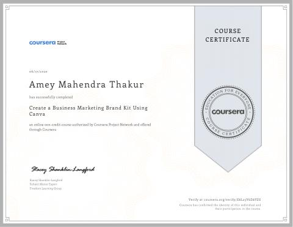 | **Create a Business Marketing Brand Kit Using Canva** | [Certificate](https://github.com/Amey-Thakur/ACHIEVEMENTS/blob/main/Coursera/Coursera%20Project%20Network/Coursera%20Create%20a%20Business%20Marketing%20Brand%20Kit%20Using%20Canva.pdf) | [Verify](https://www.coursera.org/account/accomplishments/verify/E6L25V6Z6PZG) |
| 18 | 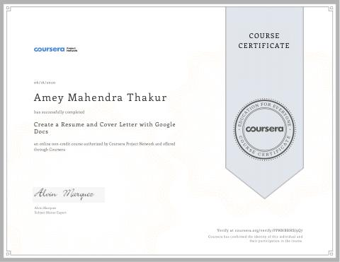 | **Create a Resume and Cover Letter with Google Docs** | [Certificate](https://github.com/Amey-Thakur/ACHIEVEMENTS/blob/main/Coursera/Coursera%20Project%20Network/Coursera%20Create%20a%20Resume%20and%20Cover%20Letter%20with%20Google%20Docs.pdf) | [Verify](https://www.coursera.org/account/accomplishments/verify/PPNNBBHSJ9Q7) |
| 19 |  | **Custom Prediction Routine on Google AI Platform** | [Certificate](https://github.com/Amey-Thakur/ACHIEVEMENTS/blob/main/Coursera/Coursera%20Project%20Network/Coursera%20Custom%20Prediction%20Routine%20on%20Google%20AI%20Platform.pdf) | [Verify](https://www.coursera.org/account/accomplishments/verify/C6DHXU6GK9GR) |
| 20 |  | **Facial Expression Recognition with Keras** | [Certificate](https://github.com/Amey-Thakur/ACHIEVEMENTS/blob/main/Coursera/Coursera%20Project%20Network/Coursera%20Facial%20Expression%20Recognition%20with%20Keras.pdf) | [Verify](https://www.coursera.org/account/accomplishments/verify/6GWEVATGMF99) |
| 21 |  | **Getting Started in Google Analytics** | [Certificate](https://github.com/Amey-Thakur/ACHIEVEMENTS/blob/main/Coursera/Coursera%20Project%20Network/Coursera%20Getting%20Started%20in%20Google%20Analytics.pdf) | [Verify](https://www.coursera.org/account/accomplishments/verify/B5GDC8CNZ94G) |
| 22 | 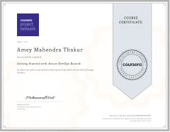 | **Getting Started with Azure DevOps Boards** | [Certificate](https://github.com/Amey-Thakur/ACHIEVEMENTS/blob/main/Coursera/Coursera%20Project%20Network/Coursera%20Getting%20Started%20with%20Azure%20DevOps%20Boards.pdf) | [Verify](https://www.coursera.org/account/accomplishments/verify/NRYE9EPZ9G9T) |
| 23 | 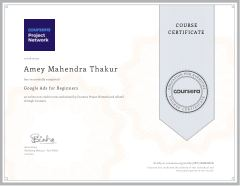 | **Google Ads for Beginners** | [Certificate](https://github.com/Amey-Thakur/ACHIEVEMENTS/blob/main/Coursera/Coursera%20Project%20Network/Coursera%20Google%20Ads%20for%20Beginners.pdf) | [Verify](https://www.coursera.org/account/accomplishments/verify/7RY77SNRPHCB) |
| 24 | 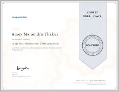 | **Image Classification with CNNs using Keras** | [Certificate](https://github.com/Amey-Thakur/ACHIEVEMENTS/blob/main/Coursera/Coursera%20Project%20Network/Coursera%20Image%20Classification%20with%20CNNs%20using%20Keras.pdf) | [Verify](https://www.coursera.org/account/accomplishments/verify/8U7FDVJYGKZ3) |
| 25 | 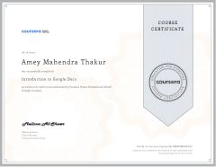 | **Introduction to Google Docs** | [Certificate](https://github.com/Amey-Thakur/ACHIEVEMENTS/blob/main/Coursera/Coursera%20Project%20Network/Coursera%20Introduction%20to%20Google%20Docs.pdf) | [Verify](https://www.coursera.org/account/accomplishments/verify/GBNPZMHLP5U9) |
| 26 | 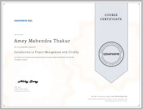 | **Introduction to Project Management with ClickUp** | [Certificate](https://github.com/Amey-Thakur/ACHIEVEMENTS/blob/main/Coursera/Coursera%20Project%20Network/Coursera%20Introduction%20to%20Project%20Management%20with%20ClickUp.pdf) | [Verify](https://www.coursera.org/account/accomplishments/verify/G8UATA9RCZ6L) |
| 27 |  | **Introduction to Project Management** | [Certificate](https://github.com/Amey-Thakur/ACHIEVEMENTS/blob/main/Coursera/Coursera%20Project%20Network/Coursera%20Introduction%20to%20Project%20Management.pdf) | [Verify](https://www.coursera.org/account/accomplishments/verify/8QJ6PAER4DCR) |
| 28 | 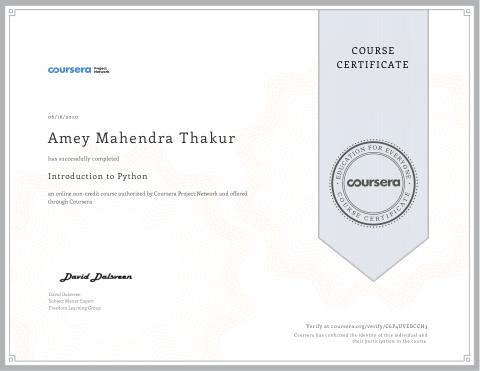 | **Introduction to Python** | [Certificate](https://github.com/Amey-Thakur/ACHIEVEMENTS/blob/main/Coursera/Coursera%20Project%20Network/Coursera%20Introduction%20to%20Python.pdf) | [Verify](https://www.coursera.org/account/accomplishments/verify/C6P4UVEBCCH3) |
| 29 |  | **Introduction to Relational Database and SQL** | [Certificate](https://github.com/Amey-Thakur/ACHIEVEMENTS/blob/main/Coursera/Coursera%20Project%20Network/Coursera%20Introduction%20to%20Relational%20Database%20and%20SQL.pdf) | [Verify](https://www.coursera.org/account/accomplishments/verify/8UWB93Q4TY4S) |
| 30 |  | **Investment Risk Management** | [Certificate](https://github.com/Amey-Thakur/ACHIEVEMENTS/blob/main/Coursera/Coursera%20Project%20Network/Coursera%20Investment%20Risk%20Management.pdf) | [Verify](https://www.coursera.org/account/accomplishments/verify/WWU7P68U3Z5M) |
| 31 |  | **Linear Regression with NumPy and Python** | [Certificate](https://github.com/Amey-Thakur/ACHIEVEMENTS/blob/main/Coursera/Coursera%20Project%20Network/Coursera%20Linear%20Regression%20with%20NumPy%20and%20Python.pdf) | [Verify](https://www.coursera.org/account/accomplishments/verify/PNJLQXHQZ9AA) |
| 32 | 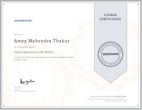 | **Linear Regression with Python** | [Certificate](https://github.com/Amey-Thakur/ACHIEVEMENTS/blob/main/Coursera/Coursera%20Project%20Network/Coursera%20Linear%20Regression%20with%20Python.pdf) | [Verify](https://www.coursera.org/account/accomplishments/verify/3LBH4QX25WPL) |
| 33 | 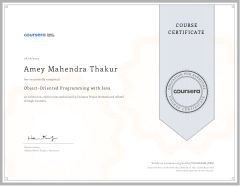 | **Object-Oriented Programming with Java** | [Certificate](https://github.com/Amey-Thakur/ACHIEVEMENTS/blob/main/Coursera/Coursera%20Project%20Network/Coursera%20Object-Oriented%20Programming%20with%20Java.pdf) | [Verify](https://www.coursera.org/account/accomplishments/verify/VGU2MLNZ3TBW) |
| 34 | 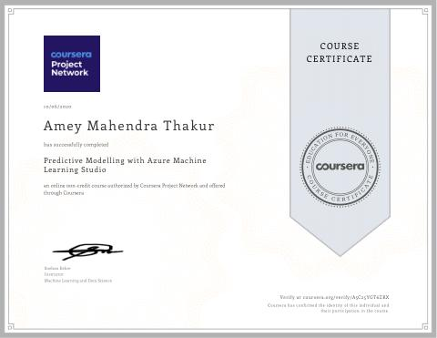 | **Predictive Modelling with Azure Machine Learning Studio** | [Certificate](https://github.com/Amey-Thakur/ACHIEVEMENTS/blob/main/Coursera/Coursera%20Project%20Network/Coursera%20Predictive%20Modelling%20with%20Azure%20Machine%20Learning%20Studio.pdf) | [Verify](https://www.coursera.org/account/accomplishments/verify/A5C25YGT6ZRX) |
| 35 |  | **Project: Creating Your First C++ Application** | [Certificate](https://github.com/Amey-Thakur/ACHIEVEMENTS/blob/main/Coursera/Coursera%20Project%20Network/Coursera%20Project%20Creating%20Your%20First%20C%2B%2B%20Application.pdf) | [Verify](https://www.coursera.org/account/accomplishments/verify/LTX5Z995UQVY) |
| 36 |  | **RESTful API with HTTP and JavaScript** | [Certificate](https://github.com/Amey-Thakur/ACHIEVEMENTS/blob/main/Coursera/Coursera%20Project%20Network/Coursera%20RESTful%20API%20with%20HTTP%20and%20JavaScript.pdf) | [Verify](https://www.coursera.org/account/accomplishments/verify/VEDG65RHVBFA) |
| 37 |  | **Spreadsheets for Beginners using Google Sheets** | [Certificate](https://github.com/Amey-Thakur/ACHIEVEMENTS/blob/main/Coursera/Coursera%20Project%20Network/Coursera%20Spreadsheets%20for%20Beginners%20using%20Google%20Sheets.pdf) | [Verify](https://www.coursera.org/account/accomplishments/verify/KFDSEY83RE8M) |
| 38 |  | **Use Canva to Create Social Media Marketing Designs** | [Certificate](https://github.com/Amey-Thakur/ACHIEVEMENTS/blob/main/Coursera/Coursera%20Project%20Network/Coursera%20Use%20Canva%20to%20Create%20Social%20Media%20Marketing%20Designs.pdf) | [Verify](https://www.coursera.org/account/accomplishments/verify/YVP7KQZ4PC7G) |
| 39 |  | **Use WordPress to Create a Blog for your Business** | [Certificate](https://github.com/Amey-Thakur/ACHIEVEMENTS/blob/main/Coursera/Coursera%20Project%20Network/Coursera%20Use%20WordPress%20to%20Create%20a%20Blog%20for%20your%20Business.pdf) | [Verify](https://www.coursera.org/account/accomplishments/verify/N7WPDT8E5SRP) |

#### &nbsp;DeepLearning.AI

| # | Preview | Topic | Certification | Verification |
| :---: | :---: | :--- | :---: | :---: |
| - |  | **Deep Learning Specialization** | [Certificate](https://github.com/Amey-Thakur/ACHIEVEMENTS/blob/main/Coursera/DeepLearning.AI/Coursera%20Deep%20Learning.pdf) | [Verify](https://www.coursera.org/account/accomplishments/specialization/PX89ZDRRQ26Q) |
| 1 |  | **Neural Networks and Deep Learning** | [Certificate](https://github.com/Amey-Thakur/ACHIEVEMENTS/blob/main/Coursera/DeepLearning.AI/Coursera%20Neural%20Networks%20and%20Deep%20Learning.pdf) | [Verify](https://www.coursera.org/account/accomplishments/verify/JRHKYENFFMQG) |
| 2 | 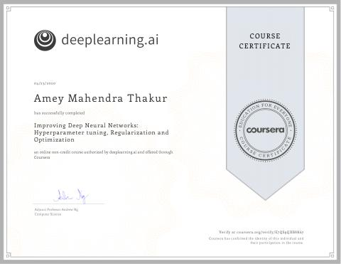 | **Improving Deep Neural Networks: Hyperparameter Tuning, Regularization and Optimization** | [Certificate](https://github.com/Amey-Thakur/ACHIEVEMENTS/blob/main/Coursera/DeepLearning.AI/Coursera%20Improving%20Deep%20Neural%20Networks%20Hyperparameter%20tuning%2C%20Regularization%20and%20Optimization.pdf) | [Verify](https://www.coursera.org/account/accomplishments/verify/E7QS9QXB8K67) |
| 3 |  | **Structuring Machine Learning Projects** | [Certificate](https://github.com/Amey-Thakur/ACHIEVEMENTS/blob/main/Coursera/DeepLearning.AI/Coursera%20Structuring%20Machine%20Learning%20Projects.pdf) | [Verify](https://www.coursera.org/account/accomplishments/verify/XETHHMQP33K6) |
| 4 | 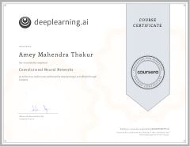 | **Convolutional Neural Networks** | [Certificate](https://github.com/Amey-Thakur/ACHIEVEMENTS/blob/main/Coursera/DeepLearning.AI/Coursera%20Convolutional%20Neural%20Networks.pdf) | [Verify](https://www.coursera.org/account/accomplishments/verify/AGKDHVHPTT2D) |
| 5 |  | **Sequence Models** | [Certificate](https://github.com/Amey-Thakur/ACHIEVEMENTS/blob/main/Coursera/DeepLearning.AI/Coursera%20Sequence%20Models.pdf) | [Verify](https://www.coursera.org/account/accomplishments/verify/JQ98D6UQYZY2) |
| 6 |  | **AI For Everyone** | [Certificate](https://github.com/Amey-Thakur/ACHIEVEMENTS/blob/main/Coursera/DeepLearning.AI/Coursera%20AI%20For%20Everyone.pdf) | [Verify](https://www.coursera.org/account/accomplishments/verify/LDQXCRKND3QY) |

#### &nbsp;Duke University

| # | Preview | Topic | Certification | Verification |
| :---: | :---: | :--- | :---: | :---: |
| 1 | 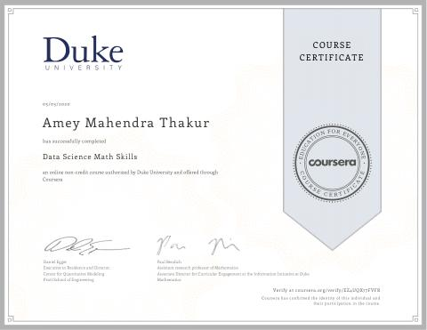 | **Data Science Math Skills** | [Certificate](https://github.com/Amey-Thakur/ACHIEVEMENTS/blob/main/Coursera/Duke%20University/Coursera%20Data%20Science%20Math%20Skills.pdf) | [Verify](https://www.coursera.org/account/accomplishments/verify/EZ4UQX77FVFR) |
| 2 | 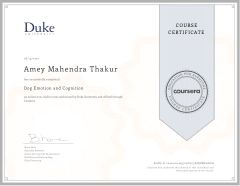 | **Dog Emotion and Cognition** | [Certificate](https://github.com/Amey-Thakur/ACHIEVEMENTS/blob/main/Coursera/Duke%20University/Coursera%20Dog%20Emotion%20and%20Cognition.pdf) | [Verify](https://www.coursera.org/account/accomplishments/verify/567QDWF2AJCA) |
| 3 | 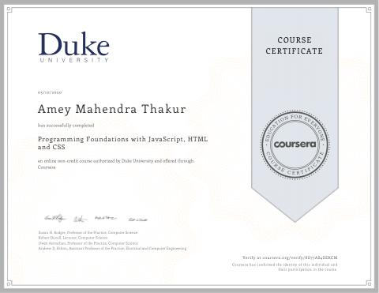 | **Programming Foundations with JavaScript, HTML and CSS** | [Certificate](https://github.com/Amey-Thakur/ACHIEVEMENTS/blob/main/Coursera/Duke%20University/Coursera%20Programming%20Foundations%20with%20JavaScript%2C%20HTML%20and%20CSS.pdf) | [Verify](https://www.coursera.org/account/accomplishments/verify/8U77AS4SEKCM) |

#### &nbsp;Georgia Institute of Technology

| # | Preview | Topic | Certification | Verification |
| :---: | :---: | :--- | :---: | :---: |
| 1 | 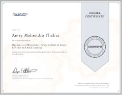 | **Mechanics of Materials I: Fundamentals of Stress & Strain and Axial Loading** | [Certificate](https://github.com/Amey-Thakur/ACHIEVEMENTS/blob/main/Coursera/Georgia%20Institute%20of%20Technology/Coursera%20Mechanics%20of%20Materials%20I%20Fundamentals%20of%20Stress%20_%20Strain%20and%20Axial%20Loading.pdf) | [Verify](https://www.coursera.org/account/accomplishments/verify/7CTL5DPH223H) |
| 2 | 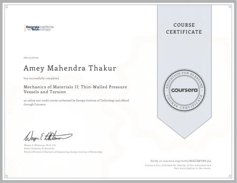 | **Mechanics of Materials II: Thin-Walled Pressure Vessels and Torsion** | [Certificate](https://github.com/Amey-Thakur/ACHIEVEMENTS/blob/main/Coursera/Georgia%20Institute%20of%20Technology/Coursera%20Mechanics%20of%20Materials%20II%20Thin-Walled%20Pressure%20Vessels%20and%20Torsion.pdf) | [Verify](https://www.coursera.org/account/accomplishments/verify/B6EEZMYWG3L9) |
| 3 | 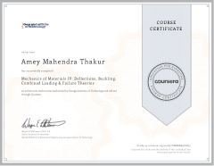 | **Mechanics of Materials IV: Deflections, Buckling, Combined Loading & Failure Theories** | [Certificate](https://github.com/Amey-Thakur/ACHIEVEMENTS/blob/main/Coursera/Georgia%20Institute%20of%20Technology/Coursera%20Mechanics%20of%20Materials%20IV%20Deflections%2C%20Buckling%2C%20Combined%20Loading%20_%20Failure%20Theories.pdf) | [Verify](https://www.coursera.org/account/accomplishments/verify/VMBRBE9TATJ5) |
| 4 |  | **Write Professional Emails in English** | [Certificate](https://github.com/Amey-Thakur/ACHIEVEMENTS/blob/main/Coursera/Georgia%20Institute%20of%20Technology/Coursera%20Write%20Professional%20Emails%20in%20English.pdf) | [Verify](https://www.coursera.org/account/accomplishments/verify/BCXKEMRD2MX8) |

#### &nbsp;Imperial College London

| # | Preview | Topic | Certification | Verification |
| :---: | :---: | :--- | :---: | :---: |
| - |  | **Mathematics for Machine Learning Specialization** | [Certificate](https://github.com/Amey-Thakur/ACHIEVEMENTS/blob/main/Coursera/Imperial%20College%20London/Coursera%20Mathematics%20for%20Machine%20Learning.pdf) | [Verify](https://www.coursera.org/account/accomplishments/specialization/YVQCTMVEVG2Q) |
| 1 |  | **Mathematics for Machine Learning: Linear Algebra** | [Certificate](https://github.com/Amey-Thakur/ACHIEVEMENTS/blob/main/Coursera/Imperial%20College%20London/Coursera%20Mathematics%20for%20Machine%20Learning%20Linear%20Algebra.pdf) | [Verify](https://www.coursera.org/account/accomplishments/verify/GQLQAYF5W5BQ) |
| 2 |  | **Mathematics for Machine Learning: Multivariate Calculus** | [Certificate](https://github.com/Amey-Thakur/ACHIEVEMENTS/blob/main/Coursera/Imperial%20College%20London/Coursera%20Mathematics%20for%20Machine%20Learning%20Multivariate%20Calculus.pdf) | [Verify](https://www.coursera.org/account/accomplishments/verify/RUVBN4MYLSUZ) |
| 3 |  | **Mathematics for Machine Learning: PCA** | [Certificate](https://github.com/Amey-Thakur/ACHIEVEMENTS/blob/main/Coursera/Imperial%20College%20London/Coursera%20Mathematics%20for%20Machine%20Learning%20PCA.pdf) | [Verify](https://www.coursera.org/account/accomplishments/verify/32AKJ6T2WW28) |
| 4 | 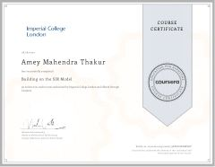 | **Building on the SIR Model** | [Certificate](https://github.com/Amey-Thakur/ACHIEVEMENTS/blob/main/Coursera/Imperial%20College%20London/Coursera%20Building%20on%20the%20SIR%20Model.pdf) | [Verify](https://www.coursera.org/account/accomplishments/verify/9FZXUZEHWSBY) |
| 5 |  | **Creative Thinking: Techniques and Tools for Success** | [Certificate](https://github.com/Amey-Thakur/ACHIEVEMENTS/blob/main/Coursera/Imperial%20College%20London/Coursera%20Creative%20Thinking%20Techniques%20and%20Tools%20for%20Success.pdf) | [Verify](https://www.coursera.org/account/accomplishments/verify/RFJN779ATXUZ) |

#### &nbsp;Indian School of Business (ISB)

| # | Preview | Topic | Certification | Verification |
| :---: | :---: | :--- | :---: | :---: |
| 1 | 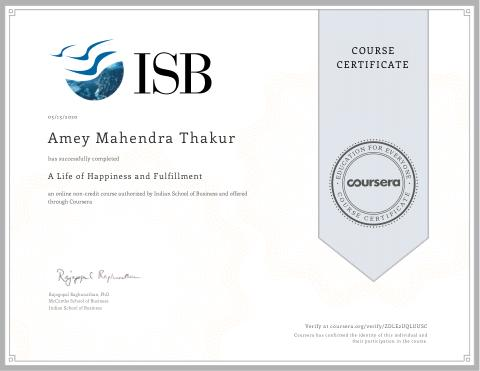 | **A Life of Happiness and Fulfillment** | [Certificate](https://github.com/Amey-Thakur/ACHIEVEMENTS/blob/main/Coursera/Indian%20School%20of%20Business%20(ISB)/Coursera%20A%20Life%20of%20Happiness%20and%20Fulfillment.pdf) | [Verify](https://www.coursera.org/account/accomplishments/verify/ZDLE2UQLUUSC) |

#### &nbsp;INSEAD - The Business School for the World, Fontainebleau, France

| # | Preview | Topic | Certification | Verification |
| :---: | :---: | :--- | :---: | :---: |
| 1 |  | **Introduction to Blockchain Technologies** | [Certificate](https://github.com/Amey-Thakur/ACHIEVEMENTS/blob/main/Coursera/INSEAD%20-%20The%20Business%20School%20for%20the%20World%2C%20Fontainebleau%2C%20France/Coursera%20Introduction%20to%20Blockchain%20Technologies.pdf) | [Verify](https://www.coursera.org/account/accomplishments/verify/QRPTJ44CJE9H) |

#### &nbsp;Johns Hopkins University

| # | Preview | Topic | Certification | Verification |
| :---: | :---: | :--- | :---: | :---: |
| - | &nbsp; | **Patient Safety Specialization** | [View Folder](https://github.com/Amey-Thakur/ACHIEVEMENTS/tree/main/Coursera/Johns%20Hopkins%20University) | - |
| 1 |  | **Patient Safety and Quality Improvement: Developing a Systems View (Patient Safety I)** | [Certificate](https://github.com/Amey-Thakur/ACHIEVEMENTS/blob/main/Coursera/Johns%20Hopkins%20University/Coursera%20Patient%20Safety%20and%20Quality%20Improvement%20Developing%20a%20Systems%20View%20(Patient%20Safety%20I).pdf) | [Verify](https://www.coursera.org/account/accomplishments/verify/EXW6DZDPMDKA) |
| 2 |  | **Setting the Stage for Success: An Eye on Safety Culture and Teamwork (Patient Safety II)** | [Certificate](https://github.com/Amey-Thakur/ACHIEVEMENTS/blob/main/Coursera/Johns%20Hopkins%20University/Coursera%20Setting%20the%20Stage%20for%20Success%20An%20Eye%20on%20Safety%20Culture%20and%20Teamwork%20(Patient%20Safety%20II).pdf) | [Verify](https://www.coursera.org/account/accomplishments/verify/JPGEM5ZFLKBE) |
| 3 | 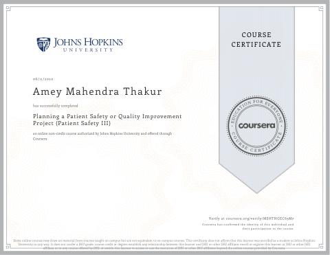 | **Planning a Patient Safety or Quality Improvement Project (Patient Safety III)** | [Certificate](https://github.com/Amey-Thakur/ACHIEVEMENTS/blob/main/Coursera/Johns%20Hopkins%20University/Coursera%20Planning%20a%20Patient%20Safety%20or%20Quality%20Improvement%20Project%20(Patient%20Safety%20III).pdf) | [Verify](https://www.coursera.org/account/accomplishments/verify/MSHTHGEC63M7) |
| 4 | 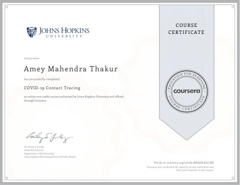 | **COVID-19 Contact Tracing** | [Certificate](https://github.com/Amey-Thakur/ACHIEVEMENTS/blob/main/Coursera/Johns%20Hopkins%20University/Coursera%20COVID-19%20Contact%20Tracing.pdf) | [Verify](https://www.coursera.org/account/accomplishments/verify/8HRJXLK2C7BK) |
| 5 | 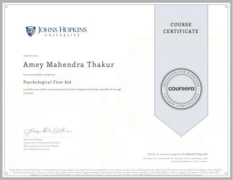 | **Psychological First Aid** | [Certificate](https://github.com/Amey-Thakur/ACHIEVEMENTS/blob/main/Coursera/Johns%20Hopkins%20University/Coursera%20Psychological%20First%20Aid.pdf) | [Verify](https://www.coursera.org/account/accomplishments/verify/XM6WYZSQ34JW) |

#### &nbsp;McMaster University

| # | Preview | Topic | Certification | Verification |
| :---: | :---: | :--- | :---: | :---: |
| 1 | 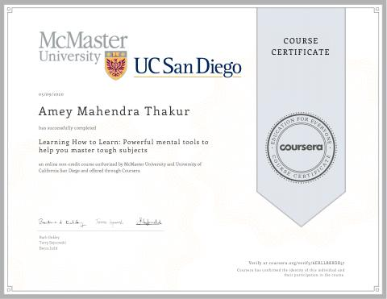 | **Learning How to Learn: Powerful mental tools to help you master tough subjects** | [Certificate](https://github.com/Amey-Thakur/ACHIEVEMENTS/blob/main/Coursera/McMaster%20University/Coursera%20Learning%20How%20to%20Learn%20Powerful%20mental%20tools%20to%20help%20you%20master%20tough%20subjects.pdf) | [Verify](https://www.coursera.org/account/accomplishments/verify/6ERLLRK8DB37) |
| 2 | 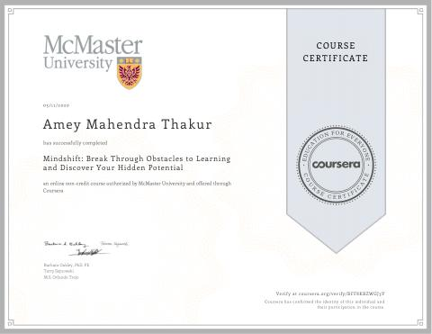 | **Mindshift: Break Through Obstacles to Learning and Discover Your Hidden Potential** | [Certificate](https://github.com/Amey-Thakur/ACHIEVEMENTS/blob/main/Coursera/McMaster%20University/Coursera%20Mindshift%20Break%20Through%20Obstacles%20to%20Learning%20and%20Discover%20Your%20Hidden%20Potential.pdf) | [Verify](https://www.coursera.org/account/accomplishments/verify/BFF8KBZWGJ3V) |

#### &nbsp;Osmosis.org

| # | Preview | Topic | Certification | Verification |
| :---: | :---: | :--- | :---: | :---: |
| 1 | 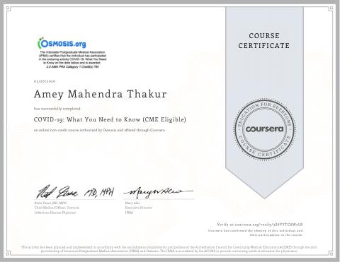 | **COVID-19: What You Need to Know (CME Eligible)** | [Certificate](https://github.com/Amey-Thakur/ACHIEVEMENTS/blob/main/Coursera/Osmosis.org/Coursera%20COVID-19%20What%20You%20Need%20to%20Know%20(CME%20Eligible).pdf) | [Verify](https://www.coursera.org/account/accomplishments/verify/3S6VYTCAW7LB) |

#### &nbsp;SUNY - The State University of New York

| # | Preview | Topic | Certification | Verification |
| :---: | :---: | :--- | :---: | :---: |
| 1 | 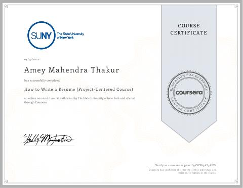 | **How to Write a Resume (Project-Centered Course)** | [Certificate](https://github.com/Amey-Thakur/ACHIEVEMENTS/blob/main/Coursera/SUNY%20-%20The%20State%20University%20of%20New%20York/Coursera%20How%20to%20Write%20a%20Resume%20(Project-Centered%20Course).pdf) | [Verify](https://www.coursera.org/account/accomplishments/verify/CGXK3AZ3AFX2) |

#### &nbsp;The Linux Foundation

  

| # | Preview | Topic | Certification | Verification |
| :---: | :---: | :--- | :---: | :---: |
| - |  | **Open Source Software Development, Linux and Git Specialization** | [Certificate](https://github.com/Amey-Thakur/ACHIEVEMENTS/blob/main/Coursera/The%20Linux%20Foundation/Coursera%20Open%20Source%20Software%20Development%2C%20Linux%20and%20Git.pdf) | [Verify](https://www.coursera.org/account/accomplishments/specialization/3F2QH3ERB3SX) |
| 1 | 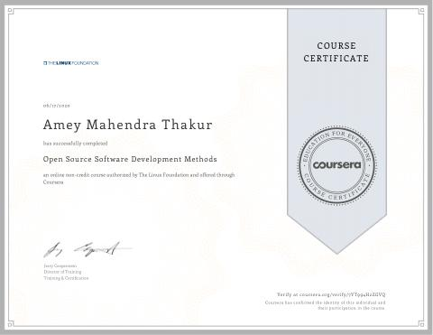 | **Open Source Software Development Methods** | [Certificate](https://github.com/Amey-Thakur/ACHIEVEMENTS/blob/main/Coursera/The%20Linux%20Foundation/Coursera%20Open%20Source%20Software%20Development%20Methods.pdf) | [Verify](https://www.coursera.org/account/accomplishments/verify/7YT994H2ZGVQ) |
| 2 | 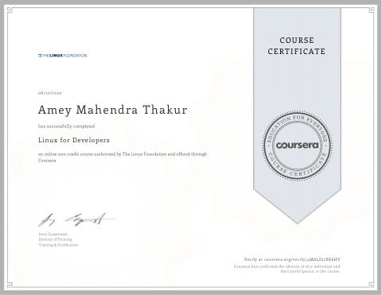 | **Linux for Developers** | [Certificate](https://github.com/Amey-Thakur/ACHIEVEMENTS/blob/main/Coursera/The%20Linux%20Foundation/Coursera%20Linux%20for%20Developers.pdf) | [Verify](https://www.coursera.org/account/accomplishments/verify/4MA5Z27SX6HV) |
| 3 | 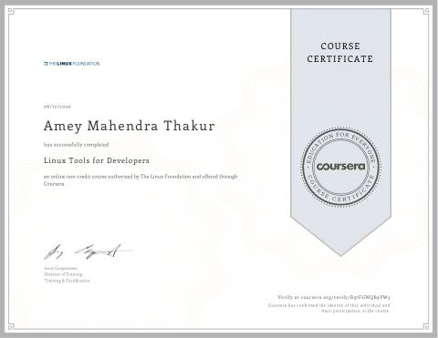 | **Linux Tools for Developers** | [Certificate](https://github.com/Amey-Thakur/ACHIEVEMENTS/blob/main/Coursera/The%20Linux%20Foundation/Coursera%20Linux%20Tools%20for%20Developers.pdf) | [Verify](https://www.coursera.org/account/accomplishments/verify/B97FGWQB9VW3) |
| 4 |  | **Using Git for Distributed Development** | [Certificate](https://github.com/Amey-Thakur/ACHIEVEMENTS/blob/main/Coursera/The%20Linux%20Foundation/Coursera%20Using%20Git%20for%20Distributed%20Development.pdf) | [Verify](https://www.coursera.org/account/accomplishments/verify/JXD7X9WQCZDR) |

#### &nbsp;The University of Edinburgh

| # | Preview | Topic | Certification | Verification |
| :---: | :---: | :--- | :---: | :---: |
| 1 | 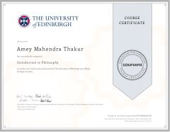 | **Introduction to Philosophy** | [Certificate](https://github.com/Amey-Thakur/ACHIEVEMENTS/blob/main/Coursera/The%20University%20of%20Edinburgh/Coursera%20Introduction%20to%20Philosophy.pdf) | [Verify](https://www.coursera.org/account/accomplishments/verify/PVC3PQHQU2YE) |
| 2 | 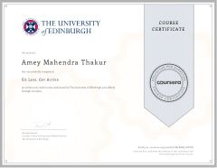 | **Sit Less, Get Active** | [Certificate](https://github.com/Amey-Thakur/ACHIEVEMENTS/blob/main/Coursera/The%20University%20of%20Edinburgh/Coursera%20Sit%20Less%2C%20Get%20Active.pdf) | [Verify](https://www.coursera.org/account/accomplishments/verify/CN5ESH57GYUD) |
| 3 | 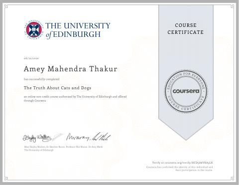 | **The Truth About Cats and Dogs** | [Certificate](https://github.com/Amey-Thakur/ACHIEVEMENTS/blob/main/Coursera/The%20University%20of%20Edinburgh/Coursera%20The%20Truth%20About%20Cats%20and%20Dogs.pdf) | [Verify](https://www.coursera.org/account/accomplishments/verify/HCD5A6VKA3LK) |

#### &nbsp;University of Alberta

| # | Preview | Topic | Certification | Verification |
| :---: | :---: | :--- | :---: | :---: |
| 1 |  | **Dino 101: Dinosaur Paleobiology** | [Certificate](https://github.com/Amey-Thakur/ACHIEVEMENTS/blob/main/Coursera/University%20of%20Alberta/Coursera%20Dino%20101%20Dinosaur%20Paleobiology.pdf) | [Verify](https://www.coursera.org/account/accomplishments/verify/VXM8JA9WL3F9) |
| 2 | 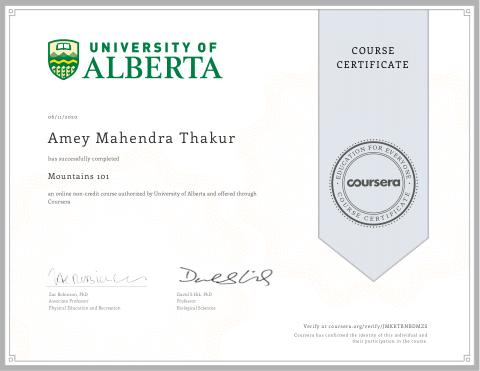 | **Mountains 101** | [Certificate](https://github.com/Amey-Thakur/ACHIEVEMENTS/blob/main/Coursera/University%20of%20Alberta/Coursera%20Mountains%20101.pdf) | [Verify](https://www.coursera.org/account/accomplishments/verify/JMKKTBNBDMZS) |

#### &nbsp;University of California Irvine

| # | Preview | Topic | Certification | Verification |
| :---: | :---: | :--- | :---: | :---: |
| 1 |  | **Concurrency in Go** | [Certificate](https://github.com/Amey-Thakur/ACHIEVEMENTS/blob/main/Coursera/University%20of%20California%20Irvine/Coursera%20Concurrency%20in%20Go.pdf) | [Verify](https://www.coursera.org/account/accomplishments/verify/43LG9BPBN9F4) |
| 2 |  | **Functions, Methods, and Interfaces in Go** | [Certificate](https://github.com/Amey-Thakur/ACHIEVEMENTS/blob/main/Coursera/University%20of%20California%20Irvine/Coursera%20Functions%2C%20Methods%2C%20and%20Interfaces%20in%20Go.pdf) | [Verify](https://www.coursera.org/account/accomplishments/verify/AEPU275WQWJD) |
| 3 |  | **Getting Started with Go** | [Certificate](https://github.com/Amey-Thakur/ACHIEVEMENTS/blob/main/Coursera/University%20of%20California%20Irvine/Coursera%20Getting%20Started%20with%20Go.pdf) | [Verify](https://www.coursera.org/account/accomplishments/verify/6D7LH29ZUBQZ) |

#### &nbsp;University of California San Diego

| # | Preview | Topic | Certification | Verification |
| :---: | :---: | :--- | :---: | :---: |
| 1 | 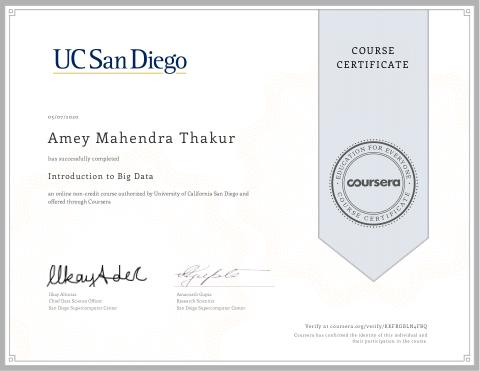 | **Introduction to Big Data** | [Certificate](https://github.com/Amey-Thakur/ACHIEVEMENTS/blob/main/Coursera/University%20of%20California%20San%20Diego/Coursera%20Introduction%20to%20Big%20Data.pdf) | [Verify](https://www.coursera.org/account/accomplishments/verify/KKFRGBLN4FBQ) |
| 2 |  | **Big Data Modeling and Management Systems** | [Certificate](https://github.com/Amey-Thakur/ACHIEVEMENTS/blob/main/Coursera/University%20of%20California%20San%20Diego/Coursera%20Big%20Data%20Modeling%20and%20Management%20Systems.pdf) | [Verify](https://www.coursera.org/account/accomplishments/verify/F8J58PWD9L2D) |
| 3 |  | **Big Data Integration and Processing** | [Certificate](https://github.com/Amey-Thakur/ACHIEVEMENTS/blob/main/Coursera/University%20of%20California%20San%20Diego/Coursera%20Big%20Data%20Integration%20and%20Processing.pdf) | [Verify](https://www.coursera.org/account/accomplishments/verify/XHFE9R2V9KM5) |
| 4 | 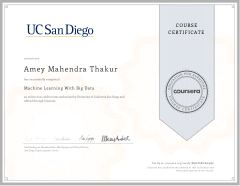 | **Machine Learning With Big Data** | [Certificate](https://github.com/Amey-Thakur/ACHIEVEMENTS/blob/main/Coursera/University%20of%20California%20San%20Diego/Coursera%20Machine%20Learning%20With%20Big%20Data.pdf) | [Verify](https://www.coursera.org/account/accomplishments/verify/XQKZ8RHAH9Q6) |
| 5 | 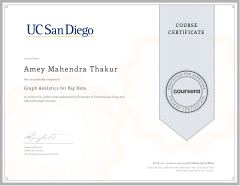 | **Graph Analytics for Big Data** | [Certificate](https://github.com/Amey-Thakur/ACHIEVEMENTS/blob/main/Coursera/University%20of%20California%20San%20Diego/Coursera%20Graph%20Analytics%20for%20Big%20Data.pdf) | [Verify](https://www.coursera.org/account/accomplishments/verify/BM3429U9VMCA) |

#### &nbsp;University of California, Irvine Division of Continuing Education

| # | Preview | Topic | Certification | Verification |
| :---: | :---: | :--- | :---: | :---: |
| 1 |  | **Grammar and Punctuation** | [Certificate](https://github.com/Amey-Thakur/ACHIEVEMENTS/blob/main/Coursera/University%20of%20California%2C%20Irvine%20Division%20of%20Continuing%20Education/Coursera%20Grammar%20and%20Punctuation.pdf) | [Verify](https://www.coursera.org/account/accomplishments/verify/8A8FAKP44VML) |
| 2 |  | **Perfect Tenses and Modals** | [Certificate](https://github.com/Amey-Thakur/ACHIEVEMENTS/blob/main/Coursera/University%20of%20California%2C%20Irvine%20Division%20of%20Continuing%20Education/Coursera%20Perfect%20Tenses%20and%20Modals.pdf) | [Verify](https://www.coursera.org/account/accomplishments/verify/AVESZE2TG6UJ) |
| 3 | 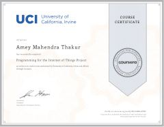 | **Programming for the Internet of Things Project** | [Certificate](https://github.com/Amey-Thakur/ACHIEVEMENTS/blob/main/Coursera/University%20of%20California%2C%20Irvine%20Division%20of%20Continuing%20Education/Coursera%20Programming%20for%20the%20Internet%20of%20Things%20Project.pdf) | [Verify](https://www.coursera.org/account/accomplishments/verify/W778GBR4FYXF) |
| 4 |  | **The Arduino Platform and C Programming** | [Certificate](https://github.com/Amey-Thakur/ACHIEVEMENTS/blob/main/Coursera/University%20of%20California%2C%20Irvine%20Division%20of%20Continuing%20Education/Coursera%20The%20Arduino%20Platform%20and%20C%20Programming.pdf) | [Verify](https://www.coursera.org/account/accomplishments/verify/HVLDN2CM2RQY) |
| 5 | 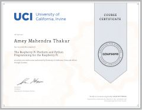 | **The Raspberry Pi Platform and Python Programming for the Raspberry Pi** | [Certificate](https://github.com/Amey-Thakur/ACHIEVEMENTS/blob/main/Coursera/University%20of%20California%2C%20Irvine%20Division%20of%20Continuing%20Education/Coursera%20The%20Raspberry%20Pi%20Platform%20and%20Python%20Programming%20for%20the%20Raspberry%20Pi.pdf) | [Verify](https://www.coursera.org/account/accomplishments/verify/AA5HYKYVNXGK) |

#### &nbsp;University of Cape Town

| # | Preview | Topic | Certification | Verification |
| :---: | :---: | :--- | :---: | :---: |
| 1 | 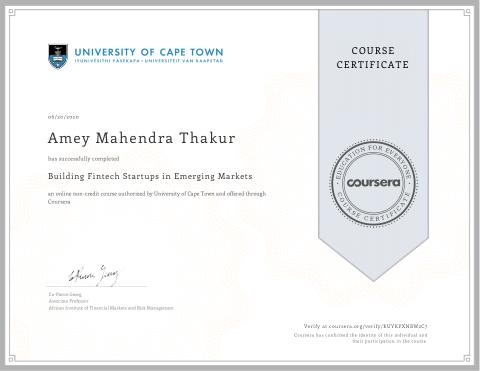 | **Building Fintech Startups in Emerging Markets** | [Certificate](https://github.com/Amey-Thakur/ACHIEVEMENTS/blob/main/Coursera/University%20of%20Cape%20Town/Coursera%20Building%20Fintech%20Startups%20in%20Emerging%20Markets.pdf) | [Verify](https://www.coursera.org/account/accomplishments/verify/KUYKPXNBW2C7) |

#### &nbsp;University of Colorado Boulder

| # | Preview | Topic | Certification | Verification |
| :---: | :---: | :--- | :---: | :---: |
| - | 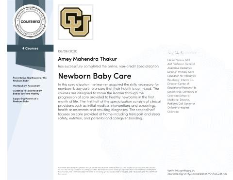 | **Newborn Baby Care Specialization** | [Certificate](https://github.com/Amey-Thakur/ACHIEVEMENTS/blob/main/Coursera/University%20of%20Colorado%20Boulder/Coursera%20Newborn%20Baby%20Care.pdf) | [Verify](https://www.coursera.org/account/accomplishments/specialization/AY7NSCZ3KN8Z) |
| 1 |  | **Preventative Healthcare for the Newborn Baby** | [Certificate](https://github.com/Amey-Thakur/ACHIEVEMENTS/blob/main/Coursera/University%20of%20Colorado%20Boulder/Coursera%20Preventative%20Healthcare%20for%20the%20Newborn%20Baby.pdf) | [Verify](https://www.coursera.org/account/accomplishments/verify/SAU2MT3VGNRJ) |
| 2 |  | **The Newborn Assessment** | [Certificate](https://github.com/Amey-Thakur/ACHIEVEMENTS/blob/main/Coursera/University%20of%20Colorado%20Boulder/Coursera%20The%20Newborn%20Assessment.pdf) | [Verify](https://www.coursera.org/account/accomplishments/verify/BELUKHPP3V28) |
| 3 | 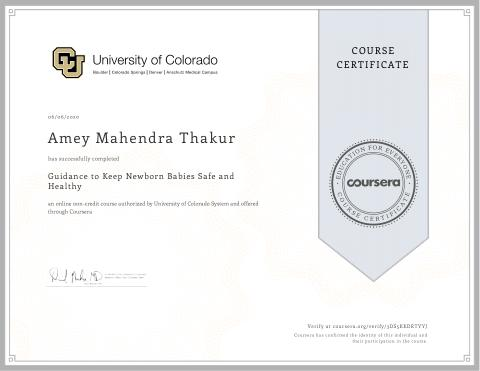 | **Guidance to Keep Newborn Babies Safe and Healthy** | [Certificate](https://github.com/Amey-Thakur/ACHIEVEMENTS/blob/main/Coursera/University%20of%20Colorado%20Boulder/Coursera%20Guidance%20to%20Keep%20Newborn%20Babies%20Safe%20and%20Healthy.pdf) | [Verify](https://www.coursera.org/account/accomplishments/verify/3DS5KKDRTYYJ) |
| 4 |  | **Supporting Parents of a Newborn Baby** | [Certificate](https://github.com/Amey-Thakur/ACHIEVEMENTS/blob/main/Coursera/University%20of%20Colorado%20Boulder/Coursera%20Supporting%20Parents%20of%20a%20Newborn%20Baby.pdf) | [Verify](https://www.coursera.org/account/accomplishments/verify/GJA4E5FMYYQM) |
| 5 |  | **Science of Exercise** | [Certificate](https://github.com/Amey-Thakur/ACHIEVEMENTS/blob/main/Coursera/University%20of%20Colorado%20Boulder/Coursera%20Science%20of%20Exercise.pdf) | [Verify](https://www.coursera.org/account/accomplishments/verify/AL6263EX5L7M) |

#### &nbsp;University of Florida

| # | Preview | Topic | Certification | Verification |
| :---: | :---: | :--- | :---: | :---: |
| 1 |  | **COVID-19 - A clinical update** | [Certificate](https://github.com/Amey-Thakur/ACHIEVEMENTS/blob/main/Coursera/University%20of%20Florida/Coursera%20COVID-19%20-%20A%20clinical%20update.pdf) | [Verify](https://www.coursera.org/account/accomplishments/verify/GADRX8FNCW8W) |

#### &nbsp;University of London

| # | Preview | Topic | Certification | Verification |
| :---: | :---: | :--- | :---: | :---: |
| 1 | 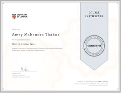 | **How Computers Work** | [Certificate](https://github.com/Amey-Thakur/ACHIEVEMENTS/blob/main/Coursera/University%20of%20London/Coursera%20How%20Computers%20Work.pdf) | [Verify](https://www.coursera.org/account/accomplishments/verify/2HBSK3TP8Z2M) |
| 2 |  | **Introduction to Virtual Reality** | [Certificate](https://github.com/Amey-Thakur/ACHIEVEMENTS/blob/main/Coursera/University%20of%20London/Coursera%20Introduction%20to%20Virtual%20Reality.pdf) | [Verify](https://www.coursera.org/account/accomplishments/verify/LA4JFLRL7J7B) |
| 3 |  | **Understanding Research Methods** | [Certificate](https://github.com/Amey-Thakur/ACHIEVEMENTS/blob/main/Coursera/University%20of%20London/Coursera%20Understanding%20Research%20Methods.pdf) | [Verify](https://www.coursera.org/account/accomplishments/verify/N6K2A9X57ACS) |
  

#### &nbsp;University of Michigan

| # | Preview | Topic | Certification | Verification |
| :---: | :---: | :--- | :---: | :---: |
| 1 |  | **Introduction to HTML5** | [Certificate](https://github.com/Amey-Thakur/ACHIEVEMENTS/blob/main/Coursera/University%20of%20Michigan/Coursera%20Introduction%20to%20HTML5.pdf) | [Verify](https://www.coursera.org/account/accomplishments/verify/2LDGCB5FAYS8) |
| 2 |  | **Programming for Everybody (Getting Started with Python)** | [Certificate](https://github.com/Amey-Thakur/ACHIEVEMENTS/blob/main/Coursera/University%20of%20Michigan/Coursera%20Programming%20for%20Everybody%20(Getting%20Started%20with%20Python).pdf) | [Verify](https://www.coursera.org/account/accomplishments/verify/7NL3XWB2SKSR) |
| 3 |  | **Python Data Structures** | [Certificate](https://github.com/Amey-Thakur/ACHIEVEMENTS/blob/main/Coursera/University%20of%20Michigan/Coursera%20Python%20Data%20Structures.pdf) | [Verify](https://www.coursera.org/account/accomplishments/verify/ATXR8BZDSA39) |
| 4 |  | **Introduction to Data Science in Python** | [Certificate](https://github.com/Amey-Thakur/ACHIEVEMENTS/blob/main/Coursera/University%20of%20Michigan/Coursera%20Introduction%20to%20Data%20Science%20in%20Python.pdf) | [Verify](https://www.coursera.org/account/accomplishments/verify/U2Y3PRPH99HD) |
| 5 | 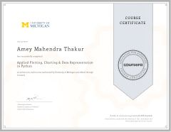 | **Applied Plotting, Charting and Data Representation in Python** | [Certificate](https://github.com/Amey-Thakur/ACHIEVEMENTS/blob/main/Coursera/University%20of%20Michigan/Coursera%20Applied%20Plotting%2C%20Charting%20_%20Data%20Representation%20in%20Python.pdf) | [Verify](https://www.coursera.org/account/accomplishments/verify/PVC3PQHQU2YE) |
| 6 |  | **Applied Text Mining in Python** | [Certificate](https://github.com/Amey-Thakur/ACHIEVEMENTS/blob/main/Coursera/University%20of%20Michigan/Coursera%20Applied%20Text%20Mining%20in%20Python.pdf) | [Verify](https://www.coursera.org/account/accomplishments/verify/8FC8EXKAQYFQ) |
| 7 | 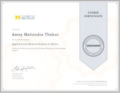 | **Applied Social Network Analysis in Python** | [Certificate](https://github.com/Amey-Thakur/ACHIEVEMENTS/blob/main/Coursera/University%20of%20Michigan/Coursera%20Applied%20Social%20Network%20Analysis%20in%20Python.pdf) | [Verify](https://www.coursera.org/account/accomplishments/verify/SFMES8DEAJ4G) |
| 8 | 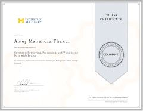 | **Capstone: Retrieving, Processing, and Visualizing Data with Python** | [Certificate](https://github.com/Amey-Thakur/ACHIEVEMENTS/blob/main/Coursera/University%20of%20Michigan/Coursera%20Capstone%20Retrieving%2C%20Processing%2C%20and%20Visualizing%20Data%20with%20Python.pdf) | [Verify](https://www.coursera.org/account/accomplishments/verify/UPQWWKQ6UMWA) |
| 9 |  | **Finding Purpose and Meaning In Life Living for What Matters Most** | [Certificate](https://github.com/Amey-Thakur/ACHIEVEMENTS/blob/main/Coursera/University%20of%20Michigan/Coursera%20Finding%20Purpose%20and%20Meaning%20In%20Life%20Living%20for%20What%20Matters%20Most.pdf) | [Verify](https://www.coursera.org/account/accomplishments/verify/BX7RV8JFBDKS) |

#### &nbsp;University of Minnesota

| # | Preview | Topic | Certification | Verification |
| :---: | :---: | :--- | :---: | :---: |
| - |  | **Nursing Informatics Leadership Specialization** | [Certificate](https://github.com/Amey-Thakur/ACHIEVEMENTS/blob/main/Coursera/University%20of%20Minnesota/Coursera%20Nursing%20Informatics%20Leadership.pdf) | [Verify](https://www.coursera.org/account/accomplishments/specialization/J8XSHDRWFR6T) |
| 1 | 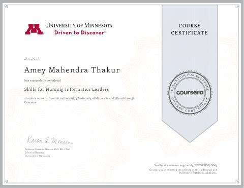 | **Skills for Nursing Informatics Leaders** | [Certificate](https://github.com/Amey-Thakur/ACHIEVEMENTS/blob/main/Coursera/University%20of%20Minnesota/Coursera%20Skills%20for%20Nursing%20Informatics%20Leaders.pdf) | [Verify](https://www.coursera.org/account/accomplishments/verify/LEZGXMWJ2VW3) |
| 2 | 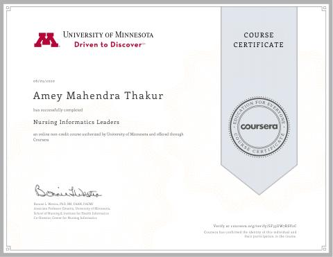 | **Nursing Informatics Leaders** | [Certificate](https://github.com/Amey-Thakur/ACHIEVEMENTS/blob/main/Coursera/University%20of%20Minnesota/Coursera%20Nursing%20Informatics%20Leaders.pdf) | [Verify](https://www.coursera.org/account/accomplishments/verify/SF33UW7RSV2C) |
| 3 | 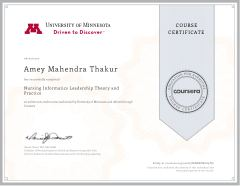 | **Nursing Informatics Leadership Theory and Practice** | [Certificate](https://github.com/Amey-Thakur/ACHIEVEMENTS/blob/main/Coursera/University%20of%20Minnesota/Coursera%20Nursing%20Informatics%20Leadership%20Theory%20and%20Practice.pdf) | [Verify](https://www.coursera.org/account/accomplishments/verify/MHR8UNU69TJ6) |
| 4 |  | **Nursing Informatics Training and Education** | [Certificate](https://github.com/Amey-Thakur/ACHIEVEMENTS/blob/main/Coursera/University%20of%20Minnesota/Coursera%20Nursing%20Informatics%20Training%20and%20Education.pdf) | [Verify](https://www.coursera.org/account/accomplishments/verify/ZU85VSKA324A) |
| 5 |  | **Leadership in Interprofessional Informatics** | [Certificate](https://github.com/Amey-Thakur/ACHIEVEMENTS/blob/main/Coursera/University%20of%20Minnesota/Coursera%20Leadership%20in%20Interprofessional%20Informatics.pdf) | [Verify](https://www.coursera.org/account/accomplishments/verify/CN3DUV4JGD32) |

#### &nbsp;University of North Carolina at Chapel Hill

| # | Preview | Topic | Certification | Verification |
| :---: | :---: | :--- | :---: | :---: |
| 1 | 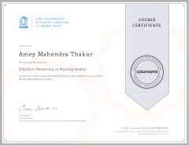 | **Infection Prevention in Nursing Homes** | [Certificate](https://github.com/Amey-Thakur/ACHIEVEMENTS/blob/main/Coursera/University%20of%20North%20Carolina%20at%20Chapel%20Hill/Coursera%20Infection%20Prevention%20in%20Nursing%20Homes.pdf) | [Verify](https://www.coursera.org/account/accomplishments/verify/R4TSARJL8LN6) |

#### &nbsp;University of Toronto

| # | Preview | Topic | Certification | Verification |
| :---: | :---: | :--- | :---: | :---: |
| 1 | 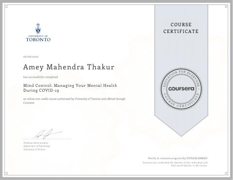 | **Mind Control: Managing Your Mental Health During COVID-19** | [Certificate](https://github.com/Amey-Thakur/ACHIEVEMENTS/blob/main/Coursera/University%20of%20Toronto/Coursera%20Mind%20Control%20Managing%20Your%20Mental%20Health%20During%20COVID-19.pdf) | [Verify](https://www.coursera.org/account/accomplishments/verify/UYPJEELASMGU) |

#### &nbsp;University of Virginia

| # | Preview | Topic | Certification | Verification |
| :---: | :---: | :--- | :---: | :---: |
| 1 | 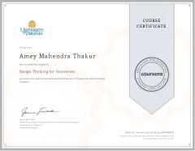 | **Design Thinking for Innovation** | [Certificate](https://github.com/Amey-Thakur/ACHIEVEMENTS/blob/main/Coursera/University%20of%20Virginia/Coursera%20Design%20Thinking%20for%20Innovation.pdf) | [Verify](https://www.coursera.org/account/accomplishments/verify/4433UKVAKPLR) |
| 2 | 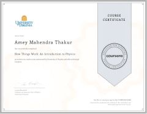 | **How Things Work: An Introduction to Physics** | [Certificate](https://github.com/Amey-Thakur/ACHIEVEMENTS/blob/main/Coursera/University%20of%20Virginia/Coursera%20How%20Things%20Work%20An%20Introduction%20to%20Physics.pdf) | [Verify](https://www.coursera.org/account/accomplishments/verify/CUH8YZ2P28HR) |
| 3 |  | **Introduction to Personal Branding** | [Certificate](https://github.com/Amey-Thakur/ACHIEVEMENTS/blob/main/Coursera/University%20of%20Virginia/Coursera%20Introduction%20to%20Personal%20Branding.pdf) | [Verify](https://www.coursera.org/account/accomplishments/verify/854M3U9N26P8) |

#### &nbsp;Yale University

| # | Preview | Topic | Certification | Verification |
| :---: | :---: | :--- | :---: | :---: |
| - |  | **Climate Change and Health: From Science to Action Specialization** | [Certificate](https://github.com/Amey-Thakur/ACHIEVEMENTS/blob/main/Coursera/Yale%20University/Coursera%20Climate%20Change%20and%20Health%20From%20Science%20to%20Action.pdf) | [Verify](https://www.coursera.org/account/accomplishments/specialization/HF4WMJCJ38FA) |
| 1 | 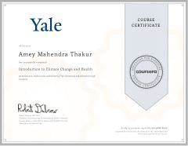 | **Introduction to Climate Change and Health** | [Certificate](https://github.com/Amey-Thakur/ACHIEVEMENTS/blob/main/Coursera/Yale%20University/Coursera%20Introduction%20to%20Climate%20Change%20and%20Health.pdf) | [Verify](https://www.coursera.org/account/accomplishments/verify/J6C988M7KS4H) |
| 2 |  | **Climate Adaptation for Human Health** | [Certificate](https://github.com/Amey-Thakur/ACHIEVEMENTS/blob/main/Coursera/Yale%20University/Coursera%20Climate%20Adaptation%20for%20Human%20Health.pdf) | [Verify](https://www.coursera.org/account/accomplishments/verify/EU8K7RUSQN9G) |
| 3 | 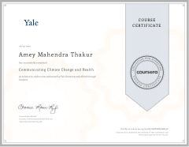 | **Communicating Climate Change and Health** | [Certificate](https://github.com/Amey-Thakur/ACHIEVEMENTS/blob/main/Coursera/Yale%20University/Coursera%20Communicating%20Climate%20Change%20and%20Health.pdf) | [Verify](https://www.coursera.org/account/accomplishments/verify/ADT8RD5M879C) |
| 4 | 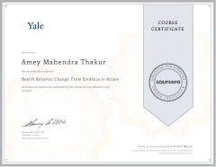 | **Health Behavior Change: From Evidence to Action** | [Certificate](https://github.com/Amey-Thakur/ACHIEVEMENTS/blob/main/Coursera/Yale%20University/Coursera%20Health%20Behavior%20Change%20From%20Evidence%20to%20Action.pdf) | [Verify](https://www.coursera.org/account/accomplishments/verify/XTQPT7PNZ54F) |
| 5 | 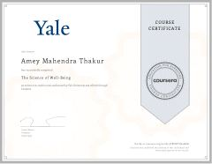 | **The Science of Well-Being** | [Certificate](https://github.com/Amey-Thakur/ACHIEVEMENTS/blob/main/Coursera/Yale%20University/Coursera%20The%20Science%20of%20Well-Being.pdf) | [Verify](https://www.coursera.org/account/accomplishments/verify/JTRCWTCG2AHD) |
  
---

### &nbsp;Eduonix

| # | Preview | Topic | Certification | Verification |
| :---: | :---: | :--- | :---: | :---: |
| 1 | 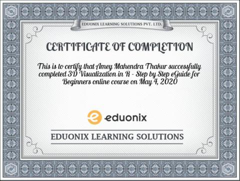 | **3D Visualization in R - Step by Step eGuide for Beginners** | [Certificate](https://github.com/Amey-Thakur/ACHIEVEMENTS/blob/main/Eduonix/Eduonix%203D%20Visualization%20in%20R%20-%20Step%20by%20Step%20eGuide%20for%20Beginners.pdf) | [Verify](https://www.eduonix.com/certificate/3f158657d9) |
| 2 |  | **A Complete Guide For Effective Business Communication** | [Certificate](https://github.com/Amey-Thakur/ACHIEVEMENTS/blob/main/Eduonix/Eduonix%20A%20Complete%20Guide%20For%20Effective%20Business%20Communication.pdf) | [Verify](https://www.eduonix.com/certificate/86f95fbb9f) |
| 3 |  | **Advance JavaScript for Coders Learn OOP in JavaScript** | [Certificate](https://github.com/Amey-Thakur/ACHIEVEMENTS/blob/main/Eduonix/Eduonix%20Advance%20JavaScript%20for%20Coders%20Learn%20OOP%20in%20JavaScript.pdf) | [Verify](https://www.eduonix.com/certificate/d4b5aef8e6) |
| 4 | 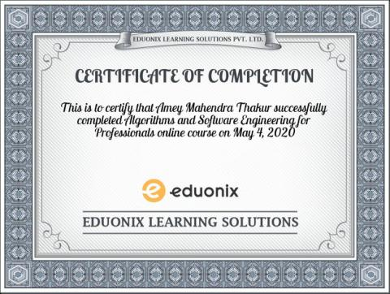 | **Algorithms and Software Engineering for Professionals** | [Certificate](https://github.com/Amey-Thakur/ACHIEVEMENTS/blob/main/Eduonix/Eduonix%20Algorithms%20and%20Software%20Engineering%20for%20Professionals.pdf) | [Verify](https://www.eduonix.com/certificate/c98cab0852) |
| 5 | 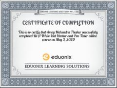 | **Be A White Hat Hacker and Pen Tester** | [Certificate](https://github.com/Amey-Thakur/ACHIEVEMENTS/blob/main/Eduonix/Eduonix%20Be%20A%20White%20Hat%20Hacker%20and%20Pen%20Tester.pdf) | [Verify](https://www.eduonix.com/certificate/ebf4567d1f) |
| 6 |  | **Become A Certified Web Developer From Scratch** | [Certificate](https://github.com/Amey-Thakur/ACHIEVEMENTS/blob/main/Eduonix/Eduonix%20Become%20A%20Certified%20Web%20Developer%20From%20Scratch.pdf) | [Verify](https://www.eduonix.com/certificate/89f12df796) |
| 7 | 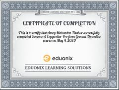 | **Become A Copywriter Pro from Ground Up** | [Certificate](https://github.com/Amey-Thakur/ACHIEVEMENTS/blob/main/Eduonix/Eduonix%20Become%20A%20Copywriter%20Pro%20from%20Ground%20Up.pdf) | [Verify](https://www.eduonix.com/certificate/425351749f) |
| 8 |  | **Become A Digital Marketing Maestro From Scratch** | [Certificate](https://github.com/Amey-Thakur/ACHIEVEMENTS/blob/main/Eduonix/Eduonix%20Become%20A%20Digital%20Marketing%20Maestro%20From%20Scratch.pdf) | [Verify](https://www.eduonix.com/certificate/0f1707f3df) |
| 9 |  | **Beginners Guide to Modeling with Maya** | [Certificate](https://github.com/Amey-Thakur/ACHIEVEMENTS/blob/main/Eduonix/Eduonix%20Beginners%20Guide%20to%20Modeling%20with%20Maya.pdf) | [Verify](https://www.eduonix.com/certificate/576b4b7f7d) |
| 10 | 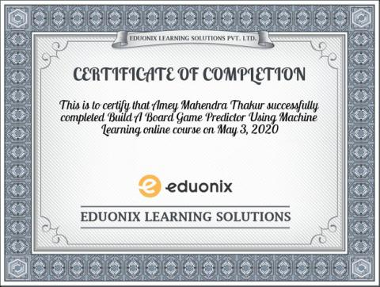 | **Build A Board Game Predictor Using Machine Learning** | [Certificate](https://github.com/Amey-Thakur/ACHIEVEMENTS/blob/main/Eduonix/Eduonix%20Build%20A%20Board%20Game%20Predictor%20Using%20Machine%20Learning.pdf) | [Verify](https://www.eduonix.com/certificate/466e630e7a) |
| 11 |  | **Build A Video Gallery WordPress Plugin** | [Certificate](https://github.com/Amey-Thakur/ACHIEVEMENTS/blob/main/Eduonix/Eduonix%20Build%20A%20Video%20Gallery%20WordPress%20Plugin.pdf) | [Verify](https://www.eduonix.com/certificate/b94c39e580) |
| 12 |  | **CCNA Routing and Switching - The Easy Certification Guide** | [Certificate](https://github.com/Amey-Thakur/ACHIEVEMENTS/blob/main/Eduonix/Eduonix%20CCNA%20Routing%20and%20Switching%20-%20The%20Easy%20Certification%20Guide.pdf) | [Verify](https://www.eduonix.com/certificate/183a94f477) |
| 13 |  | **COVID-19 Know Everything About Novel Coronavirus Outbreak** | [Certificate](https://github.com/Amey-Thakur/ACHIEVEMENTS/blob/main/Eduonix/Eduonix%20COVID-19%20Know%20Everything%20About%20Novel%20Coronavirus%20Outbreak.pdf) | [Verify](https://www.eduonix.com/certificate/feb6990771) |
| 14 |  | **Complete Beginners Course to Master Microsoft Excel** | [Certificate](https://github.com/Amey-Thakur/ACHIEVEMENTS/blob/main/Eduonix/Eduonix%20Complete%20Beginners%20Course%20to%20Master%20Microsoft%20Excel.pdf) | [Verify](https://www.eduonix.com/certificate/cbc08e533f) |
| 15 | 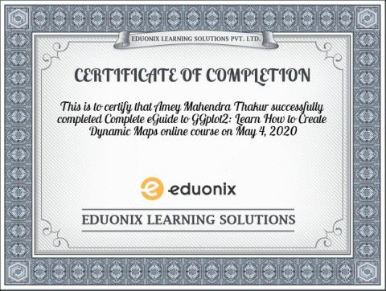 | **Complete eGuide to GGplot2 Learn How to Create Dynamic Maps** | [Certificate](https://github.com/Amey-Thakur/ACHIEVEMENTS/blob/main/Eduonix/Eduonix%20Complete%20eGuide%20to%20GGplot2%20Learn%20How%20to%20Create%20Dynamic%20Maps.pdf) | [Verify](https://www.eduonix.com/certificate/7229d8998f) |
| 16 | 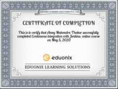 | **Continuous integration with Jenkins** | [Certificate](https://github.com/Amey-Thakur/ACHIEVEMENTS/blob/main/Eduonix/Eduonix%20Continuous%20integration%20with%20Jenkins.pdf) | [Verify](https://www.eduonix.com/certificate/f922c9a7b8) |
| 17 |  | **Create a jQuery Mobile App** | [Certificate](https://github.com/Amey-Thakur/ACHIEVEMENTS/blob/main/Eduonix/Eduonix%20Create%20a%20jQuery%20Mobile%20App.pdf) | [Verify](https://www.eduonix.com/certificate/ae40344e67) |
| 18 | 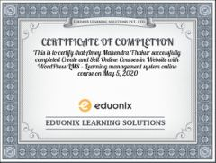 | **Create and Sell Online Courses in Website with WordPress LMS - Learning management system** | [Certificate](https://github.com/Amey-Thakur/ACHIEVEMENTS/blob/main/Eduonix/Eduonix%20Create%20and%20Sell%20Online%20Courses%20in%20Website%20with%20WordPress%20LMS%20-%20Learning%20management%20system.pdf) | [Verify](https://www.eduonix.com/certificate/e549cf6cb5) |
| 19 | 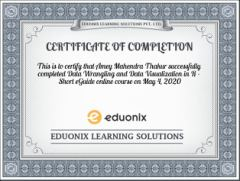 | **Data Wrangling and Data Visualization in R - Short eGuide** | [Certificate](https://github.com/Amey-Thakur/ACHIEVEMENTS/blob/main/Eduonix/Eduonix%20Data%20Wrangling%20and%20Data%20Visualization%20in%20R%20-%20Short%20eGuide.pdf) | [Verify](https://www.eduonix.com/certificate/5df424ff38) |
| 20 |  | **Design a Portfolio Gallery using jQuery** | [Certificate](https://github.com/Amey-Thakur/ACHIEVEMENTS/blob/main/Eduonix/Eduonix%20Design%20a%20Portfolio%20Gallery%20using%20jQuery.pdf) | [Verify](https://www.eduonix.com/certificate/5a53a1b078) |
| 21 |  | **Google Remarketing: Learn To Retarget Your Customers** | [Certificate](https://github.com/Amey-Thakur/ACHIEVEMENTS/blob/main/Eduonix/Eduonix%20Google%20Remarketing%20Learn%20To%20Retarget%20Your%20Customers.pdf) | [Verify](https://www.eduonix.com/certificate/2c7ddc8f43) |
| 22 | 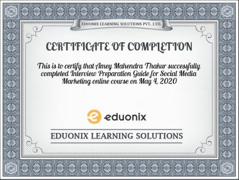 | **Interview Preparation Guide for Social Media Marketing** | [Certificate](https://github.com/Amey-Thakur/ACHIEVEMENTS/blob/main/Eduonix/Eduonix%20Interview%20Preparation%20Guide%20for%20Social%20Media%20Marketing.pdf) | [Verify](https://www.eduonix.com/certificate/811979785f) |
| 23 | 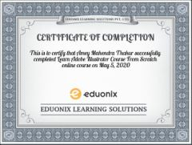 | **Learn Adobe Illustrator Course From Scratch** | [Certificate](https://github.com/Amey-Thakur/ACHIEVEMENTS/blob/main/Eduonix/Eduonix%20Learn%20Adobe%20Illustrator%20Course%20From%20Scratch.pdf) | [Verify](https://www.eduonix.com/certificate/4384788684) |
| 24 |  | **Learn Apache Cassandra from Scratch** | [Certificate](https://github.com/Amey-Thakur/ACHIEVEMENTS/blob/main/Eduonix/Eduonix%20Learn%20Apache%20Cassandra%20from%20Scratch.pdf) | [Verify](https://www.eduonix.com/certificate/1d5a51daaf) |
| 25 | 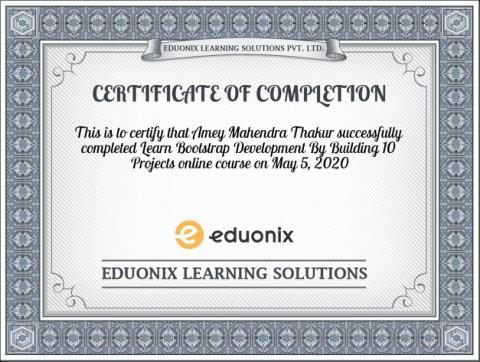 | **Learn Bootstrap Development By Building 10 Projects** | [Certificate](https://github.com/Amey-Thakur/ACHIEVEMENTS/blob/main/Eduonix/Eduonix%20Learn%20Bootstrap%20Development%20By%20Building%2010%20Projects.pdf) | [Verify](https://www.eduonix.com/certificate/ac671225dc) |
| 26 |  | **Learn C Sharp Programming From Scratch** | [Certificate](https://github.com/Amey-Thakur/ACHIEVEMENTS/blob/main/Eduonix/Eduonix%20Learn%20C%20Sharp%20Programming%20From%20Scratch.pdf) | [Verify](https://www.eduonix.com/certificate/e9436f5e9a) |
| 27 | 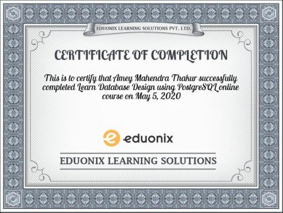 | **Learn Database Design using PostgreSQL** | [Certificate](https://github.com/Amey-Thakur/ACHIEVEMENTS/blob/main/Eduonix/Eduonix%20Learn%20Database%20Design%20using%20PostgreSQL.pdf) | [Verify](https://www.eduonix.com/certificate/7b0ea545ba) |
| 28 |  | **Learn Django and Python Development By Building Projects** | [Certificate](https://github.com/Amey-Thakur/ACHIEVEMENTS/blob/main/Eduonix/Eduonix%20Learn%20Django%20and%20Python%20Development%20By%20Building%20Projects.pdf) | [Verify](https://www.eduonix.com/certificate/f1abdc6dad) |
| 29 | 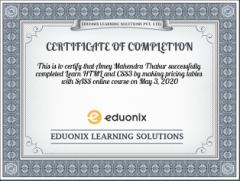 | **Learn HTML and CSS3 by making pricing tables with SASS** | [Certificate](https://github.com/Amey-Thakur/ACHIEVEMENTS/blob/main/Eduonix/Eduonix%20Learn%20HTML%20and%20CSS3%20by%20making%20pricing%20tables%20with%20SASS.pdf) | [Verify](https://www.eduonix.com/certificate/90cb768f91) |
| 30 |  | **Learn HTML and CSS3 with an animated bootstrap template** | [Certificate](https://github.com/Amey-Thakur/ACHIEVEMENTS/blob/main/Eduonix/Eduonix%20Learn%20HTML%20and%20CSS3%20with%20an%20animated%20bootstrap%20template.pdf) | [Verify](https://www.eduonix.com/certificate/74fafff83e) |
| 31 | 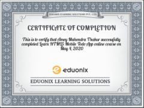 | **Learn HTML5 Mobile Todo App** | [Certificate](https://github.com/Amey-Thakur/ACHIEVEMENTS/blob/main/Eduonix/Eduonix%20Learn%20HTML5%20Mobile%20Todo%20App.pdf) | [Verify](https://www.eduonix.com/certificate/7d73383d43) |
| 32 |  | **Learn HTML5 Quiz Application** | [Certificate](https://github.com/Amey-Thakur/ACHIEVEMENTS/blob/main/Eduonix/Eduonix%20Learn%20HTML5%20Quiz%20Application.pdf) | [Verify](https://www.eduonix.com/certificate/0cae55e157) |
| 33 |  | **Learn How To Optimize Your Google My Business Page In 2018** | [Certificate](https://github.com/Amey-Thakur/ACHIEVEMENTS/blob/main/Eduonix/Eduonix%20Learn%20How%20To%20Optimize%20Your%20Google%20My%20Business%20Page%20In%202018.pdf) | [Verify](https://www.eduonix.com/certificate/65c81e7aea) |
| 34 |  | **Learn How to Build Ecommerce Website From Scratch** | [Certificate](https://github.com/Amey-Thakur/ACHIEVEMENTS/blob/main/Eduonix/Eduonix%20Learn%20How%20to%20Build%20Ecommerce%20Website%20From%20Scratch.pdf) | [Verify](https://www.eduonix.com/certificate/4e3c342c9d) |
| 35 |  | **Learn How to Build a Game Using Java** | [Certificate](https://github.com/Amey-Thakur/ACHIEVEMENTS/blob/main/Eduonix/Eduonix%20Learn%20How%20to%20Build%20a%20Game%20Using%20Java.pdf) | [Verify](https://www.eduonix.com/certificate/cefaab9b80) |
| 36 | 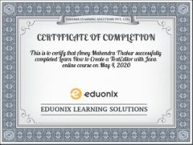 | **Learn How to Create a TextEditor with Java** | [Certificate](https://github.com/Amey-Thakur/ACHIEVEMENTS/blob/main/Eduonix/Eduonix%20Learn%20How%20to%20Create%20a%20TextEditor%20with%20Java.pdf) | [Verify](https://www.eduonix.com/certificate/26da0dd9cd) |
| 37 | 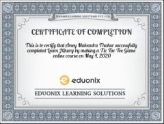 | **Learn JQuery by making a Tic Tac Toe Game** | [Certificate](https://github.com/Amey-Thakur/ACHIEVEMENTS/blob/main/Eduonix/Eduonix%20Learn%20JQuery%20by%20making%20a%20Tic%20Tac%20Toe%20Game.pdf) | [Verify](https://www.eduonix.com/certificate/9a7d17973c) |
| 38 |  | **Learn JavaScript By Building a Simple Quiz** | [Certificate](https://github.com/Amey-Thakur/ACHIEVEMENTS/blob/main/Eduonix/Eduonix%20Learn%20JavaScript%20By%20Building%20a%20Simple%20Quiz.pdf) | [Verify](https://www.eduonix.com/certificate/90bdcd0534) |
| 39 |  | **Learn Javascript And JQuery From Scratch** | [Certificate](https://github.com/Amey-Thakur/ACHIEVEMENTS/blob/main/Eduonix/Eduonix%20Learn%20Javascript%20And%20JQuery%20From%20Scratch.pdf) | [Verify](https://www.eduonix.com/certificate/b233ad3902) |
| 40 |  | **Learn MEAN Stack By Building A ToDo App** | [Certificate](https://github.com/Amey-Thakur/ACHIEVEMENTS/blob/main/Eduonix/Eduonix%20Learn%20MEAN%20Stack%20By%20Building%20A%20ToDo%20App.pdf) | [Verify](https://www.eduonix.com/certificate/f275d718f1) |
| 41 | 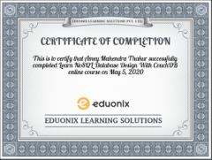 | **Learn NoSQL Database Design With CouchDB** | [Certificate](https://github.com/Amey-Thakur/ACHIEVEMENTS/blob/main/Eduonix/Eduonix%20Learn%20NoSQL%20Database%20Design%20With%20CouchDB.pdf) | [Verify](https://www.eduonix.com/certificate/bf556676be) |
| 42 |  | **Learn Object Oriented PHP By Building a Complete Website** | [Certificate](https://github.com/Amey-Thakur/ACHIEVEMENTS/blob/main/Eduonix/Eduonix%20Learn%20Object%20Oriented%20PHP%20By%20Building%20a%20Complete%20Website.pdf) | [Verify](https://www.eduonix.com/certificate/5ed2aa32dd) |
| 43 | 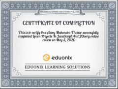 | **Learn Projects In JavaScript And JQuery** | [Certificate](https://github.com/Amey-Thakur/ACHIEVEMENTS/blob/main/Eduonix/Eduonix%20Learn%20Projects%20In%20JavaScript%20And%20JQuery.pdf) | [Verify](https://www.eduonix.com/certificate/3ac168b6d5) |
| 44 |  | **Learn Python programming From Scratch** | [Certificate](https://github.com/Amey-Thakur/ACHIEVEMENTS/blob/main/Eduonix/Eduonix%20Learn%20Python%20programming%20From%20Scratch.pdf) | [Verify](https://www.eduonix.com/certificate/7447af391c) |
| 45 | 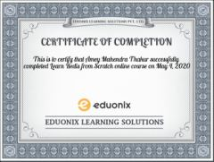 | **Learn Redis from Scratch** | [Certificate](https://github.com/Amey-Thakur/ACHIEVEMENTS/blob/main/Eduonix/Eduonix%20Learn%20Redis%20from%20Scratch.pdf) | [Verify](https://www.eduonix.com/certificate/b472f31b8b) |
| 46 |  | **Learn Socket Programming Tutorial in C from Scratch** | [Certificate](https://github.com/Amey-Thakur/ACHIEVEMENTS/blob/main/Eduonix/Eduonix%20Learn%20Socket%20Programming%20Tutorial%20in%20C%20from%20Scratch.pdf) | [Verify](https://www.eduonix.com/certificate/892b98ce14) |
| 47 | 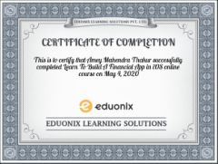 | **Learn To Build A Financial App in iOS** | [Certificate](https://github.com/Amey-Thakur/ACHIEVEMENTS/blob/main/Eduonix/Eduonix%20Learn%20To%20Build%20A%20Financial%20App%20in%20iOS.pdf) | [Verify](https://www.eduonix.com/certificate/78c37a357e) |
| 48 |  | **Learn To Build A Google Map App Using Angular 2** | [Certificate](https://github.com/Amey-Thakur/ACHIEVEMENTS/blob/main/Eduonix/Eduonix%20Learn%20To%20Build%20A%20Google%20Map%20App%20Using%20Angular%202.pdf) | [Verify](https://www.eduonix.com/certificate/e07ebe9e04) |
| 49 |  | **Learn To Build A User Login System Using NodeJS** | [Certificate](https://github.com/Amey-Thakur/ACHIEVEMENTS/blob/main/Eduonix/Eduonix%20Learn%20To%20Build%20A%20User%20Login%20System%20Using%20NodeJS.pdf) | [Verify](https://www.eduonix.com/certificate/4ed0002586) |
| 50 | 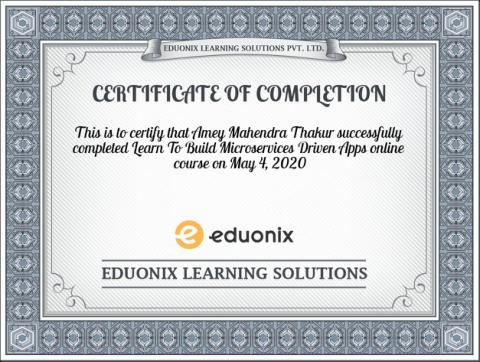 | **Learn To Build Microservices Driven Apps** | [Certificate](https://github.com/Amey-Thakur/ACHIEVEMENTS/blob/main/Eduonix/Eduonix%20Learn%20To%20Build%20Microservices%20Driven%20Apps.pdf) | [Verify](https://www.eduonix.com/certificate/fa80cf0235) |
| 51 |  | **Learn To Build WordPress Plugins By Creating A Movie Plugin** | [Certificate](https://github.com/Amey-Thakur/ACHIEVEMENTS/blob/main/Eduonix/Eduonix%20Learn%20To%20Build%20WordPress%20Plugins%20By%20Creating%20A%20Movie%20Plugin.pdf) | [Verify](https://www.eduonix.com/certificate/27992ee2df) |
| 52 |  | **Learn To Build Your First Professional iOS App** | [Certificate](https://github.com/Amey-Thakur/ACHIEVEMENTS/blob/main/Eduonix/Eduonix%20Learn%20To%20Build%20Your%20First%20Professional%20iOS%20App.pdf) | [Verify](https://www.eduonix.com/certificate/24091f87a2) |
| 53 | 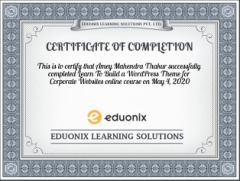 | **Learn To Build a WordPress Theme for Corporate Websites** | [Certificate](https://github.com/Amey-Thakur/ACHIEVEMENTS/blob/main/Eduonix/Eduonix%20Learn%20To%20Build%20a%20WordPress%20Theme%20for%20Corporate%20Websites.pdf) | [Verify](https://www.eduonix.com/certificate/b60e51ed9b) |
| 54 |  | **Learn Top Ten Frameworks In PHP By Building Projects** | [Certificate](https://github.com/Amey-Thakur/ACHIEVEMENTS/blob/main/Eduonix/Eduonix%20Learn%20Top%20Ten%20Frameworks%20In%20PHP%20By%20Building%20Projects.pdf) | [Verify](https://www.eduonix.com/certificate/151e2e45b2) |
| 55 |  | **Learn how to make a pure CSS3 image Slider** | [Certificate](https://github.com/Amey-Thakur/ACHIEVEMENTS/blob/main/Eduonix/Eduonix%20Learn%20how%20to%20make%20a%20pure%20CSS3%20image%20Slider.pdf) | [Verify](https://www.eduonix.com/certificate/2ba67f9251) |
| 56 | 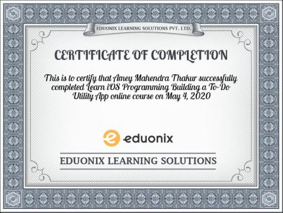 | **Learn iOS Programming Building a To-Do Utility App** | [Certificate](https://github.com/Amey-Thakur/ACHIEVEMENTS/blob/main/Eduonix/Eduonix%20Learn%20iOS%20Programming%20Building%20a%20To-Do%20Utility%20App.pdf) | [Verify](https://www.eduonix.com/certificate/bbba58568a) |
| 57 |  | **Learn jQuery Ajax and PHP by creating a Shoutbox application** | [Certificate](https://github.com/Amey-Thakur/ACHIEVEMENTS/blob/main/Eduonix/Eduonix%20Learn%20jQuery%20Ajax%20and%20PHP%20by%20creating%20a%20Shoutbox%20application.pdf) | [Verify](https://www.eduonix.com/certificate/3670b2229d) |
| 58 |  | **Learn jQuery and JavaScript by creating an apple style thumb Slider** | [Certificate](https://github.com/Amey-Thakur/ACHIEVEMENTS/blob/main/Eduonix/Eduonix%20Learn%20jQuery%20and%20JavaScript%20by%20creating%20an%20apple%20style%20thumb%20Slider.pdf) | [Verify](https://www.eduonix.com/certificate/7df41cb551) |
| 59 |  | **Learn jQuery by making a Content Slider** | [Certificate](https://github.com/Amey-Thakur/ACHIEVEMENTS/blob/main/Eduonix/Eduonix%20Learn%20jQuery%20by%20making%20a%20Content%20Slider.pdf) | [Verify](https://www.eduonix.com/certificate/789dbefb9f) |
| 60 |  | **Learn jQuery by making a complete jQuery Plugin** | [Certificate](https://github.com/Amey-Thakur/ACHIEVEMENTS/blob/main/Eduonix/Eduonix%20Learn%20jQuery%20by%20making%20a%20complete%20jQuery%20Plugin.pdf) | [Verify](https://www.eduonix.com/certificate/33df73ff71) |
| 61 | 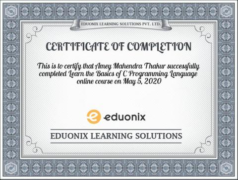 | **Learn the Basics of C Programming Language** | [Certificate](https://github.com/Amey-Thakur/ACHIEVEMENTS/blob/main/Eduonix/Eduonix%20Learn%20the%20Basics%20of%20C%20Programming%20Language.pdf) | [Verify](https://www.eduonix.com/certificate/794ff1eec4) |
| 62 |  | **Learn to Build Apps Using Neo4J** | [Certificate](https://github.com/Amey-Thakur/ACHIEVEMENTS/blob/main/Eduonix/Eduonix%20Learn%20to%20Build%20Apps%20Using%20Neo4J.pdf) | [Verify](https://www.eduonix.com/certificate/ec34bfc091) |
| 63 |  | **Learn to Build Mobile Games using Unity3D** | [Certificate](https://github.com/Amey-Thakur/ACHIEVEMENTS/blob/main/Eduonix/Eduonix%20Learn%20to%20Build%20Mobile%20Games%20using%20Unity3D.pdf) | [Verify](https://www.eduonix.com/certificate/0e939111f1) |
| 64 | 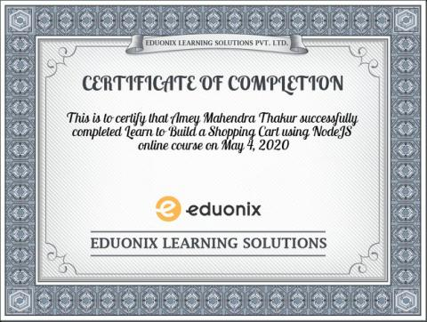 | **Learn to Build a Shopping Cart using NodeJS** | [Certificate](https://github.com/Amey-Thakur/ACHIEVEMENTS/blob/main/Eduonix/Eduonix%20Learn%20to%20Build%20a%20Shopping%20Cart%20using%20NodeJS.pdf) | [Verify](https://www.eduonix.com/certificate/91084fbcac) |
| 65 | 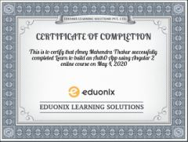 | **Learn to build an Auth0 App using Angular 2** | [Certificate](https://github.com/Amey-Thakur/ACHIEVEMENTS/blob/main/Eduonix/Eduonix%20Learn%20to%20build%20an%20Auth0%20App%20using%20Angular%202.pdf) | [Verify](https://www.eduonix.com/certificate/d8cde11c20) |
| 66 |  | **Learn to create a jQuery Accordion Slider** | [Certificate](https://github.com/Amey-Thakur/ACHIEVEMENTS/blob/main/Eduonix/Eduonix%20Learn%20to%20create%20a%20jQuery%20Accordion%20Slider.pdf) | [Verify](https://www.eduonix.com/certificate/a650ae82f7) |
| 67 | 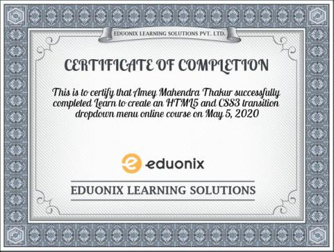 | **Learn to create an HTML5 and CSS3 transition dropdown menu** | [Certificate](https://github.com/Amey-Thakur/ACHIEVEMENTS/blob/main/Eduonix/Eduonix%20Learn%20to%20create%20an%20HTML5%20and%20CSS3%20transition%20dropdown%20menu.pdf) | [Verify](https://www.eduonix.com/certificate/f23840c51b) |
| 68 | 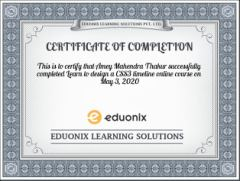 | **Learn to design a CSS3 timeline** | [Certificate](https://github.com/Amey-Thakur/ACHIEVEMENTS/blob/main/Eduonix/Eduonix%20Learn%20to%20design%20a%20CSS3%20timeline.pdf) | [Verify](https://www.eduonix.com/certificate/c7171f8905) |
| 69 |  | **Learn to design an animated car using HTML and CSS3** | [Certificate](https://github.com/Amey-Thakur/ACHIEVEMENTS/blob/main/Eduonix/Eduonix%20Learn%20to%20design%20an%20animated%20car%20using%20HTML%20and%20CSS3.pdf) | [Verify](https://www.eduonix.com/certificate/c1ed17c29d) |
| 70 |  | **Learn to make a functional CSS3 image gallery** | [Certificate](https://github.com/Amey-Thakur/ACHIEVEMENTS/blob/main/Eduonix/Eduonix%20Learn%20to%20make%20a%20functional%20CSS3%20image%20gallery.pdf) | [Verify](https://www.eduonix.com/certificate/b5024ef655) |
| 71 | 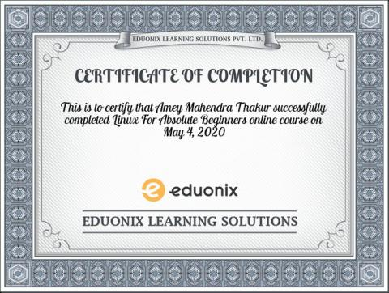 | **Linux For Absolute Beginners** | [Certificate](https://github.com/Amey-Thakur/ACHIEVEMENTS/blob/main/Eduonix/Eduonix%20Linux%20For%20Absolute%20Beginners.pdf) | [Verify](https://www.eduonix.com/certificate/d633515a2c) |
| 72 |  | **Logo Design Course for Beginners** | [Certificate](https://github.com/Amey-Thakur/ACHIEVEMENTS/blob/main/Eduonix/Eduonix%20Logo%20Design%20Course%20for%20Beginners.pdf) | [Verify](https://www.eduonix.com/certificate/9a466c9afc) |
| 73 |  | **Quick and Easy Guide to Microsoft Word** | [Certificate](https://github.com/Amey-Thakur/ACHIEVEMENTS/blob/main/Eduonix/Eduonix%20Quick%20and%20Easy%20Guide%20to%20Microsoft%20Word.pdf) | [Verify](https://www.eduonix.com/certificate/aea4e4a553) |
| 74 |  | **Quick eGuide to Learn Exploratory Data Analysis in R** | [Certificate](https://github.com/Amey-Thakur/ACHIEVEMENTS/blob/main/Eduonix/Eduonix%20Quick%20eGuide%20to%20Learn%20Exploratory%20Data%20Analysis%20in%20R.pdf) | [Verify](https://www.eduonix.com/certificate/31e5c82352) |
| 75 |  | **Reactjs Interview Practice Guide** | [Certificate](https://github.com/Amey-Thakur/ACHIEVEMENTS/blob/main/Eduonix/Eduonix%20Reactjs%20Interview%20Practice%20Guide.pdf) | [Verify](https://www.eduonix.com/certificate/3b5de72b7f) |
| 76 |  | **Running webinars on a shoestring** | [Certificate](https://github.com/Amey-Thakur/ACHIEVEMENTS/blob/main/Eduonix/Eduonix%20Running%20webinars%20on%20a%20shoestring.pdf) | [Verify](https://www.eduonix.com/certificate/f8f3811208) |
| 77 | 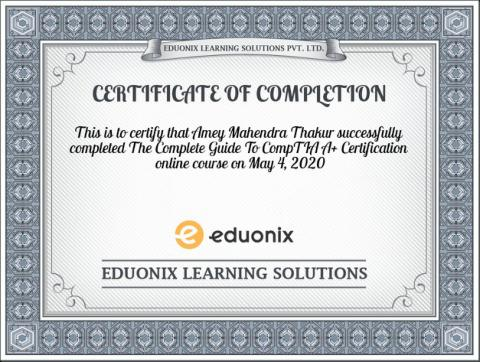 | **The Complete Guide To CompTIA A+ Certification** | [Certificate](https://github.com/Amey-Thakur/ACHIEVEMENTS/blob/main/Eduonix/Eduonix%20The%20Complete%20Guide%20To%20CompTIA%20A+%20Certification.pdf) | [Verify](https://www.eduonix.com/certificate/9a1cbc46cc) |
| 78 |  | **The Developers Guide to Python 3 Programming** | [Certificate](https://github.com/Amey-Thakur/ACHIEVEMENTS/blob/main/Eduonix/Eduonix%20The%20Developers%20Guide%20to%20Python%203%20Programming.pdf) | [Verify](https://www.eduonix.com/certificate/517565d9b6) |
| 79 |  | **The Ultimate Guide to RHCSA Certification Exam** | [Certificate](https://github.com/Amey-Thakur/ACHIEVEMENTS/blob/main/Eduonix/Eduonix%20The%20Ultimate%20Guide%20to%20RHCSA%20Certification%20Exam.pdf) | [Verify](https://www.eduonix.com/certificate/42eb935254) |
| 80 | 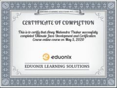 | **Ultimate Java Development and Certification Course** | [Certificate](https://github.com/Amey-Thakur/ACHIEVEMENTS/blob/main/Eduonix/Eduonix%20Ultimate%20Java%20Development%20and%20Certification%20Course.pdf) | [Verify](https://www.eduonix.com/certificate/ab101c57cf) |
| 81 |  | **WordPress Plugin Development - Build A Facebook Footer Link** | [Certificate](https://github.com/Amey-Thakur/ACHIEVEMENTS/blob/main/Eduonix/Eduonix%20WordPress%20Plugin%20Development%20-%20Build%20A%20Facebook%20Footer%20Link.pdf) | [Verify](https://www.eduonix.com/certificate/528674af69) |
| 82 |  | **Youtube An Advance Guide For A Successful Youtube Channel** | [Certificate](https://github.com/Amey-Thakur/ACHIEVEMENTS/blob/main/Eduonix/Eduonix%20Youtube%20An%20Advance%20Guide%20For%20A%20Successful%20Youtube%20Channel.pdf) | [Verify](https://www.eduonix.com/certificate/aca055a6ac) |
| 83 |  | **Youtube Beginners Guide To A Successful Channel** | [Certificate](https://github.com/Amey-Thakur/ACHIEVEMENTS/blob/main/Eduonix/Eduonix%20Youtube%20Beginners%20Guide%20To%20A%20Successful%20Channel.pdf) | [Verify](https://www.eduonix.com/certificate/4fe415d16c) |
| 84 | 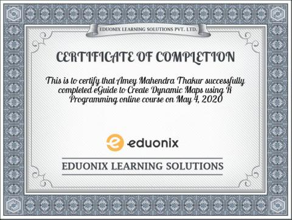 | **eGuide to Create Dynamic Maps using R Programming** | [Certificate](https://github.com/Amey-Thakur/ACHIEVEMENTS/blob/main/Eduonix/Eduonix%20eGuide%20to%20Create%20Dynamic%20Maps%20using%20R%20Programming.pdf) | [Verify](https://www.eduonix.com/certificate/12e0adab0e) |

---

### Engineering

🎓 <b>Foundational Baccalaureate Studies and Applied Engineering Research</b> 🎓

### [Bachelor of Engineering (B.E.) · Computer Engineering](https://github.com/Amey-Thakur/COMPUTER-ENGINEERING)

**University of Mumbai** · Affiliated Institute **Terna Engineering College**
*Duration: 2018 — 2022*

> [!TIP]
> An archival record of academic coursework, laboratory implementations, and applied research projects completed during the four-year baccalaureate program at Terna Engineering College. Each subject is mapped to its dedicated technical repository for scholarly verification and reference.

##### Semester I

| Code | Course Title | Repository | Project |
|:----:|:-------------|:----------:|:-------:|
| FEC101 | **Applied Mathematics - I** | — | — |
| FEC102 | **Applied Physics - I** | — | — |
| FEC103 | **Applied Chemistry - I** | — | — |
| FEC104 | **Engineering Mechanics** | — | — |
| FEC105 | **Basic Electrical Engineering** | — | — |
| FEC106 | **Environmental Studies** | — | — |
| FEL101 | **Basic Workshop Practice - I** | — | — |

##### Semester II

| Code | Course Title | Repository | Project |
|:----:|:-------------|:----------:|:-------:|
| FEC201 | **Applied Mathematics - II** | — | — |
| FEC202 | **Applied Physics - II** | — | — |
| FEC203 | **Applied Chemistry - II** | — | — |
| FEC204 | **Engineering Drawing** | — | — |
| FEC205 | **Structured Programming Approach** | — | — |
| FEC206 | **Communication Skills** | — | — |
| FEL201 | **Basic Workshop Practice - II** | — | — |

##### Semester III

| Code | Course Title | Repository | Project |
|:----:|:-------------|:----------:|:-------:|
| CSC301 | **Applied Mathematics - III** | [Course](https://github.com/Amey-Thakur/APPLIED-MATHEMATICS-III) | — |
| CSC302 | **Digital Logic Design and Analysis** | [Course](https://github.com/Amey-Thakur/DIGITAL-LOGIC-DESIGN-AND-ANALYSIS-AND-DIGITAL-SYSTEM-LAB) | — |
| CSC303 | **Discrete Mathematics** | [Course](https://github.com/Amey-Thakur/DISCRETE-MATHEMATICS) | — |
| CSC304 | **Electronic Circuits and Communication Fundamentals** | [Course](https://github.com/Amey-Thakur/ELECTRONIC-CIRCUITS-AND-COMMUNICATION-FUNDAMENTALS-AND-BASIC-ELECTRONICS-LAB) | — |
| CSC305 | **Data Structures** | [Course](https://github.com/Amey-Thakur/DATA-STRUCTURES-AND-DATA-STRUCTURES-LAB) | — |
| CSL301 | **Digital System Lab** | [Lab](https://github.com/Amey-Thakur/DIGITAL-LOGIC-DESIGN-AND-ANALYSIS-AND-DIGITAL-SYSTEM-LAB) | — |
| CSL302 | **Basic Electronics Lab** | [Lab](https://github.com/Amey-Thakur/ELECTRONIC-CIRCUITS-AND-COMMUNICATION-FUNDAMENTALS-AND-BASIC-ELECTRONICS-LAB) | — |
| CSL303 | **Data Structure Lab** | [Lab](https://github.com/Amey-Thakur/DATA-STRUCTURES-AND-DATA-STRUCTURES-LAB) | — |
| CSL304 | **OOPM (Java) Lab** | [Lab](https://github.com/Amey-Thakur/OOPM-JAVA-LAB) | [Hangman Word Game](https://github.com/Amey-Thakur/HANGMAN-WORD-GAME) |

##### Semester IV

| Code | Course Title | Repository | Project |
|:----:|:-------------|:----------:|:-------:|
| CSC401 | **Applied Mathematics - IV** | [Course](https://github.com/Amey-Thakur/APPLIED-MATHEMATICS-IV) | — |
| CSC402 | **Analysis of Algorithm** | [Course](https://github.com/Amey-Thakur/ANALYSIS-OF-ALGORITHM-AND-ANALYSIS-OF-ALGORITHM-LAB) | — |
| CSC403 | **Computer Organization and Architecture** | [Course](https://github.com/Amey-Thakur/COMPUTER-ORGANIZATION-AND-ARCHITECTURE-AND-PROCESSOR-ARCHITECTURE-LAB) | — |
| CSC404 | **Computer Graphics** | [Course](https://github.com/Amey-Thakur/COMPUTER-GRAPHICS-AND-COMPUTER-GRAPHICS-LAB) | — |
| CSC405 | **Operating System** | [Course](https://github.com/Amey-Thakur/OPERATING-SYSTEM-AND-OPERATING-SYSTEM-LAB) | — |
| CSL401 | **Analysis of Algorithms Lab** | [Lab](https://github.com/Amey-Thakur/ANALYSIS-OF-ALGORITHM-AND-ANALYSIS-OF-ALGORITHM-LAB) | — |
| CSL402 | **Computer Graphics Lab** | [Lab](https://github.com/Amey-Thakur/COMPUTER-GRAPHICS-AND-COMPUTER-GRAPHICS-LAB) | [AR Stack Game](https://github.com/Amey-Thakur/AR-STACK-GAME) |
| CSL403 | **Processor Architecture Lab** | [Lab](https://github.com/Amey-Thakur/COMPUTER-ORGANIZATION-AND-ARCHITECTURE-AND-PROCESSOR-ARCHITECTURE-LAB) | — |
| CSL404 | **Operating System Lab** | [Lab](https://github.com/Amey-Thakur/OPERATING-SYSTEM-AND-OPERATING-SYSTEM-LAB) | [Interest Calculator](https://github.com/Amey-Thakur/SIMPLE-AND-COMPOUND-INTEREST-CALCULATOR) |
| CSL405 | **Open Source Tech Lab** | [Lab](https://github.com/Amey-Thakur/OPEN-SOURCE-TECH-LAB) | [COVID-19 Web Scraper](https://github.com/Amey-Thakur/COVID19-WEB-SCRAPER) |

##### Semester V

| Code | Course Title | Repository | Project |
|:----:|:-------------|:----------:|:-------:|
| CSC501 | **Microprocessor** | [Course](https://github.com/Amey-Thakur/MICROPROCESSOR-AND-MICROPROCESSOR-LAB) | — |
| CSC502 | **Database Management System** | [Course](https://github.com/Amey-Thakur/DATABASE-MANAGEMENT-SYSTEM-AND-DATABASE-MANAGEMENT-SYSTEM-LAB) | — |
| CSC503 | **Computer Network** | [Course](https://github.com/Amey-Thakur/COMPUTER-NETWORK-AND-COMPUTER-NETWORK-LAB) | — |
| CSC504 | **Theory of Computer Science** | [Course](https://github.com/Amey-Thakur/THEORY-OF-COMPUTER-SCIENCE) | — |
| CSDLO5011 | **Multimedia System** | [Course](https://github.com/Amey-Thakur/MULTIMEDIA-SYSTEM) | — |
| CSL501 | **Microprocessor Lab** | [Lab](https://github.com/Amey-Thakur/MICROPROCESSOR-AND-MICROPROCESSOR-LAB) | [8086 ASM](https://github.com/Amey-Thakur/8086-ASSEMBLY-LANGUAGE-PROGRAMS) |
| CSL502 | **Computer Network Lab** | [Lab](https://github.com/Amey-Thakur/COMPUTER-NETWORK-AND-COMPUTER-NETWORK-LAB) | — |
| CSL503 | **Database Management System Lab** | [Lab](https://github.com/Amey-Thakur/DATABASE-MANAGEMENT-SYSTEM-AND-DATABASE-MANAGEMENT-SYSTEM-LAB) | [Car Rental System](https://github.com/Amey-Thakur/CAR-RENTAL-SYSTEM) |
| CSL504 | **Web Design Lab** | [Lab](https://github.com/Amey-Thakur/WEB-DESIGNING-LAB) | [Chat Room](https://github.com/Amey-Thakur/CHAT-ROOM) |
| CSL505 | **Business Communication & Ethics** | [Course](https://github.com/Amey-Thakur/BUSINESS-COMMUNICATION-AND-ETHICS) | — |

##### Semester VI

| Code | Course Title | Repository | Project |
|:----:|:-------------|:----------:|:-------:|
| CSC601 | **Software Engineering** | [Course](https://github.com/Amey-Thakur/SOFTWARE-ENGINEERING-AND-SOFTWARE-ENGINEERING-LAB) | — |
| CSC602 | **System Programming and Compiler Construction** | [Course](https://github.com/Amey-Thakur/SYSTEM-PROGRAMMING-AND-COMPILER-CONSTRUCTION-AND-SYSTEM-SOFTWARE-LAB) | — |
| CSC603 | **Data Warehousing and Mining** | [Course](https://github.com/Amey-Thakur/DATA-WAREHOUSING-AND-MINING-AND-DATA-WAREHOUSING-AND-MINING-LAB) | — |
| CSC604 | **Cryptography and System Security** | [Course](https://github.com/Amey-Thakur/CRYPTOGRAPHY-AND-SYSTEM-SECURITY-AND-SYSTEM-SECURITY-LAB) | — |
| CSDLO6021 | **Machine Learning** | [Course](https://github.com/Amey-Thakur/MACHINE-LEARNING) | — |
| CSL601 | **Software Engineering Lab** | [Lab](https://github.com/Amey-Thakur/SOFTWARE-ENGINEERING-AND-SOFTWARE-ENGINEERING-LAB) | [Digital Bookstore](https://github.com/Amey-Thakur/DIGITAL-BOOKSTORE) |
| CSL602 | **System Software Lab** | [Lab](https://github.com/Amey-Thakur/SYSTEM-PROGRAMMING-AND-COMPILER-CONSTRUCTION-AND-SYSTEM-SOFTWARE-LAB) | — |
| CSL603 | **Data Warehousing and Mining Lab** | [Lab](https://github.com/Amey-Thakur/DATA-WAREHOUSING-AND-MINING-AND-DATA-WAREHOUSING-AND-MINING-LAB) | — |
| CSL604 | **System Security Lab** | [Lab](https://github.com/Amey-Thakur/CRYPTOGRAPHY-AND-SYSTEM-SECURITY-AND-SYSTEM-SECURITY-LAB) | — |
| CSM605 | **Mini-Project** | — | [White-Box Cartoonization](https://github.com/Amey-Thakur/WHITE-BOX-CARTOONIZATION) |

##### Semester VII

| Code | Course Title | Repository | Project |
|:----:|:-------------|:----------:|:-------:|
| CSC701 | **Digital Signal and Image Processing** | [Course](https://github.com/Amey-Thakur/DIGITAL-SIGNAL-AND-IMAGE-PROCESSING-AND-DIGITAL-SIGNAL-AND-IMAGE-PROCESSING-LAB) | — |
| CSC702 | **Mobile Communication and Computing** | [Course](https://github.com/Amey-Thakur/MOBILE-COMMUNICATION-AND-COMPUTING-AND-MOBILE-APPLICATION-DEVELOPMENT-LAB) | — |
| CSC703 | **Artificial Intelligence and Soft Computing** | [Course](https://github.com/Amey-Thakur/ARTIFICIAL-INTELLIGENCE-AND-SOFT-COMPUTING-AND-ARTIFICIAL-INTELLIGENCE-AND-SOFT-COMPUTING-LAB) | — |
| CSDLO7032 | **Big Data Analytics** | [Course](https://github.com/Amey-Thakur/BIG-DATA-ANALYTICS-AND-COMPUTATIONAL-LAB-I) | — |
| ILO7013 | **Management Information System** | [Course](https://github.com/Amey-Thakur/MANAGEMENT-INFORMATION-SYSTEM) | — |
| CSL701 | **Digital Signal and Image Processing Lab** | [Lab](https://github.com/Amey-Thakur/DIGITAL-SIGNAL-AND-IMAGE-PROCESSING-AND-DIGITAL-SIGNAL-AND-IMAGE-PROCESSING-LAB) | — |
| CSL702 | **Mobile Application Development Lab** | [Lab](https://github.com/Amey-Thakur/MOBILE-COMMUNICATION-AND-COMPUTING-AND-MOBILE-APPLICATION-DEVELOPMENT-LAB) | — |
| CSL703 | **Artificial Intelligence and Soft Computing Lab** | [Lab](https://github.com/Amey-Thakur/ARTIFICIAL-INTELLIGENCE-AND-SOFT-COMPUTING-AND-ARTIFICIAL-INTELLIGENCE-AND-SOFT-COMPUTING-LAB) | — |
| CSL704 | **Computational Lab - I** | [Lab](https://github.com/Amey-Thakur/BIG-DATA-ANALYTICS-AND-COMPUTATIONAL-LAB-I) | [K-Means Stock Trading](https://github.com/Amey-Thakur/OPTIMIZING-STOCK-TRADING-STRATEGY-WITH-K-MEANS-CLUSTERING) |
| CSP705 | **Major Project - I** | — | [Quadtree Visualizer](https://github.com/Amey-Thakur/QUADTREE-VISUALIZER) |

##### Semester VIII

| Code | Course Title | Repository | Project |
|:----:|:-------------|:----------:|:-------:|
| CSC801 | **Human Machine Interaction** | [Course](https://github.com/Amey-Thakur/HUMAN-MACHINE-INTERACTION-AND-HUMAN-MACHINE-INTERACTION-LAB) | — |
| CSC802 | **Distributed Computing** | [Course](https://github.com/Amey-Thakur/DISTRIBUTED-COMPUTING-AND-DISTRIBUTED-COMPUTING-LAB) | — |
| DLO8012 | **Natural Language Processing** | [Course](https://github.com/Amey-Thakur/NATURAL-LANGUAGE-PROCESSING-AND-COMPUTATIONAL-LAB-II) | — |
| ILO8022 | **Finance Management** | [Course](https://github.com/Amey-Thakur/FINANCE-MANAGEMENT) | — |
| CSL801 | **Human Machine Interaction Lab** | [Lab](https://github.com/Amey-Thakur/HUMAN-MACHINE-INTERACTION-AND-HUMAN-MACHINE-INTERACTION-LAB) | [Online Chess Game](https://github.com/Amey-Thakur/ONLINE-CHESS-GAME) |
| CSL802 | **Distributed Computing Lab** | [Lab](https://github.com/Amey-Thakur/DISTRIBUTED-COMPUTING-AND-DISTRIBUTED-COMPUTING-LAB) | — |
| CSL803 | **Cloud Computing Lab** | [Lab](https://github.com/Amey-Thakur/CLOUD-COMPUTING-LAB) | [AWS Certified Cloud Practitioner](https://github.com/Amey-Thakur/AWS-CERTIFIED-CLOUD-PRACTITIONER-CLF-C01) |
| CSL804 | **Computational Lab - II** | [Lab](https://github.com/Amey-Thakur/NATURAL-LANGUAGE-PROCESSING-AND-COMPUTATIONAL-LAB-II) | [Text Summarizer](https://github.com/Amey-Thakur/TEXT-SUMMARIZER) |
| CSP805 | **Major Project - II** | — | [Quadtree Visualizer](https://github.com/Amey-Thakur/QUADTREE-VISUALIZER) |

 &nbsp; **[Engineering Projects - YouTube Playlist](https://youtube.com/playlist?list=PLGOc13Pt03SZ9INe4gyxoZnA4zAXssiLn)**

🎓 <b>Progressing to Advanced Graduate Research and Specialized Engineering</b> 🎓

### [Master of Engineering (M.Eng.) · Computer Engineering](https://github.com/Amey-Thakur/MENG-COMPUTER-ENGINEERING)

**University of Windsor** · Department of Electrical and Computer Engineering
*Duration: 2023 — 2024*

> [!TIP]
> An archival record of graduate-level research, advanced engineering coursework, and technical models completed during the Master of Engineering program at the University of Windsor. Each registry entry is mapped to its dedicated repository for scholarly verification and reference.

##### Semester I

| Code | Course Title | Repository | Project |
|:----:|:-------------|:----------:|:-------:|
| GENG 8000 | **Engineering Technical Communications** | [Course](https://github.com/Amey-Thakur/ENGINEERING-TECHNICAL-COMMUNICATIONS) | [UN SDG Sustainable Engineering Solutions](https://github.com/Amey-Thakur/ENGINEERING-TECHNICAL-COMMUNICATIONS?tab=readme-ov-file#iv-the-major-team-project-suite--capstone-engineering-design) |
| GENG 8010 | **Engineering Mathematics** | [Course](https://github.com/Amey-Thakur/ENGINEERING-MATHEMATICS) | — |

##### Semester II

| Code | Course Title | Repository | Project |
|:----:|:-------------|:----------:|:-------:|
| GENG 8020 | **Engineering Project Management** | [Course](https://github.com/Amey-Thakur/ENGINEERING-PROJECT-MANAGEMENT) | [Strategic Project Management Case Studies](https://github.com/Amey-Thakur/ENGINEERING-PROJECT-MANAGEMENT?tab=readme-ov-file#assignments) |
| GENG 8030 | **Computational Methods and Modeling** | [Course](https://github.com/Amey-Thakur/COMPUTATIONAL-METHODS-AND-MODELING-FOR-ENGINEERING-APPLICATIONS) | [Adaptive Cruise Control](https://github.com/Amey-Thakur/ADAPTIVE-CRUISE-CONTROL) |

##### Semester III

| Code | Course Title | Repository | Project |
|:----:|:-------------|:----------:|:-------:|
| ELEC 8560 | **Computer Networks** | [Course](https://github.com/Amey-Thakur/COMPUTER-NETWORKS) | — |
| ELEC 8900 | **Machine Learning** | [Course](https://github.com/Amey-Thakur/MACHINE--LEARNING) | [Zero-Shot Video Generation](https://github.com/Amey-Thakur/ZERO-SHOT-VIDEO-GENERATION) |
| VIP-CSL | **VIP - Community Service Learning** | [Open](https://github.com/Amey-Thakur/VIP-CSL-FALL-2023) | [View Certificate](https://github.com/Amey-Thakur/VIP-CSL-FALL-2023/blob/main/Amey%20Mahendra%20Thakur%20F23%20VIP-CSL%20Certificate%20.pdf) |

##### Semester IV

| Code | Course Title | Repository | Project |
|:----:|:-------------|:----------:|:-------:|
| ELEC 8330 | **Computational Intelligence** | [Course](https://github.com/Amey-Thakur/COMPUTATIONAL-INTELLIGENCE) | [Computational Intelligence Algorithms](https://github.com/Amey-Thakur/COMPUTATIONAL-INTELLIGENCE?tab=readme-ov-file#matlab-programs) |
| ELEC 8900 | **Digital Communications** | [Course](https://github.com/Amey-Thakur/DIGITAL-COMMUNICATIONS) | [Simulink Digital Communication Models](https://github.com/Amey-Thakur/DIGITAL-COMMUNICATIONS?tab=readme-ov-file#simulink-projects) |

##### Student Support & Professional Resources

> [!TIP]
> Targeted support systems and professional development resources dedicated to health, career strategic planning, and collaborative academic research during the graduate tenure.

| Category | Resource Title | Repository |
|:---------|:---------------|:----------:|
| **International Support** | **International Student Centre** | [Open](https://github.com/Amey-Thakur/INTERNATIONAL-STUDENT-CENTRE) |
| **Academic Advising** | **Engineering International Student Advising** | [Open](https://github.com/Amey-Thakur/ENGINEERING-INTERNATIONAL-STUDENT-ADVISING) |
| **Academic Skills** | **Writing Support** | [Open](https://github.com/Amey-Thakur/WRITING-SUPPORT) |

---

### Professional Experience

> [!TIP]
> An archival record of applied engineering impact, technical internships, and virtual professional experiences completed across global finance, insurance, and research sectors. Each registry entry is mapped to its dedicated technical project and cloud-hosted verification for scholarly reference.

<h3 align="center">HDFC ERGO General Insurance Company</h3>

| Preview | Role | Verification |
| :---: | :----- | :------------: |
|  | **Software Developer Intern** | [Completion](https://github.com/Amey-Thakur/ACHIEVEMENTS/blob/main/Experience/HDFC%20ERGO%20General%20Insurance%20Company/HDFC%20ERGO%20Internship%20Completion%20Letter.pdf) |
 

<h3 align="center">Technocolabs Software</h3>

| Preview | Role | Project / Links | Verification |
| :---: | :----- | :----------------: | :------------: |
| 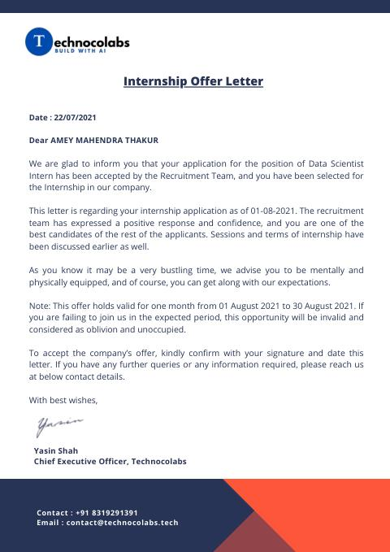 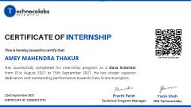 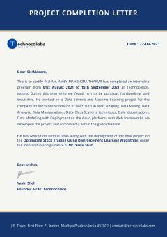  | **Data Scientist Intern** | [Stock Trading RL](https://github.com/Amey-Thakur/OPTIMIZING-STOCK-TRADING-STRATEGY-WITH-REINFORCEMENT-LEARNING) • [Web Application](https://stock-trading-with-rl.herokuapp.com) | [Offer Letter](https://github.com/Amey-Thakur/ACHIEVEMENTS/blob/main/Experience/Technocolabs/Technocolabs%20Software%20-%20Data%20Scientist%20-%20Internship%20Offer%20Letter.pdf) • [Completion](https://github.com/Amey-Thakur/ACHIEVEMENTS/blob/main/Experience/Technocolabs/Technocolabs%20Software%20-%20Data%20Scientist%20-%20Internship%20Completion%20Letter.pdf) • [Project Cert](https://github.com/Amey-Thakur/ACHIEVEMENTS/blob/main/Experience/Technocolabs/Technocolabs%20Software%20-%20Data%20Scientist%20-%20Project%20Completion%20Letter.pdf) • [L.O.R.](https://github.com/Amey-Thakur/ACHIEVEMENTS/blob/main/Experience/Technocolabs/Technocolabs%20Software%20-%20Data%20Scientist%20-%20Letter%20of%20Recommendation.pdf) |
 

<h3 align="center">The Sparks Foundation</h3>

| Preview | Role | Verification |
| :---: | :----- | :------------: |
| 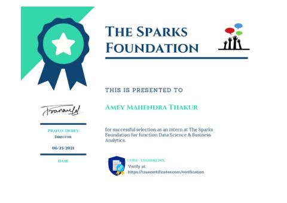 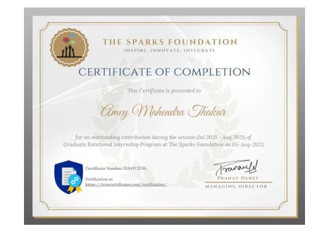 | **Data Science & Business Analytics** | [Selection](https://github.com/Amey-Thakur/ACHIEVEMENTS/blob/main/Experience/The%20Sparks%20Foundation/The%20Sparks%20Foundation%20-%20Internship%20Offer%20Letter.pdf) • [Completion](https://github.com/Amey-Thakur/ACHIEVEMENTS/blob/main/Experience/The%20Sparks%20Foundation/The%20Sparks%20Foundation%20-%20Completion.pdf) |
 

<h3 align="center">IIT Ropar - Diginique Techlabs</h3>

| Preview | Role | Project / Links | Verification |
| :---: | :----- | :----------------: | :------------: |
| 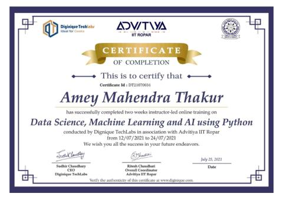   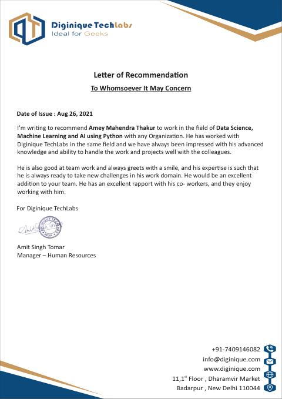 | **Data Science & ML/AI** | [House Price Prediction](https://github.com/Amey-Thakur/BANGALORE-HOUSE-PRICE-PREDICTION) • [Web Application](https://bangalorehousepriceprediction.herokuapp.com) | [Training](https://github.com/Amey-Thakur/ACHIEVEMENTS/blob/main/Experience/IIT%20ROPAR%20-%20Diginique%20Techlabs/IIT%20ROPAR%20-%20Diginique%20Techlabs%20-%20Data%20Science%20Machine%20Learning%20and%20AI%20using%20Python%20-%20Training.pdf) • [Completion](https://github.com/Amey-Thakur/ACHIEVEMENTS/blob/main/Experience/IIT%20ROPAR%20-%20Diginique%20Techlabs/IIT%20ROPAR%20-%20Diginique%20Techlabs%20-%20Data%20Science%20Machine%20Learning%20and%20AI%20using%20Python%20-%20Internship%20Completion%20Letter.pdf) • [Project Cert](https://github.com/Amey-Thakur/ACHIEVEMENTS/blob/main/Experience/IIT%20ROPAR%20-%20Diginique%20Techlabs/IIT%20ROPAR%20-%20Diginique%20Techlabs%20-%20Data%20Science%20Machine%20Learning%20and%20AI%20using%20Python%20-%20Project%20Completion%20Letter.pdf) • [L.O.R.](https://github.com/Amey-Thakur/ACHIEVEMENTS/blob/main/Experience/IIT%20ROPAR%20-%20Diginique%20Techlabs/IIT%20ROPAR%20-%20Diginique%20Techlabs%20-%20Data%20Science%20Machine%20Learning%20and%20AI%20using%20Python%20-%20Letter%20of%20Recommendation.pdf) |
 

<h3 align="center">JPMorgan Chase & Co.</h3>

| Role | Verification |
|:-----|:------------:|
| **Software Engineering** | [Certificate](https://insidesherpa.s3.amazonaws.com/completion-certificates/J.P.%20Morgan/R5iK7HMxJGBgaSbvk_JPMorgan%20Chase_JtA9vXwzt8JuiqQpt_1626951761146_completion_certificate.pdf) |
| **Investment Banking** | [Certificate](https://insidesherpa.s3.amazonaws.com/completion-certificates/JPMorgan%20Chase/YD2kY95RQxQtXxFTS_J.P.%20Morgan_JtA9vXwzt8JuiqQpt_1629367039154_completion_certificate.pdf) |
 

<h3 align="center">Accenture</h3>

| Role | Verification |
|:-----|:------------:|
| **Nordic Consultant Program** | [Certificate](https://insidesherpa.s3.amazonaws.com/completion-certificates/Accenture%20Nordics/KJGjQRHZ6eGquTKfF_Accenture%20Nordic_JtA9vXwzt8JuiqQpt_1627100582696_completion_certificate.pdf) |
 

<h3 align="center">Goldman Sachs</h3>

| Role | Verification |
|:-----|:------------:|
| **Engineering Virtual Program** | [Certificate](https://insidesherpa.s3.amazonaws.com/completion-certificates/Goldman%20Sachs/NPdeQ43o8P9HJmJzg_Goldman%20Sachs_JtA9vXwzt8JuiqQpt_1627194162680_completion_certificate.pdf) |
 

<h3 align="center">KPMG International Limited</h3>

| Role | Verification |
|:-----|:------------:|
| **Data Analytics Program** | [Certificate](https://insidesherpa.s3.amazonaws.com/completion-certificates/KPMG/m7W4GMqeT3bh9Nb2c_KPMG_JtA9vXwzt8JuiqQpt_1627153479459_completion_certificate.pdf) |
 

<h3 align="center">Teach For Australia</h3>

| Role | Verification |
|:-----|:------------:|
| **Classroom Virtual Experience** | [Certification](https://insidesherpa.s3.amazonaws.com/completion-certificates/Teach%20for%20Australia/S2fumwGye5YrE5WsM_Teach%20for%20Australia_JtA9vXwzt8JuiqQpt_1627276843194_completion_certificate.pdf) |
 

<h3 align="center">Edureka</h3>

| Preview | Role | Verification |
| :---: | :----- | :------------: |
| 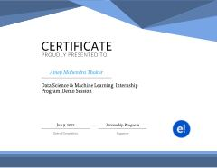 | **Data Science & ML Internship** | [Demo Letter](https://github.com/Amey-Thakur/ACHIEVEMENTS/blob/main/Experience/Edureka/Data%20Science%20%26%20Machine%20Learning%20Internship%20Program%20Demo%20Session%20by%20Edureka.pdf) |

---

### &nbsp;Google

#### &nbsp;Google Digital Unlocked

| # | Preview | Topic | Certification |
| :---: | :---: | :--- | :---: |
| 1 | 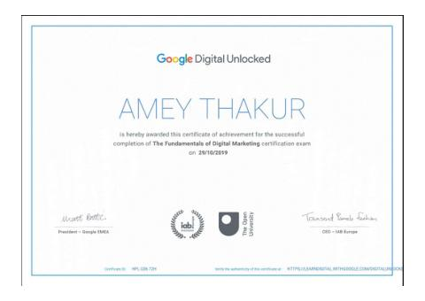 | **The Fundamentals of Digital Marketing** | [Certificate](Google/Google%20The%20Fundamentals%20of%20Digital%20Marketing.pdf) |

#### &nbsp;Google Play Academy

> [!TIP]
> **Academy for App Success:** [**Enrollment History**](Google/Google%20Play%20Academy/Academy%20for%20App%20Success%20_%20Enrollment%20History.pdf)

| # | Preview | Topic | Certification |
| :---: | :---: | :--- | :---: |
| 1 |  | **Analyze your data** | [Certificate](Google/Google%20Play%20Academy/Analyze%20your%20data%20_%20Academy%20for%20App%20Success.pdf) |
| 2 | 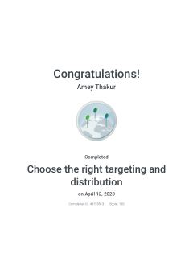 | **Choose the right targeting and distribution** | [Certificate](Google/Google%20Play%20Academy/Choose%20the%20right%20targeting%20and%20distribution%20_%20Academy%20for%20App%20Success.pdf) |
| 3 | 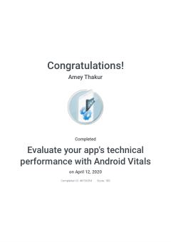 | **Evaluate your app's technical performance with Android Vitals** | [Certificate](Google/Google%20Play%20Academy/Evaluate%20your%20app_s%20technical%20performance%20with%20Android%20Vitals%20_%20Academy%20for%20App%20Success.pdf) |
| 4 | 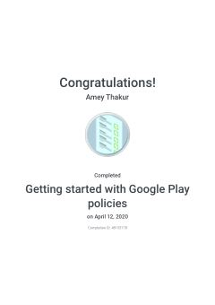 | **Getting started with Google Play policies** | [Certificate](Google/Google%20Play%20Academy/Getting%20started%20with%20Google%20Play%20policies%20_%20Academy%20for%20App%20Success.pdf) |
| 5 | 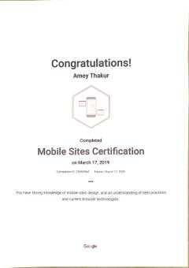 | **Google Mobile Site Development** | [Certificate](Google/Google%20Play%20Academy/Google%20Mobile%20Site%20Development.pdf) |
| 6 | 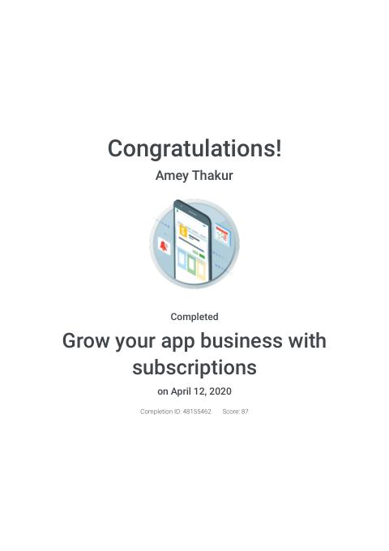 | **Grow your app business with subscriptions** | [Certificate](Google/Google%20Play%20Academy/Grow%20your%20app%20business%20with%20subscriptions%20_%20Academy%20for%20App%20Success.pdf) |
| 7 | 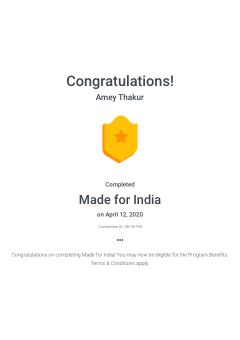 | **Made for India** | [Certificate](Google/Google%20Play%20Academy/Made%20for%20India%20_%20Academy%20for%20App%20Success.pdf) |
| 8 |  | **Make the most of the Android App Bundle and dynamic delivery** | [Certificate](Google/Google%20Play%20Academy/Make%20the%20most%20of%20the%20Android%20App%20Bundle%20and%20dynamic%20delivery%20_%20Academy%20for%20App%20Success.pdf) |
| 9 |  | **Manage an app release** | [Certificate](Google/Google%20Play%20Academy/Manage%20an%20app%20release%20_%20Academy%20for%20App%20Success.pdf) |
| 10 | 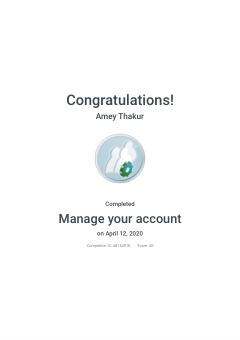 | **Manage your account** | [Certificate](Google/Google%20Play%20Academy/Manage%20your%20account%20_%20Academy%20for%20App%20Success.pdf) |
| 11 | 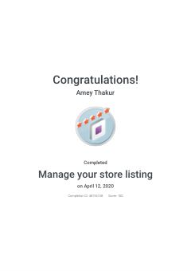 | **Manage your store listing** | [Certificate](Google/Google%20Play%20Academy/Manage%20your%20store%20listing%20_%20Academy%20for%20App%20Success.pdf) |
| 12 |  | **Monetize your app** | [Certificate](Google/Google%20Play%20Academy/Monetize%20your%20app%20_%20Academy%20for%20App%20Success.pdf) |
| 13 | 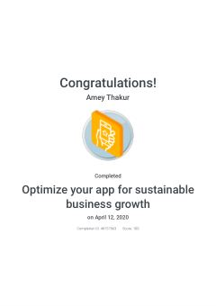 | **Optimize your app for sustainable business growth** | [Certificate](Google/Google%20Play%20Academy/Optimize%20your%20app%20for%20sustainable%20business%20growth%20_%20Academy%20for%20App%20Success.pdf) |
| 14 | 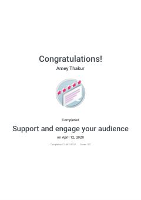 | **Support and engage your audience** | [Certificate](Google/Google%20Play%20Academy/Support%20and%20engage%20your%20audience%20_%20Academy%20for%20App%20Success.pdf) |
| 15 |  | **Test your app before release** | [Certificate](Google/Google%20Play%20Academy/Test%20your%20app%20before%20release%20_%20Academy%20for%20App%20Success.pdf) |
| 16 | 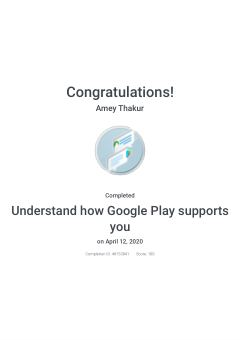 | **Understand how Google Play supports you** | [Certificate](Google/Google%20Play%20Academy/Understand%20how%20Google%20Play%20supports%20you%20_%20Academy%20for%20App%20Success.pdf) |
| 17 | 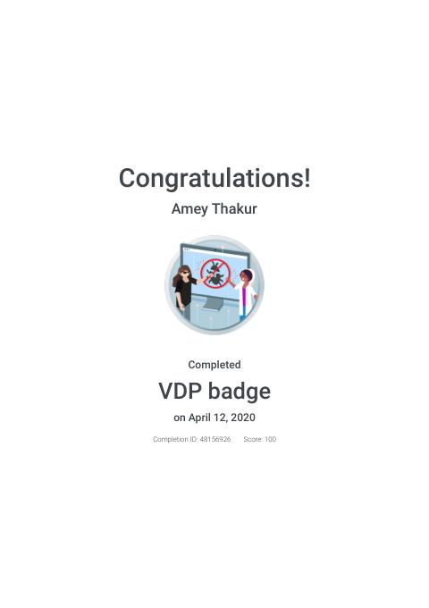 | **Vulnerability Disclosure Program Assessment** | [Certificate](Google/Google%20Play%20Academy/Vulnerability%20Disclosure%20Program%20Assessment%20_%20Academy%20for%20App%20Success.pdf) |

#### &nbsp;Google Skillshop

> [!TIP]
> **Google Skills:** [**Enrollment History**](Google/Google%20Skillshop/Google%20_%20Enrollment%20History.pdf)

| # | Preview | Topic | Certification |
| :---: | :---: | :--- | :---: |
| 1 | 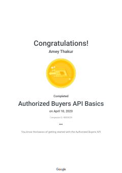 | **Authorized Buyers API Basics** | [Certificate](Google/Google%20Skillshop/Authorized%20Buyers%20API%20Basics%20_%20Google.pdf) |
| 2 |  | **Authorized Buyers Basics** | [Certificate](Google/Google%20Skillshop/Authorized%20Buyers%20Basics%20_%20Google.pdf) |
| 3 | 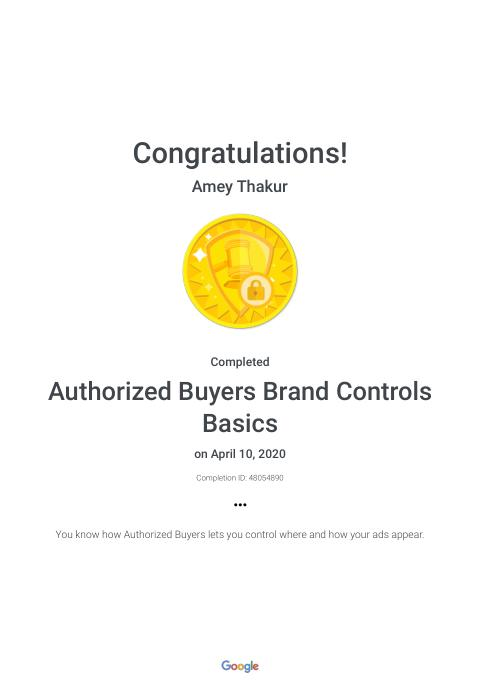 | **Authorized Buyers Brand Controls Basics** | [Certificate](Google/Google%20Skillshop/Authorized%20Buyers%20Brand%20Controls%20Basics%20_%20Google.pdf) |
| 4 |  | **Campaign Manager Brand Controls Basics** | [Certificate](Google/Google%20Skillshop/Campaign%20Manager%20Brand%20Controls%20Basics%20_%20Google.pdf) |
| 5 | 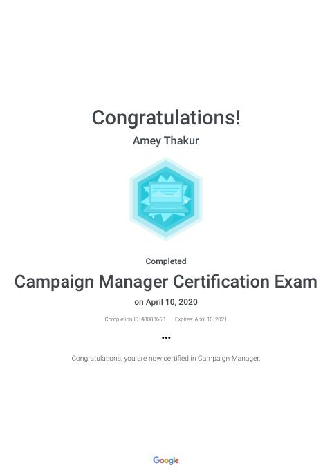 | **Campaign Manager Certification Exam** | [Certificate](Google/Google%20Skillshop/Campaign%20Manager%20Certification%20Exam%20_%20Google.pdf) |
| 6 | 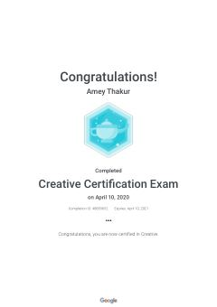 | **Creative Certification Exam** | [Certificate](Google/Google%20Skillshop/Creative%20Certification%20Exam%20_%20Google.pdf) |
| 7 | 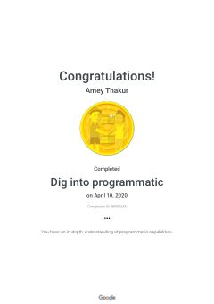 | **Dig into programmatic** | [Certificate](Google/Google%20Skillshop/Dig%20into%20programmatic%20_%20Google.pdf) |
| 8 | 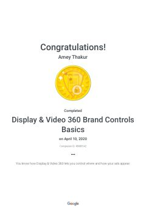 | **Display and Video 360 Brand Controls Basics** | [Certificate](Google/Google%20Skillshop/Display%20_%20Video%20360%20Brand%20Controls%20Basics%20_%20Google.pdf) |
| 9 | 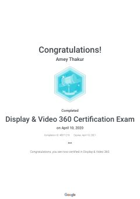 | **Display and Video 360 Certification Exam** | [Certificate](Google/Google%20Skillshop/Display%20_%20Video%20360%20Certification%20Exam%20_%20Google.pdf) |
| 10 | 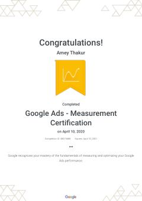 | **Google Ads - Measurement Certification** | [Certificate](Google/Google%20Skillshop/Google%20Ads%20-%20Measurement%20Certification%20_%20Google.pdf) |
| 11 |  | **Google Ads Display Certification** | [Certificate](Google/Google%20Skillshop/Google%20Ads%20Display%20Certification%20_%20Google.pdf) |
| 12 | 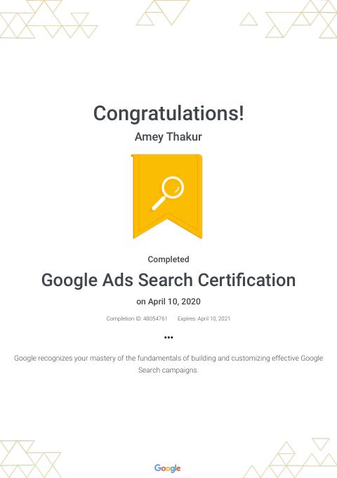 | **Google Ads Search Certification** | [Certificate](Google/Google%20Skillshop/Google%20Ads%20Search%20Certification%20_%20Google.pdf) |
| 13 |  | **Google Ads Video Certification** | [Certificate](Google/Google%20Skillshop/Google%20Ads%20Video%20Certification%20_%20Google.pdf) |
| 14 | 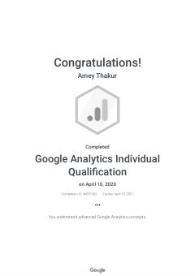 | **Google Analytics Individual Qualification** | [Certificate](Google/Google%20Skillshop/Google%20Analytics%20Individual%20Qualification%20_%20Google.pdf) |
| 15 | 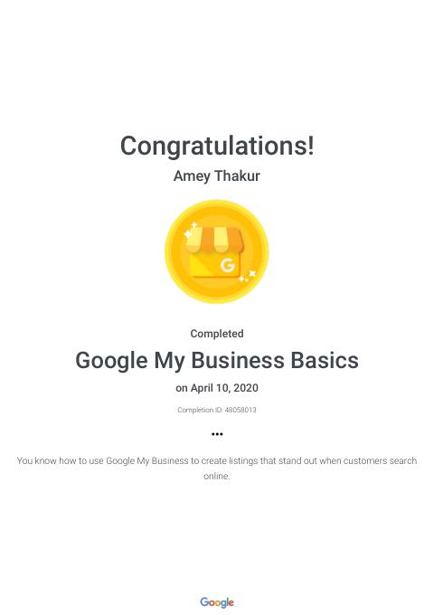 | **Google My Business Basics** | [Certificate](Google/Google%20Skillshop/Google%20My%20Business%20Basics%20_%20Google.pdf) |
| 16 | 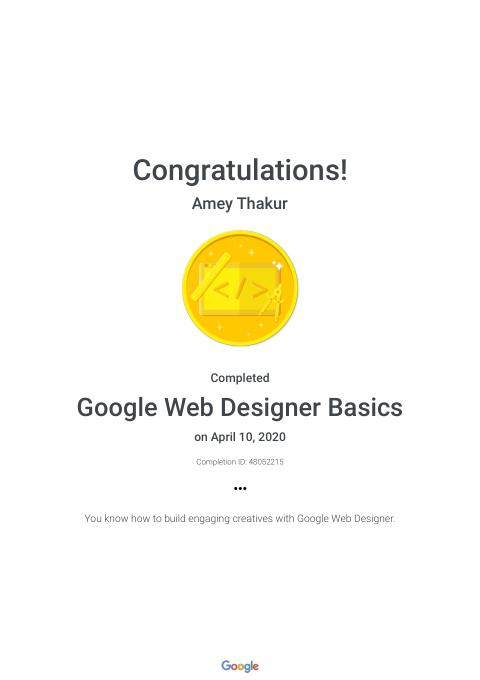 | **Google Web Designer Basics** | [Certificate](Google/Google%20Skillshop/Google%20Web%20Designer%20Basics%20_%20Google.pdf) |
| 17 | 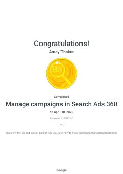 | **Manage campaigns in Search Ads 360** | [Certificate](Google/Google%20Skillshop/Manage%20campaigns%20in%20Search%20Ads%20360%20_%20Google.pdf) |
| 18 |  | **Optimize bids and creatives** | [Certificate](Google/Google%20Skillshop/Optimize%20bids%20and%20creatives%20_%20Google.pdf) |
| 19 |  | **Optimize performance in Search Ads 360** | [Certificate](Google/Google%20Skillshop/Optimize%20performance%20in%20Search%20Ads%20360%20_%20Google.pdf) |
| 20 | 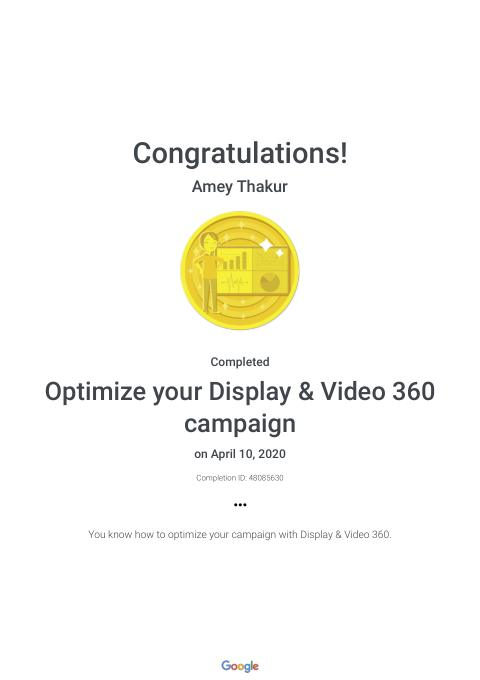 | **Optimize your Display and Video 360 campaign** | [Certificate](Google/Google%20Skillshop/Optimize%20your%20Display%20_%20Video%20360%20campaign%20_%20Google.pdf) |
| 21 |  | **Search Ads 360 Basics** | [Certificate](Google/Google%20Skillshop/Search%20Ads%20360%20Basics%20_%20Google.pdf) |
| 22 | 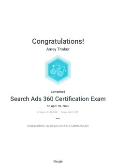 | **Search Ads 360 Certification Exam** | [Certificate](Google/Google%20Skillshop/Search%20Ads%20360%20Certification%20Exam%20_%20Google.pdf) |
| 23 | 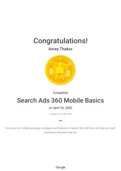 | **Search Ads 360 Mobile Basics** | [Certificate](Google/Google%20Skillshop/Search%20Ads%20360%20Mobile%20Basics%20_%20Google.pdf) |
| 24 | 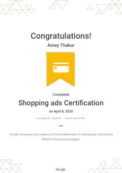 | **Shopping ads Certification** | [Certificate](Google/Google%20Skillshop/Shopping%20ads%20Certification%20_%20Google.pdf) |
| 25 | 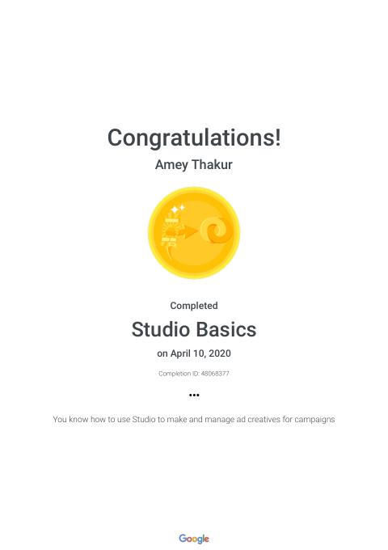 | **Studio Basics** | [Certificate](Google/Google%20Skillshop/Studio%20Basics%20_%20Google.pdf) |
| 26 | 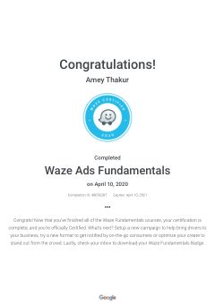 | **Waze Ads Fundamentals** | [Certificate](Google/Google%20Skillshop/Waze%20Ads%20Fundamentals%20_%20Google.pdf) |
| 27 | 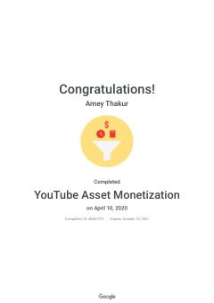 | **YouTube Asset Monetization** | [Certificate](Google/Google%20Skillshop/YouTube%20Asset%20Monetization%20_%20Google.pdf) |
| 28 | 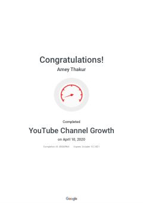 | **YouTube Channel Growth** | [Certificate](Google/Google%20Skillshop/YouTube%20Channel%20Growth%20_%20Google.pdf) |
| 29 | 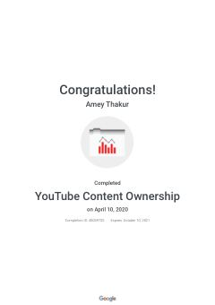 | **YouTube Content Ownership** | [Certificate](Google/Google%20Skillshop/YouTube%20Content%20Ownership%20_%20Google.pdf) |
| 30 | 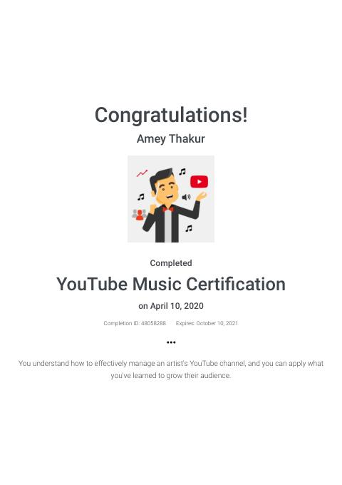 | **YouTube Music Certification** | [Certificate](Google/Google%20Skillshop/YouTube%20Music%20Certification%20_%20Google.pdf) |
| 31 | 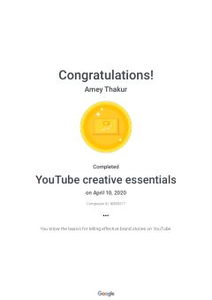 | **YouTube creative essentials** | [Certificate](Google/Google%20Skillshop/YouTube%20creative%20essentials%20_%20Google.pdf) |
 
---

### &nbsp;Harvard Medical School

| # | Preview | Topic | Certification |
| :---: | :---: | :--- | :---: |
| 1 |  | **Silent Spreaders: Children and COVID-19**   Accredited by ACCME® \| 1.00 AMA PRA Category 1 Credit™ | [Certificate](Harvard%20Medical%20School/Silent%20Spreaders%20Children%20and%20COVID-19%20by%20Harvard%20Medical%20School.pdf) |

---

### &nbsp;IBM

#### &nbsp;IBM Training

| # | Preview | Topic | Certification |
| :---: | :---: | :--- | :---: |
| 1 | 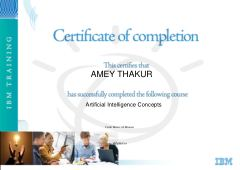 | **Artificial Intelligence Concepts** | [Certificate](IBM/Artificial%20Intelligence%20Concepts%20by%20IBM.pdf) |
 
---

### &nbsp;IIT Bombay

#### &nbsp;IIT Bombay Training

| # | Preview | Topic | Certification |
| :---: | :---: | :--- | :---: |
| 1 | 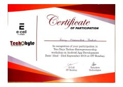 | **Android App Development Workshop** | [Certificate](IIT%20Bombay/IITB%20Android%20App%20Development.pdf) |
| 2 | 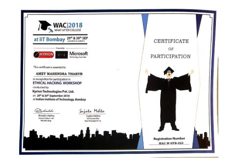 | **Ethical Hacking Workshop** | [Certificate](IIT%20Bombay/IITB%20Ethical%20Hacking.pdf) |
| 3 | 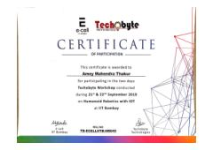 | **Humanoid Robotics with IOT Workshop** | [Certificate](IIT%20Bombay/IITB%20Humanoid%20Robotics%20with%20IOT.pdf) |
| 4 | 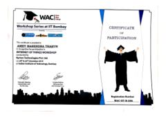 | **Internet Of Things Workshop** | [Certificate](IIT%20Bombay/IITB%20Internet%20Of%20Things.pdf) |
| 5 | 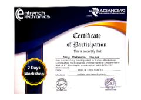 | **Android Mobile Site Development Workshop** | [Certificate](IIT%20Bombay/IITB%20Mobile%20Site%20Development.pdf) |

---

### &nbsp;Intel

#### &nbsp;Intel® AI Academy

| # | Preview | Topic | Certification |
| :---: | :---: | :--- | :---: |
| 1 | 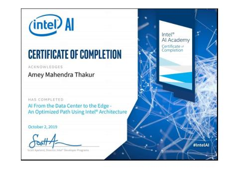 | **AI From the Data Center to the Edge**   Optimized Path Using Intel® Architecture | [Certificate](Intel/Intel%20AI.pdf) |

---

### &nbsp;Julia

#### &nbsp;Julia Academy

| # | Preview | Topic | Certification |
| :---: | :---: | :--- | :---: |
| 1 |  | **Getting Started With JuliaAcademy** | [Certificate](Julia%20Academy/Getting%20Started%20With%20JuliaAcademy.pdf) |
| 2 |  | **Introduction to Julia (for programmers)** | [Certificate](Julia%20Academy/Introduction%20to%20Julia%20(for%20programmers).pdf) |
| 3 | 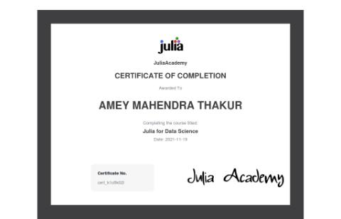 | **Julia for Data Science** | [Certificate](Julia%20Academy/Julia%20for%20Data%20Science.pdf) |
| 4 | 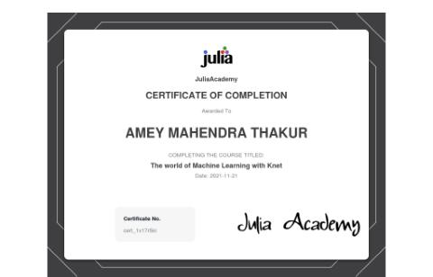 | **The world of Machine Learning with Knet** | [Certificate](Julia%20Academy/The%20world%20of%20Machine%20Learning%20with%20Knet.pdf) |
| 5 |  | **Foundations of Machine Learning** | [Certificate](Julia%20Academy/Foundations%20of%20Machine%20Learning.pdf) |
| 6 |  | **Deep Learning with Flux.jl** | [Certificate](Julia%20Academy/Deep%20Learning%20with%20Flux.jl.pdf) |
| 7 | 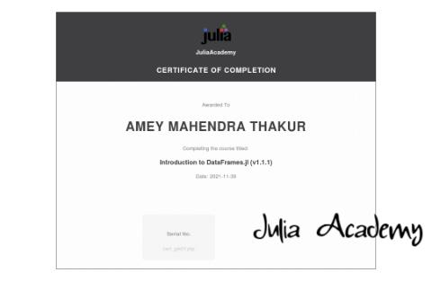 | **Introduction to DataFrames.jl (v1.1.1)** | [Certificate](Julia%20Academy/Introduction%20to%20DataFrames.jl%20(v1.1.1).pdf) |
| 8 |  | **Decision Making Under Uncertainty with POMDPs.jl** | [Certificate](Julia%20Academy/Decision%20Making%20Under%20Uncertainty%20with%20POMDPs.jl.pdf) |
| 9 |  | **Parallel Computing** | [Certificate](Julia%20Academy/Parallel%20Computing.pdf) |
| 10 |  | **Computational Modeling in Julia with Applications to the COVID-19 Pandemic** | [Certificate](Julia%20Academy/Computational%20Modeling%20in%20Julia%20with%20Applications%20to%20the%20COVID-19%20Pandemic.pdf) |

---

### &nbsp;Kaggle

> [!TIP]
> **Track my Notebooks @ **
>
> **[KAGGLE-COMPETITIONS](https://github.com/Amey-Thakur/KAGGLE-COMPETITIONS)** — Solutions for competitions.
>
> **[KAGGLE-COURSES](https://github.com/Amey-Thakur/KAGGLE-COURSES)** — Archive of core certifications.

#### &nbsp;Kaggle Academy

| # | Preview | Topic | Certification |
| :---: | :---: | :--- | :---: |
| 1 |  | **Intro to Programming** | [Certificate](Kaggle/Intro_to_Programming.png) |
| 2 | 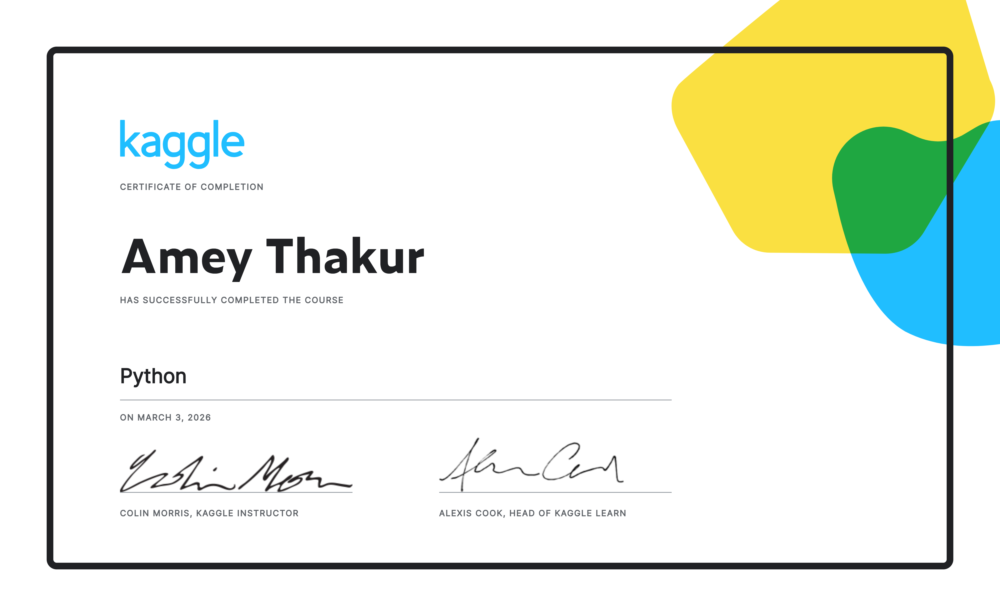 | **Python** | [Certificate](Kaggle/Python.png) |
| 3 |  | **Intro to Machine Learning** | [Certificate](Kaggle/Intro_to_Machine_Learning.png) |
| 4 | 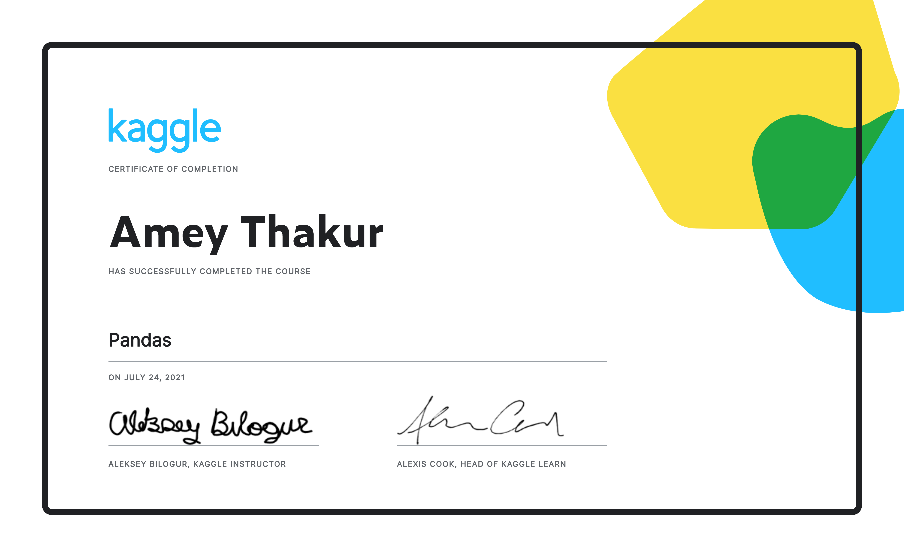 | **Pandas** | [Certificate](Kaggle/Pandas.png) |
| 5 | 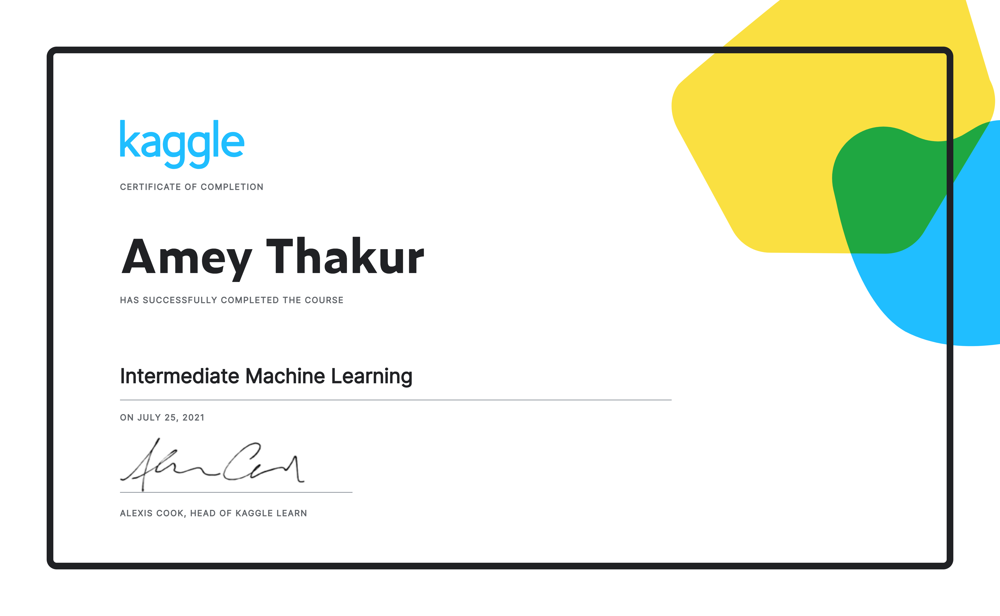 | **Intermediate Machine Learning** | [Certificate](Kaggle/Intermediate_Machine_Learning.png) |
| 6 | 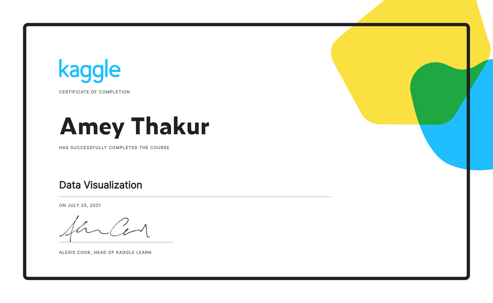 | **Data Visualization** | [Certificate](Kaggle/Data_Visualization.png) |
| 7 |  | **Feature Engineering** | [Certificate](Kaggle/Feature_Engineering.png) |
| 8 | 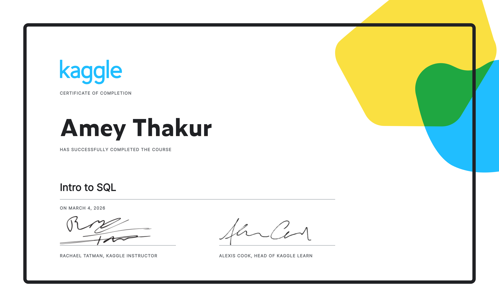 | **Intro to SQL** | [Certificate](Kaggle/Intro_to_SQL.png) |
| 9 | 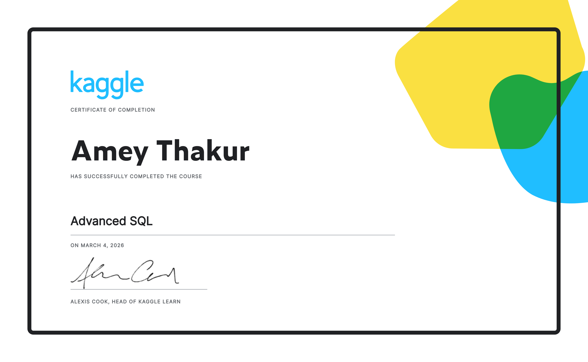 | **Advanced SQL** | [Certificate](Kaggle/Advanced_SQL.png) |
| 10 | 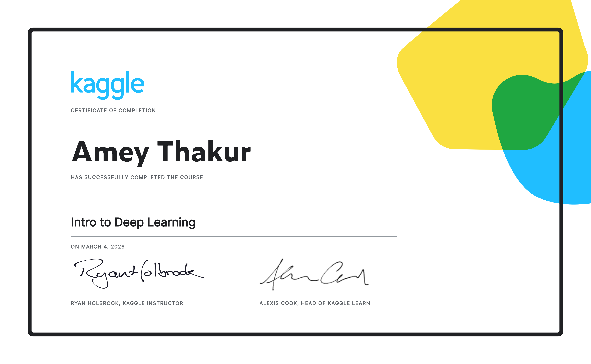 | **Intro to Deep Learning** | [Certificate](Kaggle/Intro_to_Deep_Learning.png) |
| 11 |  | **Computer Vision** | [Certificate](Kaggle/Computer_Vision.png) |
| 12 |  | **Time Series** | [Certificate](Kaggle/Time_Series.png) |
| 13 |  | **Data Cleaning** | [Certificate](Kaggle/Data_Cleaning.png) |
| 14 | 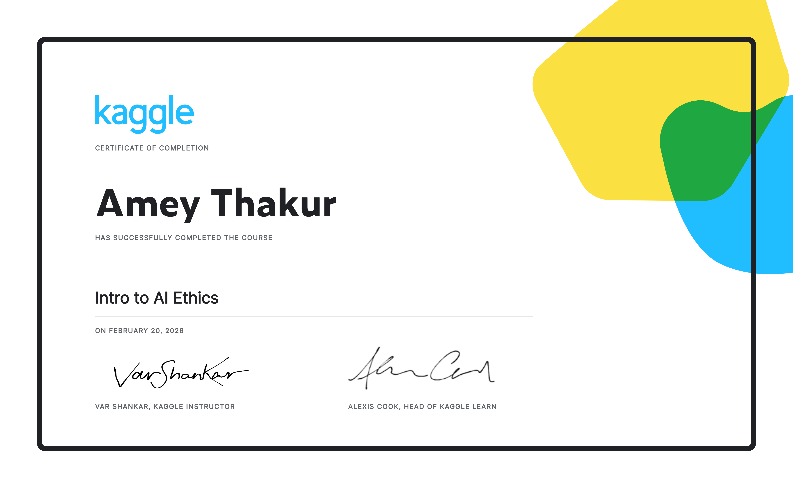 | **Intro to AI Ethics** | [Certificate](Kaggle/Intro_to_AI_Ethics.png) |
| 15 | 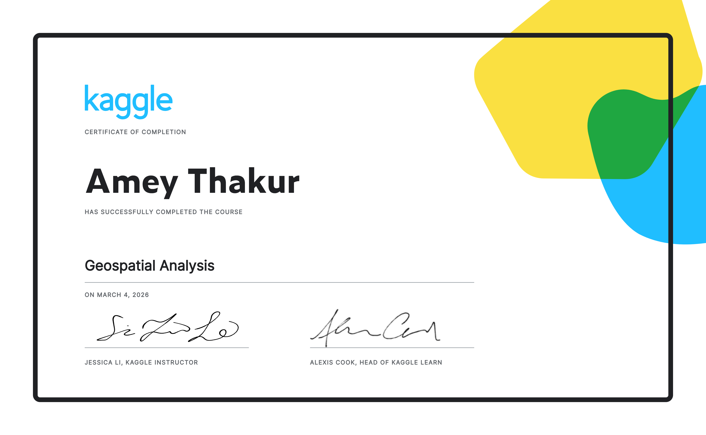 | **Geospatial Analysis** | [Certificate](Kaggle/Geospatial_Analysis.png) |
| 16 | 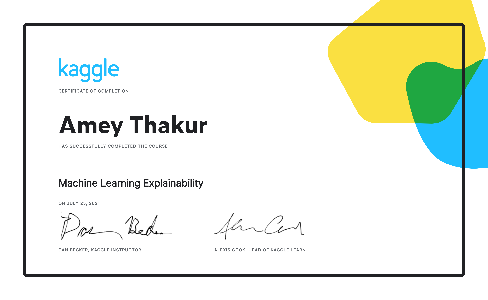 | **Machine Learning Explainability** | [Certificate](Kaggle/Machine_Learning_Explainability.png) |
| 17 | 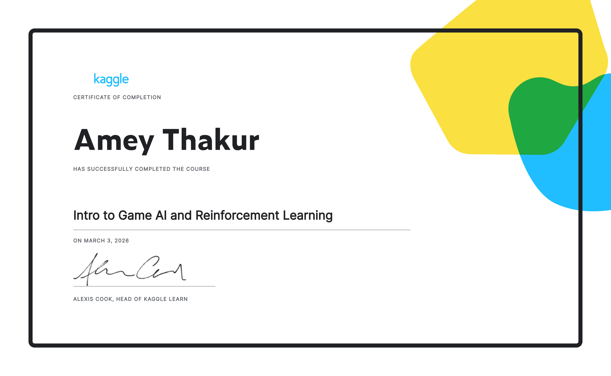 | **Game AI and Reinforcement Learning** | [Certificate](Kaggle/Intro_to_Game_AI_and_Reinforcement_Learning.png) |

---

### &nbsp;Linkedin Learning

> [!NOTE]
> **Accreditation Key:**
> - **CompTIA**: Computing Technology Industry Association
> - **HRCI**: HR Certification Institute
> - **IIBA**: International Institute of Business Analysis
> - **ISC2**: International Information System Security Certification Consortium
> - **NASBA**: National Association of State Boards of Accountancy
> - **PMI**: Project Management Institute
> - **SHRM**: Society for Human Resource Management

### &nbsp;Adobe
#### Essential Skills in Generative AI for Creatives &ndash; [Professional Certificate](Linkedin%20Learning/Essential%20Skills%20in%20Generative%20AI%20for%20Creatives%20by%20Adobe.pdf)

  | # | Preview | Topic | Certification |
  | :---: | :---: | :--- | :---: |
  | 1 | 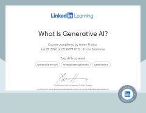 | **What Is Generative AI?** | [Certificate](Linkedin%20Learning/What%20Is%20Generative%20AI_.pdf) |
  | 2 | 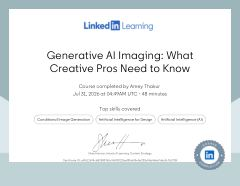 | **Generative AI Imaging: What Creative Pros Need to Know** | [Certificate](Linkedin%20Learning/Generative%20AI%20Imaging_%20What%20Creative%20Pros%20Need%20to%20Know.pdf) |
  | 3 |  | **Leveraging AI in Adobe Photoshop and Creative Cloud** | [Certificate](Linkedin%20Learning/Leveraging%20AI%20in%20Adobe%20Photoshop%20and%20Creative%20Cloud.pdf) |
  | 4 |  | **Generative AI: Business and Legal Concerns for Creatives** | [Certificate](Linkedin%20Learning/Generative%20AI_%20Business%20and%20Legal%20Concerns%20for%20Creatives.pdf) |

### &nbsp;Aha!
#### Product Management Professional Certificate &ndash; [Professional Certificate](Linkedin%20Learning/Aha!%20Product%20Management%20Professional%20Certificate.pdf)

  | # | Preview | Topic | Certification |
  | :---: | :---: | :--- | :---: |
  | 1 | 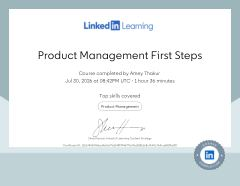 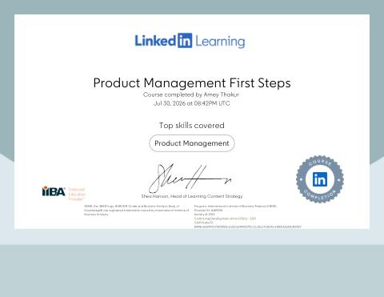 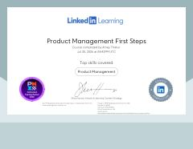 | **Product Management First Steps** | [LinkedIn Learning](Linkedin%20Learning/Product%20Management%20First%20Steps%20(LinkedIn%20Learning).pdf)   [IIBA](Linkedin%20Learning/Product%20Management%20First%20Steps%20(IIBA).pdf)   [PMI](Linkedin%20Learning/Product%20Management%20First%20Steps%20(PMI).pdf) |
  | 2 |    | **Technical Product Management** | [LinkedIn Learning](Linkedin%20Learning/Technical%20Product%20Management%20(LinkedIn%20Learning).pdf)   [IIBA](Linkedin%20Learning/Technical%20Product%20Management%20(IIBA).pdf)   [PMI](Linkedin%20Learning/Technical%20Product%20Management%20(PMI).pdf) |
  | 3 |   | **Product Management: Building a Product Strategy** | [LinkedIn Learning](Linkedin%20Learning/Product%20Management_%20Building%20a%20Product%20Strategy%20(LinkedIn%20Learning).pdf)   [PMI](Linkedin%20Learning/Product%20Management_%20Building%20a%20Product%20Strategy%20(PMI).pdf) |
  | 4 |   | **Product Management: Building a Product Roadmap** | [LinkedIn Learning](Linkedin%20Learning/Product%20Management_%20Building%20a%20Product%20Roadmap%20(LinkedIn%20Learning).pdf)   [PMI](Linkedin%20Learning/Product%20Management_%20Building%20a%20Product%20Roadmap%20(PMI).pdf) |
  | 5 | 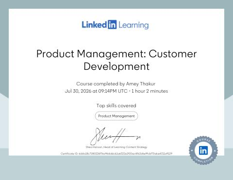   | **Product Management: Customer Development** | [LinkedIn Learning](Linkedin%20Learning/Product%20Management_%20Customer%20Development%20(LinkedIn%20Learning).pdf)   [IIBA](Linkedin%20Learning/Product%20Management_%20Customer%20Development%20(IIBA).pdf)   [PMI](Linkedin%20Learning/Product%20Management_%20Customer%20Development%20(PMI).pdf) |

### &nbsp;All Tech Is Human
#### Responsible AI Foundations Professional Certificate &ndash; [Professional Certificate](Linkedin%20Learning/Responsible%20AI%20Foundations%20Professional%20Certificate%20by%20All%20Tech%20Is%20Human.pdf)

  | # | Preview | Topic | Certification |
  | :---: | :---: | :--- | :---: |
  | 1 |  | **Governing Agentic AI Systems by All Tech Is Human** | [Certificate](Linkedin%20Learning/Governing%20Agentic%20AI%20Systems%20by%20All%20Tech%20Is%20Human.pdf) |
  | 2 |  | **History of Responsible AI: From Principles to Professionalization by All Tech Is Human** | [Certificate](Linkedin%20Learning/History%20of%20Responsible%20AI_%20From%20Principles%20to%20Professionalization%20by%20All%20Tech%20Is%20Human.pdf) |
  | 3 |  | **Operationalizing AI Governance: Strategy and Foundations by All Tech Is Human** | [Certificate](Linkedin%20Learning/Operationalizing%20AI%20Governance_%20Strategy%20and%20Foundations%20by%20All%20Tech%20Is%20Human.pdf) |
  | 4 | 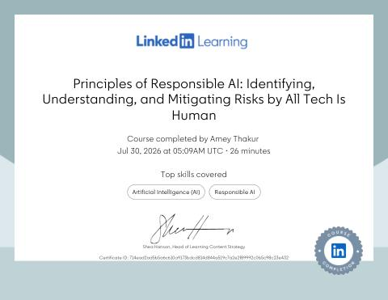 | **Principles of Responsible AI: Identifying, Understanding, and Mitigating Risks by All Tech Is Human** | [Certificate](Linkedin%20Learning/Principles%20of%20Responsible%20AI_%20Identifying,%20Understanding,%20and%20Mitigating%20Risks%20by%20All%20Tech%20Is%20Human.pdf) |

### &nbsp;American Marketing Association
#### Generative AI for Marketing Professional Certificate &ndash; [Professional Certificate](Linkedin%20Learning/Generative%20AI%20for%20Marketing%20Professional%20Certificate%20by%20the%20American%20Marketing%20Association.pdf)

  | # | Preview | Topic | Certification |
  | :---: | :---: | :--- | :---: |
  | 1 |  | **Everyday AI Concepts** | [Certificate](Linkedin%20Learning/Everyday%20AI%20Concepts.pdf) |
  | 2 |  | **Introduction to Prompt Engineering for Generative AI** | [Certificate](Linkedin%20Learning/Introduction%20to%20Prompt%20Engineering%20for%20Generative%20AI.pdf) |
  | 3 | 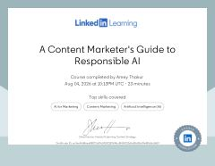 | **A Content Marketer's Guide to Responsible AI** | [Certificate](Linkedin%20Learning/A%20Content%20Marketer%27s%20Guide%20to%20Responsible%20AI.pdf) |
  | 4 | 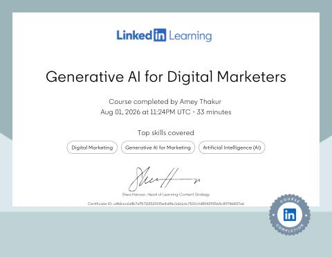  | **Generative AI for Digital Marketers** | [LinkedIn Learning](Linkedin%20Learning/Generative%20AI%20for%20Digital%20Marketers%20(LinkedIn%20Learning).pdf)   [PMI](Linkedin%20Learning/Generative%20AI%20for%20Digital%20Marketers%20(PMI).pdf) |
  | 5 |  | **Writing Great Content with Gen AI That Doesn't Sound Fake** | [Certificate](Linkedin%20Learning/Writing%20Great%20Content%20with%20Gen%20AI%20That%20Doesn%27t%20Sound%20Fake.pdf) |
  | 6 |  | **Build Your Generative AI Plan for Marketing Success** | [Certificate](Linkedin%20Learning/Build%20Your%20Generative%20AI%20Plan%20for%20Marketing%20Success.pdf) |

### &nbsp;Anaconda
#### Anaconda Python for Data Science Professional Certificate &ndash; [Professional Certificate](Linkedin%20Learning/Anaconda%20Python%20for%20Data%20Science%20Professional%20Certificate.pdf)

  | # | Preview | Topic | Certification |
  | :---: | :---: | :--- | :---: |
  | 1 | 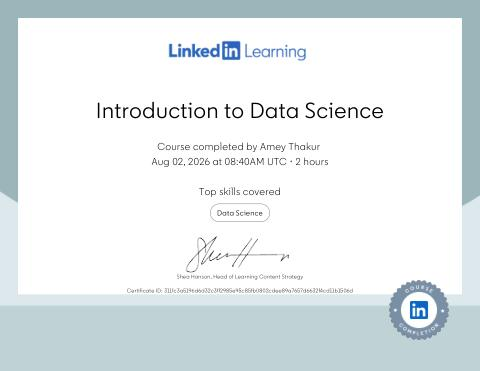  | **Introduction to Data Science** | [LinkedIn Learning](Linkedin%20Learning/Introduction%20to%20Data%20Science%20(LinkedIn%20Learning).pdf)   [PMI](Linkedin%20Learning/Introduction%20to%20Data%20Science%20(PMI).pdf) |
  | 2 |  | **Statistics Foundations 1: The Basics** | [Certificate](Linkedin%20Learning/Statistics%20Foundations%201_%20The%20Basics.pdf) |
  | 3 |  | **Statistics Foundations 3: Using Data Sets** | [Certificate](Linkedin%20Learning/Statistics%20Foundations%203_%20Using%20Data%20Sets.pdf) |
  | 4 | 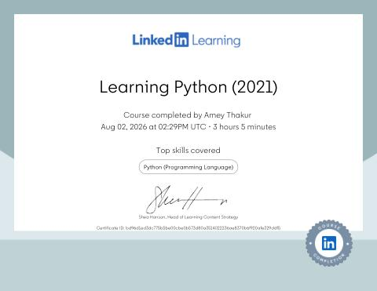 | **Learning Python (2021)** | [Certificate](Linkedin%20Learning/Learning%20Python%20(2021).pdf) |
  | 5 | 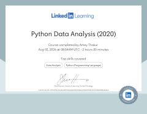 | **Python Data Analysis (2020)** | [Certificate](Linkedin%20Learning/Python%20Data%20Analysis%20(2020).pdf) |

#### Machine Learning with Python Professional Certificate &ndash; [Professional Certificate](Linkedin%20Learning/Machine%20Learning%20with%20Python%20Professional%20Certificate%20by%20Anaconda.pdf)

  | # | Preview | Topic | Certification |
  | :---: | :---: | :--- | :---: |
  | 1 |  | **Artificial Intelligence Foundations: Machine Learning** | [Certificate](Linkedin%20Learning/Artificial%20Intelligence%20Foundations_%20Machine%20Learning.pdf) |
  | 2 |  | **Machine Learning with Python: Foundations** | [Certificate](Linkedin%20Learning/Machine%20Learning%20with%20Python_%20Foundations.pdf) |
  | 3 | 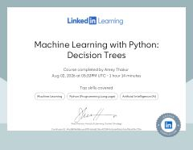 | **Machine Learning with Python: Decision Trees** | [Certificate](Linkedin%20Learning/Machine%20Learning%20with%20Python_%20Decision%20Trees.pdf) |
  | 4 |  | **Machine Learning with Python: Logistic Regression** | [Certificate](Linkedin%20Learning/Machine%20Learning%20with%20Python_%20Logistic%20Regression.pdf) |
  | 5 | 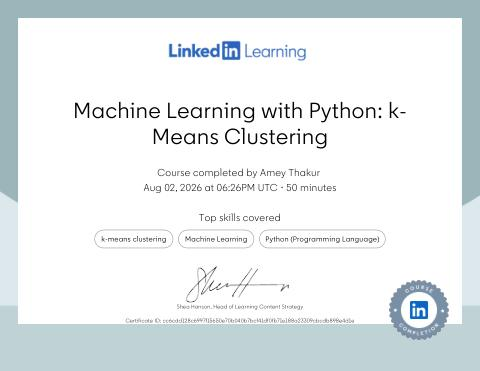 | **Machine Learning with Python: k-Means Clustering** | [Certificate](Linkedin%20Learning/Machine%20Learning%20with%20Python_%20k-Means%20Clustering.pdf) |
  | 6 |  | **Processing Text with Python Essential Training** | [Certificate](Linkedin%20Learning/Processing%20Text%20with%20Python%20Essential%20Training.pdf) |

### &nbsp;Astronomer
#### Data Engineering Foundations Professional Certificate &ndash; [Professional Certificate](Linkedin%20Learning/Data%20Engineering%20Foundations%20Professional%20Certificate%20by%20Astronomer.pdf)

  | # | Preview | Topic | Certification |
  | :---: | :---: | :--- | :---: |
  | 1 |  | **Learning SQL Programming** | [Certificate](Linkedin%20Learning/Learning%20SQL%20Programming.pdf) |
  | 2 |  | **Complete Guide to Python for Data Engineering: From Beginner to Advanced** | [Certificate](Linkedin%20Learning/Complete%20Guide%20to%20Python%20for%20Data%20Engineering_%20From%20Beginner%20to%20Advanced.pdf) |
  | 3 |  | **Hands-On Introduction: Data Engineering** | [Certificate](Linkedin%20Learning/Hands-On%20Introduction_%20Data%20Engineering.pdf) |
  | 4 |  | **Learning Apache Airflow (2023)** | [Certificate](Linkedin%20Learning/Learning%20Apache%20Airflow%20(2023).pdf) |
  | 5 | 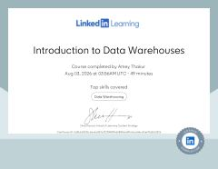 | **Introduction to Data Warehouses** | [Certificate](Linkedin%20Learning/Introduction%20to%20Data%20Warehouses.pdf) |
  | 6 |  | **Learning Data Governance** | [Certificate](Linkedin%20Learning/Learning%20Data%20Governance.pdf) |

### &nbsp;Atlassian
#### Atlassian Agile Project Management Professional Certificate &ndash; [Professional Certificate](Linkedin%20Learning/Atlassian%20Agile%20Project%20Management%20Professional%20Certificate.pdf)

  | # | Preview | Topic | Certification |
  | :---: | :---: | :--- | :---: |
  | 1 | 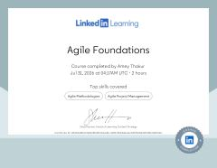 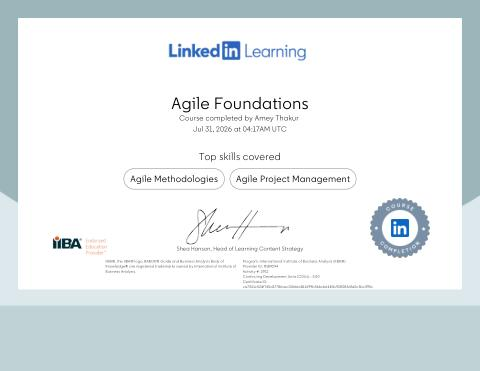  | **Agile Foundations** | [LinkedIn Learning](Linkedin%20Learning/Agile%20Foundations%20(LinkedIn%20Learning).pdf)   [IIBA](Linkedin%20Learning/Agile%20Foundations%20(IIBA).pdf)   [PMI](Linkedin%20Learning/Agile%20Foundations%20(PMI).pdf) |
  | 2 | 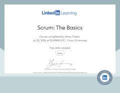  | **Scrum: The Basics** | [LinkedIn Learning](Linkedin%20Learning/Scrum_%20The%20Basics%20(LinkedIn%20Learning).pdf)   [PMI](Linkedin%20Learning/Scrum_%20The%20Basics%20(PMI).pdf) |
  | 3 |  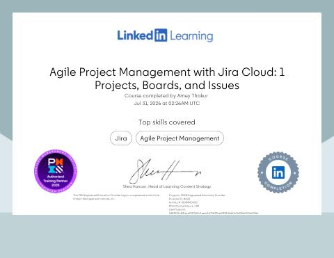 | **Agile Project Management with Jira Cloud: 1 Projects, Boards, and Issues** | [LinkedIn Learning](Linkedin%20Learning/Agile%20Project%20Management%20with%20Jira%20Cloud_%201%20Projects,%20Boards,%20and%20Issues%20(LinkedIn%20Learning).pdf)   [PMI](Linkedin%20Learning/Agile%20Project%20Management%20with%20Jira%20Cloud_%201%20Projects,%20Boards,%20and%20Issues%20(PMI).pdf) |
  | 4 | 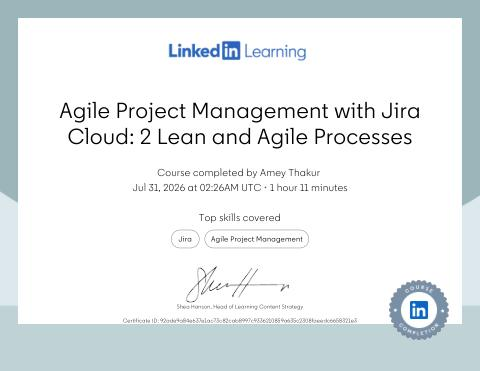  | **Agile Project Management with Jira Cloud: 2 Lean and Agile Processes** | [LinkedIn Learning](Linkedin%20Learning/Agile%20Project%20Management%20with%20Jira%20Cloud_%202%20Lean%20and%20Agile%20Processes%20(LinkedIn%20Learning).pdf)   [PMI](Linkedin%20Learning/Agile%20Project%20Management%20with%20Jira%20Cloud_%202%20Lean%20and%20Agile%20Processes%20(PMI).pdf) |
  | 5 |   | **Agile Project Management with Jira Cloud: 3 Advanced Topics** | [LinkedIn Learning](Linkedin%20Learning/Agile%20Project%20Management%20with%20Jira%20Cloud_%203%20Advanced%20Topics%20(LinkedIn%20Learning).pdf)   [PMI](Linkedin%20Learning/Agile%20Project%20Management%20with%20Jira%20Cloud_%203%20Advanced%20Topics%20(PMI).pdf) |
  | 6 |   | **Mistakes to Avoid in Agile Project Management** | [LinkedIn Learning](Linkedin%20Learning/Mistakes%20to%20Avoid%20in%20Agile%20Project%20Management%20(LinkedIn%20Learning).pdf)   [PMI](Linkedin%20Learning/Mistakes%20to%20Avoid%20in%20Agile%20Project%20Management%20(PMI).pdf) |

#### Atlassian IT Service Management (ITSM) Professional Certificate &ndash; [Professional Certificate](Linkedin%20Learning/Atlassian%20IT%20Service%20Management%20(ITSM)%20Professional%20Certificate.pdf)

  | # | Preview | Topic | Certification |
  | :---: | :---: | :--- | :---: |
  | 1 |  | **IT Service Desk: Service Management** | [Certificate](Linkedin%20Learning/IT%20Service%20Desk_%20Service%20Management.pdf) |
  | 2 |  | **IT Service Management Foundations: Problem Management** | [Certificate](Linkedin%20Learning/IT%20Service%20Management%20Foundations_%20Problem%20Management.pdf) |
  | 3 |  | **IT Service Management Foundations: Change Management** | [Certificate](Linkedin%20Learning/IT%20Service%20Management%20Foundations_%20Change%20Management.pdf) |
  | 4 |  | **IT Service Desk: Monitoring and Metrics Fundamentals** | [Certificate](Linkedin%20Learning/IT%20Service%20Desk_%20Monitoring%20and%20Metrics%20Fundamentals.pdf) |

### &nbsp;Canonical
#### Ubuntu Linux Professional Certificate &ndash; [Professional Certificate](Linkedin%20Learning/Ubuntu%20Linux%20Professional%20Certificate%20by%20Canonical.pdf)

  | # | Preview | Topic | Certification |
  | :---: | :---: | :--- | :---: |
  | 1 |  | **Learning Linux Command Line** | [Certificate](Linkedin%20Learning/Learning%20Linux%20Command%20Line.pdf) |
  | 2 |  | **Ubuntu Linux: Operating System Basics** | [Certificate](Linkedin%20Learning/Ubuntu%20Linux_%20Operating%20System%20Basics.pdf) |
  | 3 |  | **Ubuntu Linux: Storage Management** | [Certificate](Linkedin%20Learning/Ubuntu%20Linux_%20Storage%20Management.pdf) |
  | 4 |  | **Ubuntu Linux: User and Group Management** | [Certificate](Linkedin%20Learning/Ubuntu%20Linux_%20User%20and%20Group%20Management.pdf) |

### &nbsp;ChurnZero
#### Customer Success Foundations Professional Certificate &ndash; [Professional Certificate](Linkedin%20Learning/Customer%20Success%20Foundations%20Professional%20Certificate%20by%20ChurnZero.pdf)

  | # | Preview | Topic | Certification |
  | :---: | :---: | :--- | :---: |
  | 1 |  | **Move into a Customer Success Career** | [Certificate](Linkedin%20Learning/Move%20into%20a%20Customer%20Success%20Career.pdf) |
  | 2 | 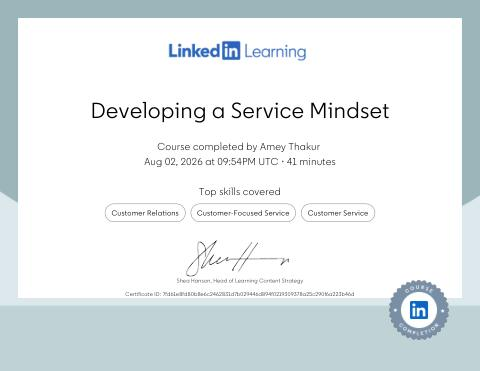  | **Developing a Service Mindset** | [LinkedIn Learning](Linkedin%20Learning/Developing%20a%20Service%20Mindset%20(LinkedIn%20Learning).pdf)   [PMI](Linkedin%20Learning/Developing%20a%20Service%20Mindset%20(PMI).pdf) |
  | 3 |  | **Building Rapport with Customers** | [Certificate](Linkedin%20Learning/Building%20Rapport%20with%20Customers.pdf) |
  | 4 | 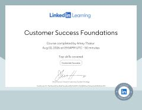 | **Customer Success Foundations** | [Certificate](Linkedin%20Learning/Customer%20Success%20Foundations.pdf) |
  | 5 |  | **Onboard New Customers for Loyalty, Engagement, and Expansion** | [Certificate](Linkedin%20Learning/Onboard%20New%20Customers%20for%20Loyalty,%20Engagement,%20and%20Expansion.pdf) |
  | 6 |  | **Customer Experience: Journey Mapping** | [Certificate](Linkedin%20Learning/Customer%20Experience_%20Journey%20Mapping.pdf) |
  | 7 |  | **Customer Retention** | [Certificate](Linkedin%20Learning/Customer%20Retention.pdf) |
  | 8 |  | **Customer Experience Leadership** | [Certificate](Linkedin%20Learning/Customer%20Experience%20Leadership.pdf) |

### &nbsp;Docker
#### Docker Foundations Professional Certificate &ndash; [Professional Certificate](Linkedin%20Learning/Docker%20Foundations%20Professional%20Certificate.pdf)

  | # | Preview | Topic | Certification |
  | :---: | :---: | :--- | :---: |
  | 1 |  | **Learning Docker** | [Certificate](Linkedin%20Learning/Learning%20Docker.pdf) |
  | 2 | 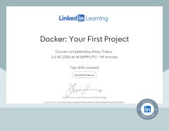 | **Docker: Your First Project** | [Certificate](Linkedin%20Learning/Docker_%20Your%20First%20Project.pdf) |
  | 3 |  | **Learning Docker Compose** | [Certificate](Linkedin%20Learning/Learning%20Docker%20Compose.pdf) |

### &nbsp;GitHub
#### Career Essentials in GitHub Copilot Professional Certificate &ndash; [Professional Certificate](Linkedin%20Learning/Career%20Essentials%20in%20GitHub%20Copilot%20Professional%20Certificate.pdf)

  | # | Preview | Topic | Certification |
  | :---: | :---: | :--- | :---: |
  | 1 |  | **AI Pair Programming with GitHub Copilot** | [Certificate](Linkedin%20Learning/AI%20Pair%20Programming%20with%20GitHub%20Copilot.pdf) |
  | 2 |  | **Supercharge the Development Process with GitHub Extensions for Copilot Chat** | [Certificate](Linkedin%20Learning/Supercharge%20the%20Development%20Process%20with%20GitHub%20Extensions%20for%20Copilot%20Chat.pdf) |
  | 3 |  | **Refactoring with GitHub Copilot** | [Certificate](Linkedin%20Learning/Refactoring%20with%20GitHub%20Copilot.pdf) |
  | 4 |  | **Responsible GitHub Copilot: Creating Reliable Code Ethically** | [Certificate](Linkedin%20Learning/Responsible%20GitHub%20Copilot_%20Creating%20Reliable%20Code%20Ethically.pdf) |

#### Career Essentials in GitHub Professional Certificate &ndash; [Professional Certificate](Linkedin%20Learning/Career%20Essentials%20in%20GitHub%20Professional%20Certificate.pdf)

  | # | Preview | Topic | Certification |
  | :---: | :---: | :--- | :---: |
  | 1 | 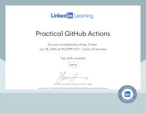 | **Practical GitHub Actions** | [Certificate](Linkedin%20Learning/Practical%20GitHub%20Actions.pdf) |
  | 2 |   | **Practical GitHub Project Management and Collaboration** | [LinkedIn Learning](Linkedin%20Learning/Practical%20GitHub%20Project%20Management%20and%20Collaboration%20(LinkedIn%20Learning).pdf)   [PMI](Linkedin%20Learning/Practical%20GitHub%20Project%20Management%20and%20Collaboration%20(PMI).pdf) |
  | 3 | 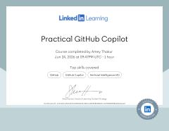 | **Practical GitHub Copilot** | [Certificate](Linkedin%20Learning/Practical%20GitHub%20Copilot.pdf) |
  | 4 |  | **Practical GitHub Code Search** | [Certificate](Linkedin%20Learning/Practical%20GitHub%20Code%20Search.pdf) |

### &nbsp;Grammarly
#### Business Writing Professional Certificate &ndash; [Professional Certificate](Linkedin%20Learning/Business%20Writing%20Professional%20Certificate%20by%20Grammarly.pdf)

  | # | Preview | Topic | Certification |
  | :---: | :---: | :--- | :---: |
  | 1 | 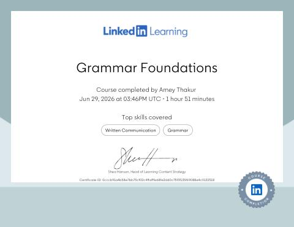 | **Grammar Foundations** | [Certificate](Linkedin%20Learning/Grammar%20Foundations.pdf) |
  | 2 |   | **Business Writing Principles** | [LinkedIn Learning](Linkedin%20Learning/Business%20Writing%20Principles%20(LinkedIn%20Learning).pdf)   [PMI](Linkedin%20Learning/Business%20Writing%20Principles%20(PMI).pdf) |
  | 3 |  | **What's the So What: Writing Clearly for a Business Audience** | [Certificate](Linkedin%20Learning/What's%20the%20So%20What_%20Writing%20Clearly%20for%20a%20Business%20Audience.pdf) |
  | 4 |   | **Writing Formal Business Letters and Emails** | [LinkedIn Learning](Linkedin%20Learning/Writing%20Formal%20Business%20Letters%20and%20Emails%20(LinkedIn%20Learning).pdf)   [PMI](Linkedin%20Learning/Writing%20Formal%20Business%20Letters%20and%20Emails%20(PMI).pdf) |
  | 5 |  | **Writing Emails People Want to Read** | [Certificate](Linkedin%20Learning/Writing%20Emails%20People%20Want%20to%20Read.pdf) |
  | 6 | 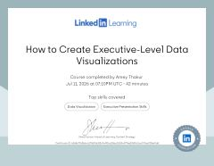 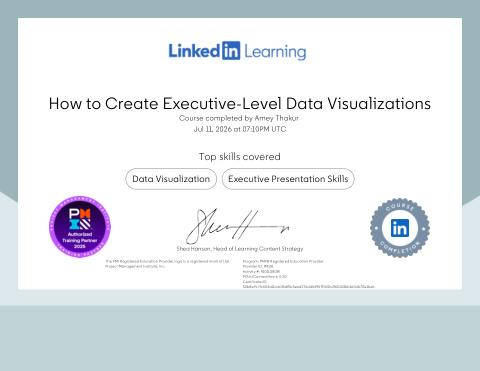 | **How to Create Executive-Level Data Visualizations** | [LinkedIn Learning](Linkedin%20Learning/How%20to%20Create%20Executive-Level%20Data%20Visualizations%20(LinkedIn%20Learning).pdf)   [PMI](Linkedin%20Learning/How%20to%20Create%20Executive-Level%20Data%20Visualizations%20(PMI).pdf) |
  | 7 |   | **Grammarly: Your AI Writing Partner** | [LinkedIn Learning](Linkedin%20Learning/Grammarly_%20Your%20AI%20Writing%20Partner%20(LinkedIn%20Learning).pdf)   [PMI](Linkedin%20Learning/Grammarly_%20Your%20AI%20Writing%20Partner%20(PMI).pdf) |

### &nbsp;Intuit Mailchimp
#### Email Marketing Professional Certificate &ndash; [Professional Certificate](Linkedin%20Learning/Email%20Marketing%20Professional%20Certificate%20by%20Intuit%20Mailchimp.pdf)

  | # | Preview | Topic | Certification |
  | :---: | :---: | :--- | :---: |
  | 1 |  | **Email Marketing: Strategy and Optimization** | [Certificate](Linkedin%20Learning/Email%20Marketing_%20Strategy%20and%20Optimization.pdf) |
  | 2 | 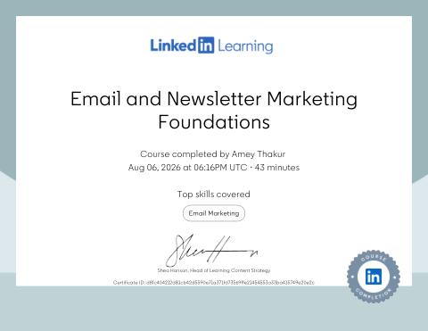  | **Email and Newsletter Marketing Foundations** | [LinkedIn Learning](Linkedin%20Learning/Email%20and%20Newsletter%20Marketing%20Foundations%20(LinkedIn%20Learning).pdf)   [PMI](Linkedin%20Learning/Email%20and%20Newsletter%20Marketing%20Foundations%20(PMI).pdf) |
  | 3 |   | **Email Marketing Strategy: Warm Up a Cold List** | [LinkedIn Learning](Linkedin%20Learning/Email%20Marketing%20Strategy_%20Warm%20Up%20a%20Cold%20List%20(LinkedIn%20Learning).pdf)   [PMI](Linkedin%20Learning/Email%20Marketing%20Strategy_%20Warm%20Up%20a%20Cold%20List%20(PMI).pdf) |

### &nbsp;KNIME
#### Data Science Professional Certificate &ndash; [Professional Certificate](Linkedin%20Learning/Data%20Science%20Professional%20Certificate%20by%20KNIME.pdf)

  | # | Preview | Topic | Certification |
  | :---: | :---: | :--- | :---: |
  | 1 |  | **Data Science Foundations: Fundamentals** | [Certificate](Linkedin%20Learning/Data%20Science%20Foundations_%20Fundamentals.pdf) |
  | 2 |  | **Low Code/No-Code Data Literacy with KNIME: From Basic to Advanced** | [Certificate](Linkedin%20Learning/Low%20Code_No-Code%20Data%20Literacy%20with%20KNIME_%20From%20Basic%20to%20Advanced.pdf) |
  | 3 |  | **Introduction to Artificial Intelligence** | [Certificate](Linkedin%20Learning/Introduction%20to%20Artificial%20Intelligence.pdf) |
  | 4 | 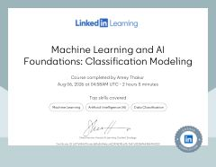 | **Machine Learning and AI Foundations: Classification Modeling** | [Certificate](Linkedin%20Learning/Machine%20Learning%20and%20AI%20Foundations_%20Classification%20Modeling.pdf) |
  | 5 |  | **Generative AI: Introduction to Large Language Models** | [Certificate](Linkedin%20Learning/Generative%20AI_%20Introduction%20to%20Large%20Language%20Models.pdf) |
  | 6 |  | **The Non-Technical Skills of Effective Data Scientists** | [Certificate](Linkedin%20Learning/The%20Non-Technical%20Skills%20of%20Effective%20Data%20Scientists.pdf) |

### &nbsp;LinkedIn
#### Become a Data Analyst Professional Certificate &ndash; [Professional Certificate](Linkedin%20Learning/Become%20a%20Data%20Analyst.pdf)

  | # | Preview | Topic | Certification |
  | :---: | :---: | :--- | :---: |
  | 1 |   | **Complete Guide to R: Wrangling, Visualizing, and Modeling Data** | [LinkedIn Learning](Linkedin%20Learning/Complete%20Guide%20to%20R_%20Wrangling,%20Visualizing,%20and%20Modeling%20Data%20(LinkedIn%20Learning).pdf)   [PMI](Linkedin%20Learning/Complete%20Guide%20to%20R_%20Wrangling,%20Visualizing,%20and%20Modeling%20Data%20(PMI).pdf) |
  | 2 |  | **Data Cleaning in Python Essential Training** | [Certificate](Linkedin%20Learning/Data%20Cleaning%20in%20Python%20Essential%20Training.pdf) |
  | 3 |  | **Data Literacy: Exploring and Describing Data in an AI World** | [Certificate](Linkedin%20Learning/Data%20Literacy_%20Exploring%20and%20Describing%20Data%20in%20an%20AI%20World.pdf) |
  | 4 |  | **Learning Data Analytics: 1 Foundations** | [Certificate](Linkedin%20Learning/Learning%20Data%20Analytics_%201%20Foundations.pdf) |
  | 5 |  | **Learning Data Analytics Part 2: Extending and Applying Core Knowledge** | [Certificate](Linkedin%20Learning/Learning%20Data%20Analytics%20Part%202_%20Extending%20and%20Applying%20Core%20Knowledge.pdf) |
  | 6 |  | **Learning Data Visualization** | [Certificate](Linkedin%20Learning/Learning%20Data%20Visualization.pdf) |
  | 7 | 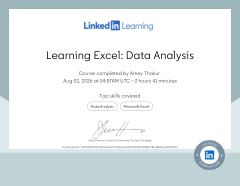 | **Learning Excel: Data Analysis** | [Certificate](Linkedin%20Learning/Learning%20Excel_%20Data%20Analysis.pdf) |
  | 8 |  | **Power BI Essential Training** | [Certificate](Linkedin%20Learning/Power%20BI%20Essential%20Training.pdf) |
  | 9 | 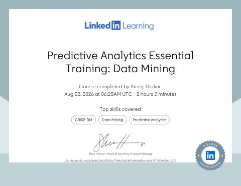  | **Predictive Analytics Essential Training: Data Mining** | [LinkedIn Learning](Linkedin%20Learning/Predictive%20Analytics%20Essential%20Training_%20Data%20Mining%20(LinkedIn%20Learning).pdf)   [IIBA](Linkedin%20Learning/Predictive%20Analytics%20Essential%20Training_%20Data%20Mining%20(IIBA).pdf) |
  | 10 |  | **SQL: Data Reporting and Analysis** | [Certificate](Linkedin%20Learning/SQL_%20Data%20Reporting%20and%20Analysis.pdf) |
  | 11 |  | **Tableau 2024.1: Essential Training** | [Certificate](Linkedin%20Learning/Tableau%202024.1_%20Essential%20Training.pdf) |
  | 12 |  | **The Non-Technical Skills of Effective Data Scientists** | [Certificate](Linkedin%20Learning/The%20Non-Technical%20Skills%20of%20Effective%20Data%20Scientists.pdf) |

### &nbsp;Microsoft
#### AI for Managers Professional Certificate &ndash; [Professional Certificate](Linkedin%20Learning/AI%20for%20Managers%20by%20Microsoft%20and%20LinkedIn.pdf)

  | # | Preview | Topic | Certification |
  | :---: | :---: | :--- | :---: |
  | 1 |  | **Become an AI-Powered People Manager** | [Certificate](Linkedin%20Learning/Become%20an%20AI-Powered%20People%20Manager.pdf) |
  | 2 |  | **The Manager's Guide to Career Conversations in the Age of AI** | [Certificate](Linkedin%20Learning/The%20Manager's%20Guide%20to%20Career%20Conversations%20in%20the%20Age%20of%20AI.pdf) |
  | 3 |  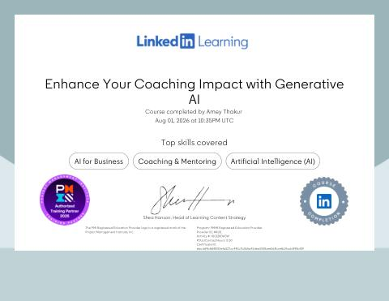 | **Enhance Your Coaching Impact with Generative AI** | [LinkedIn Learning](Linkedin%20Learning/Enhance%20Your%20Coaching%20Impact%20with%20Generative%20AI%20(LinkedIn%20Learning).pdf)   [PMI](Linkedin%20Learning/Enhance%20Your%20Coaching%20Impact%20with%20Generative%20AI%20(PMI).pdf) |
  | 4 |  | **Building a Collaborative Team Culture with AI** | [Certificate](Linkedin%20Learning/Building%20a%20Collaborative%20Team%20Culture%20with%20AI.pdf) |
  | 5 | 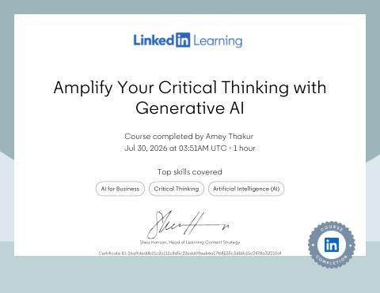 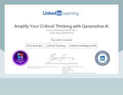 | **Amplify Your Critical Thinking with Generative AI** | [LinkedIn Learning](Linkedin%20Learning/Amplify%20Your%20Critical%20Thinking%20with%20Generative%20AI%20(LinkedIn%20Learning).pdf)   [PMI](Linkedin%20Learning/Amplify%20Your%20Critical%20Thinking%20with%20Generative%20AI%20(PMI).pdf) |
  | 6 |  | **Responsible AI for Managers** | [Certificate](Linkedin%20Learning/Responsible%20AI%20for%20Managers.pdf) |
#### AI for Nonprofits Professional Certificate &ndash; [Professional Certificate](Linkedin%20Learning/AI%20for%20Nonprofits%20Professional%20Certificate%20by%20Microsoft%20Elevate,%20LinkedIn,%20and%20NetHope.pdf)

  | # | Preview | Topic | Certification |
  | :---: | :---: | :--- | :---: |
  | 1 |  | **Leveraging AI in Your Nonprofit Role by Microsoft and NetHope** | [Certificate](Linkedin%20Learning/Leveraging%20AI%20in%20Your%20Nonprofit%20Role%20by%20Microsoft%20and%20NetHope.pdf) |
  | 2 | 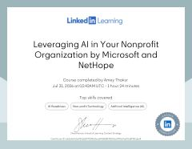 | **Leveraging AI in Your Nonprofit Organization by Microsoft and NetHope** | [Certificate](Linkedin%20Learning/Leveraging%20AI%20in%20Your%20Nonprofit%20Organization%20by%20Microsoft%20and%20NetHope.pdf) |
#### AI for Organizational Leaders Professional Certificate &ndash; [Professional Certificate](Linkedin%20Learning/AI%20for%20Organizational%20Leaders%20by%20Microsoft%20and%20LinkedIn.pdf)

  | # | Preview | Topic | Certification |
  | :---: | :---: | :--- | :---: |
  | 1 |  | **Generative AI for Business Leaders (2025)** | [Certificate](Linkedin%20Learning/Generative%20AI%20for%20Business%20Leaders%20(2025).pdf) |
  | 2 | 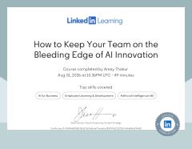 | **How to Keep Your Team on the Bleeding Edge of AI Innovation** | [Certificate](Linkedin%20Learning/How%20to%20Keep%20Your%20Team%20on%20the%20Bleeding%20Edge%20of%20AI%20Innovation.pdf) |
  | 3 | 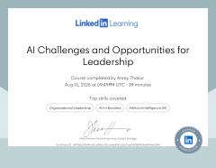  | **AI Challenges and Opportunities for Leadership** | [LinkedIn Learning](Linkedin%20Learning/AI%20Challenges%20and%20Opportunities%20for%20Leadership%20(LinkedIn%20Learning).pdf)   [PMI](Linkedin%20Learning/AI%20Challenges%20and%20Opportunities%20for%20Leadership%20(PMI).pdf) |
  | 4 |  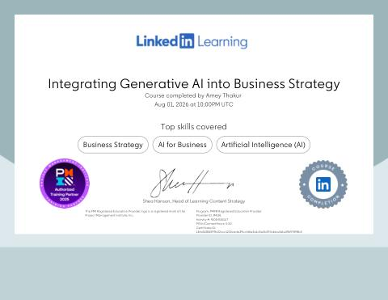 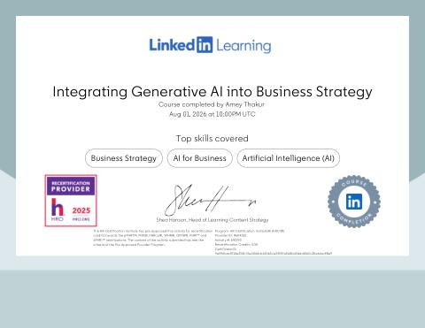 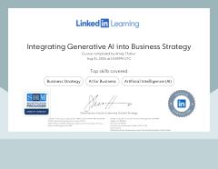 | **Integrating Generative AI into Business Strategy** | [LinkedIn Learning](Linkedin%20Learning/Integrating%20Generative%20AI%20into%20Business%20Strategy%20(LinkedIn%20Learning).pdf)   [PMI](Linkedin%20Learning/Integrating%20Generative%20AI%20into%20Business%20Strategy%20(PMI).pdf)   [HRCI](Linkedin%20Learning/Integrating%20Generative%20AI%20into%20Business%20Strategy%20(HRCI).pdf)   [SHRM](Linkedin%20Learning/Integrating%20Generative%20AI%20into%20Business%20Strategy%20(SHRM).pdf) |
  | 5 |  | **AI Literacy for Business Leaders** | [Certificate](Linkedin%20Learning/AI%20Literacy%20for%20Business%20Leaders.pdf) |
  | 6 |   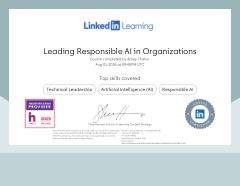 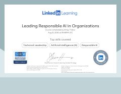 | **Leading Responsible AI in Organizations** | [LinkedIn Learning](Linkedin%20Learning/Leading%20Responsible%20AI%20in%20Organizations%20(LinkedIn%20Learning).pdf)   [PMI](Linkedin%20Learning/Leading%20Responsible%20AI%20in%20Organizations%20(PMI).pdf)   [HRCI](Linkedin%20Learning/Leading%20Responsible%20AI%20in%20Organizations%20(HRCI).pdf)   [SHRM](Linkedin%20Learning/Leading%20Responsible%20AI%20in%20Organizations%20(SHRM).pdf) |
#### Build Your Generative AI Productivity Skills with Microsoft and LinkedIn Professional Certificate &ndash; [Professional Certificate](Linkedin%20Learning/Build%20Your%20Generative%20AI%20Productivity%20Skills%20with%20Microsoft%20and%20LinkedIn.pdf)

  | # | Preview | Topic | Certification |
  | :---: | :---: | :--- | :---: |
  | 1 |  | **Microsoft Copilot: The Art of Prompt Writing** | [Certificate](Linkedin%20Learning/Microsoft%20Copilot_%20The%20Art%20of%20Prompt%20Writing.pdf) |
  | 2 |     | **AI Productivity Hacks to Reimagine Your Workday and Career** | [LinkedIn Learning](Linkedin%20Learning/AI%20Productivity%20Hacks%20to%20Reimagine%20Your%20Workday%20and%20Career%20(LinkedIn%20Learning).pdf)   [PMI](Linkedin%20Learning/AI%20Productivity%20Hacks%20to%20Reimagine%20Your%20Workday%20and%20Career%20(PMI).pdf)   [HRCI](Linkedin%20Learning/AI%20Productivity%20Hacks%20to%20Reimagine%20Your%20Workday%20and%20Career%20(HRCI).pdf)   [SHRM](Linkedin%20Learning/AI%20Productivity%20Hacks%20to%20Reimagine%20Your%20Workday%20and%20Career%20(SHRM).pdf) |
  | 3 | 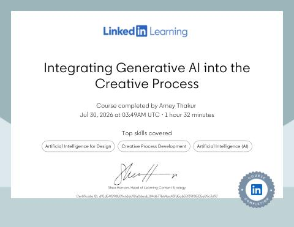 | **Integrating Generative AI into the Creative Process** | [Certificate](Linkedin%20Learning/Integrating%20Generative%20AI%20into%20the%20Creative%20Process.pdf) |
  | 4 | 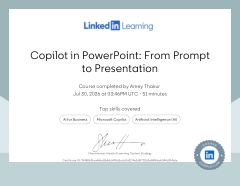 | **Copilot in PowerPoint: From Prompt to Presentation** | [Certificate](Linkedin%20Learning/Copilot%20in%20PowerPoint_%20From%20Prompt%20to%20Presentation.pdf) |
  | 5 |   | **Excel with Copilot: AI-Driven Data Analysis** | [LinkedIn Learning](Linkedin%20Learning/Excel%20with%20Copilot_%20AI-Driven%20Data%20Analysis%20(LinkedIn%20Learning).pdf)   [PMI](Linkedin%20Learning/Excel%20with%20Copilot_%20AI-Driven%20Data%20Analysis%20(PMI).pdf) |
#### Career Essentials in Administrative Assistance Professional Certificate &ndash; [Professional Certificate](Linkedin%20Learning/Career%20Essentials%20in%20Administrative%20Assistance%20by%20Microsoft%20and%20LinkedIn.pdf)

  | # | Preview | Topic | Certification |
  | :---: | :---: | :--- | :---: |
  | 1 | 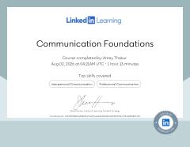 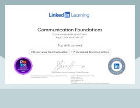 | **Communication Foundations** | [LinkedIn Learning](Linkedin%20Learning/Communication%20Foundations%20(LinkedIn%20Learning).pdf)   [PMI](Linkedin%20Learning/Communication%20Foundations%20(PMI).pdf) |
  | 2 |  | **Learning Microsoft 365 Copilot for Work (2025)** | [Certificate](Linkedin%20Learning/Learning%20Microsoft%20365%20Copilot%20for%20Work%20(2025).pdf) |
  | 3 |  | **Tips for Writing Business Emails** | [Certificate](Linkedin%20Learning/Tips%20for%20Writing%20Business%20Emails.pdf) |
  | 4 |  | **Building a Time Management Mindset** | [Certificate](Linkedin%20Learning/Building%20a%20Time%20Management%20Mindset.pdf) |
  | 5 |  | **Learning Microsoft 365** | [Certificate](Linkedin%20Learning/Learning%20Microsoft%20365.pdf) |
  | 6 |  | **Administrative Professional Foundations** | [Certificate](Linkedin%20Learning/Administrative%20Professional%20Foundations.pdf) |
  | 7 |     | **Business Etiquette: Phone, Email, and Text** | [LinkedIn Learning](Linkedin%20Learning/Business%20Etiquette_%20Phone,%20Email,%20and%20Text%20(LinkedIn%20Learning).pdf)   [PMI](Linkedin%20Learning/Business%20Etiquette_%20Phone,%20Email,%20and%20Text%20(PMI).pdf)   [HRCI](Linkedin%20Learning/Business%20Etiquette_%20Phone,%20Email,%20and%20Text%20(HRCI).pdf)   [SHRM](Linkedin%20Learning/Business%20Etiquette_%20Phone,%20Email,%20and%20Text%20(SHRM).pdf) |

#### Career Essentials in Business Analysis Professional Certificate &ndash; [Professional Certificate](Linkedin%20Learning/Career%20Essentials%20in%20Business%20Analysis%20by%20Microsoft%20and%20LinkedIn.pdf)

  | # | Preview | Topic | Certification |
  | :---: | :---: | :--- | :---: |
  | 1 | 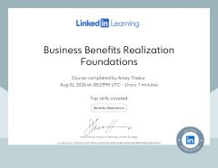 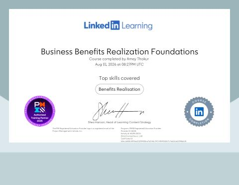 | **Business Benefits Realization Foundations** | [LinkedIn Learning](Linkedin%20Learning/Business%20Benefits%20Realization%20Foundations%20(LinkedIn%20Learning).pdf)   [PMI](Linkedin%20Learning/Business%20Benefits%20Realization%20Foundations%20(PMI).pdf) |
  | 2 | 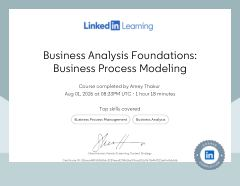  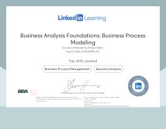 | **Business Analysis Foundations: Business Process Modeling** | [LinkedIn Learning](Linkedin%20Learning/Business%20Analysis%20Foundations_%20Business%20Process%20Modeling%20(LinkedIn%20Learning).pdf)   [PMI](Linkedin%20Learning/Business%20Analysis%20Foundations_%20Business%20Process%20Modeling%20(PMI).pdf)   [IIBA](Linkedin%20Learning/Business%20Analysis%20Foundations_%20Business%20Process%20Modeling%20(IIBA).pdf) |
  | 3 |   | **Modern Project Management in Microsoft 365** | [LinkedIn Learning](Linkedin%20Learning/Modern%20Project%20Management%20in%20Microsoft%20365%20(LinkedIn%20Learning).pdf)   [PMI](Linkedin%20Learning/Modern%20Project%20Management%20in%20Microsoft%20365%20(PMI).pdf) |
  | 4 |  | **Managing Data with Microsoft 365** | [Certificate](Linkedin%20Learning/Managing%20Data%20with%20Microsoft%20365.pdf) |
  | 5 | 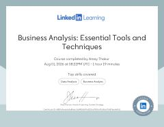 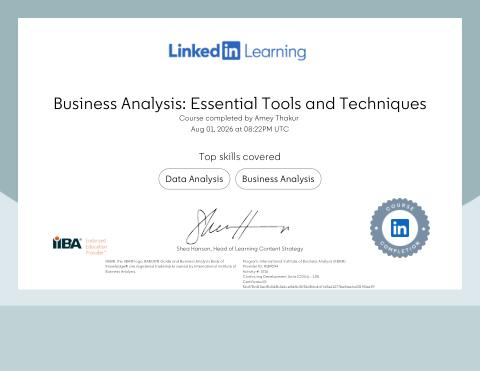 | **Business Analysis: Essential Tools and Techniques** | [LinkedIn Learning](Linkedin%20Learning/Business%20Analysis_%20Essential%20Tools%20and%20Techniques%20(LinkedIn%20Learning).pdf)   [IIBA](Linkedin%20Learning/Business%20Analysis_%20Essential%20Tools%20and%20Techniques%20(IIBA).pdf) |
  | 6 |  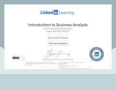 | **Introduction to Business Analysis** | [LinkedIn Learning](Linkedin%20Learning/Introduction%20to%20Business%20Analysis%20(LinkedIn%20Learning).pdf)   [IIBA](Linkedin%20Learning/Introduction%20to%20Business%20Analysis%20(IIBA).pdf) |
  | 7 |   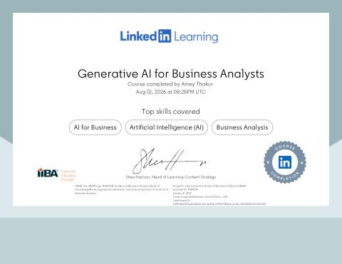 | **Generative AI for Business Analysts** | [LinkedIn Learning](Linkedin%20Learning/Generative%20AI%20for%20Business%20Analysts%20(LinkedIn%20Learning).pdf)   [PMI](Linkedin%20Learning/Generative%20AI%20for%20Business%20Analysts%20(PMI).pdf)   [IIBA](Linkedin%20Learning/Generative%20AI%20for%20Business%20Analysts%20(IIBA).pdf) |
  | 8 |  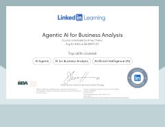 | **Agentic AI for Business Analysis** | [LinkedIn Learning](Linkedin%20Learning/Agentic%20AI%20for%20Business%20Analysis%20(LinkedIn%20Learning).pdf)   [IIBA](Linkedin%20Learning/Agentic%20AI%20for%20Business%20Analysis%20(IIBA).pdf) |
  | 9 |  | **The Role of Business Analysis in Data Analytics** | [Certificate](Linkedin%20Learning/The%20Role%20of%20Business%20Analysis%20in%20Data%20Analytics.pdf) |
#### Career Essentials in Cybersecurity Professional Certificate &ndash; [Professional Certificate](Linkedin%20Learning/Career%20Essentials%20in%20Cybersecurity%20by%20Microsoft%20and%20LinkedIn.pdf)

  | # | Preview | Topic | Certification |
  | :---: | :---: | :--- | :---: |
  | 1 |  | **The Cybersecurity Threat Landscape** | [Certificate](Linkedin%20Learning/The%20Cybersecurity%20Threat%20Landscape.pdf) |
  | 2 |   | **Cybersecurity Awareness: Cybersecurity Terminology** | [LinkedIn Learning](Linkedin%20Learning/Cybersecurity%20Awareness_%20Cybersecurity%20Terminology%20(LinkedIn%20Learning).pdf)   [PMI](Linkedin%20Learning/Cybersecurity%20Awareness_%20Cybersecurity%20Terminology%20(PMI).pdf) |
  | 3 |   | **Cybersecurity Foundations** | [LinkedIn Learning](Linkedin%20Learning/Cybersecurity%20Foundations%20(LinkedIn%20Learning).pdf)   [PMI](Linkedin%20Learning/Cybersecurity%20Foundations%20(PMI).pdf) |
  | 4 |  | **Microsoft Security Copilot** | [Certificate](Linkedin%20Learning/Microsoft%20Security%20Copilot.pdf) |
#### Career Essentials in Data Analysis Professional Certificate &ndash; [Professional Certificate](Linkedin%20Learning/Career%20Essentials%20in%20Data%20Analysis%20by%20Microsoft%20and%20LinkedIn.pdf)

  | # | Preview | Topic | Certification |
  | :---: | :---: | :--- | :---: |
  | 1 | 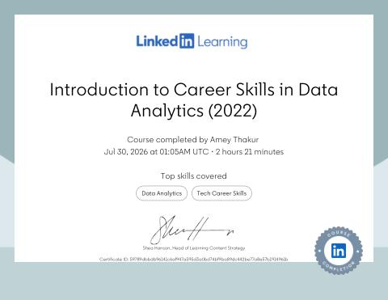 | **Introduction to Career Skills in Data Analytics** | [Certificate](Linkedin%20Learning/Introduction%20to%20Career%20Skills%20in%20Data%20Analytics%20(2022).pdf) |
  | 2 |  | **Learning Data Analytics: 1 Foundations** | [Certificate](Linkedin%20Learning/Learning%20Data%20Analytics_%201%20Foundations.pdf) |
  | 3 |  | **Learning Data Analytics Part 2: Extending and Applying Core Knowledge** | [Certificate](Linkedin%20Learning/Learning%20Data%20Analytics%20Part%202_%20Extending%20and%20Applying%20Core%20Knowledge.pdf) |
  | 4 |   | **Data Analytics for Business Professionals** | [LinkedIn Learning](Linkedin%20Learning/Data%20Analytics%20for%20Business%20Professionals%20(LinkedIn%20Learning).pdf)   [IIBA](Linkedin%20Learning/Data%20Analytics%20for%20Business%20Professionals%20(IIBA).pdf) |
  | 5 |  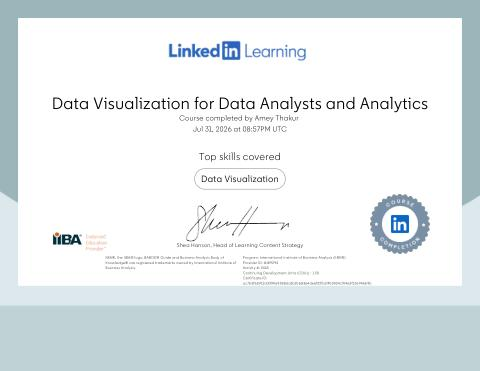 | **Data Visualization for Data Analysts and Analytics** | [LinkedIn Learning](Linkedin%20Learning/Data%20Visualization%20for%20Data%20Analysts%20and%20Analytics%20(LinkedIn%20Learning).pdf)   [IIBA](Linkedin%20Learning/Data%20Visualization%20for%20Data%20Analysts%20and%20Analytics%20(IIBA).pdf) |

#### Career Essentials in Generative AI Professional Certificate &ndash; [Professional Certificate](Linkedin%20Learning/Career%20Essentials%20in%20Generative%20AI%20by%20Microsoft%20and%20LinkedIn.pdf)

  | # | Preview | Topic | Certification |
  | :---: | :---: | :--- | :---: |
  | 1 |  | **What Is Generative AI?** | [Certificate](Linkedin%20Learning/What%20Is%20Generative%20AI_.pdf) |
  | 2 |  | **Your Top AI Questions Answered: AI Literacy for Everyone** | [Certificate](Linkedin%20Learning/Your%20Top%20AI%20Questions%20Answered_%20AI%20Literacy%20for%20Everyone.pdf) |
  | 3 |  | **Learning Microsoft 365 Copilot for Work (2025)** | [Certificate](Linkedin%20Learning/Learning%20Microsoft%20365%20Copilot%20for%20Work%20(2025).pdf) |
  | 4 | 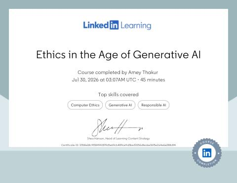  | **Ethics in the Age of Generative AI** | [LinkedIn Learning](Linkedin%20Learning/Ethics%20in%20the%20Age%20of%20Generative%20AI%20(LinkedIn%20Learning).pdf)   [PMI](Linkedin%20Learning/Ethics%20in%20the%20Age%20of%20Generative%20AI%20(PMI).pdf) |
  | 5 |  | **Everyday AI Concepts** | [Certificate](Linkedin%20Learning/Everyday%20AI%20Concepts.pdf) |

#### Career Essentials in Project Management Professional Certificate &ndash; [Professional Certificate](Linkedin%20Learning/Career%20Essentials%20in%20Project%20Management%20by%20Microsoft%20and%20LinkedIn.pdf)

  | # | Preview | Topic | Certification |
  | :---: | :---: | :--- | :---: |
  | 1 |   | **Project Management Foundations** | [LinkedIn Learning](Linkedin%20Learning/Project%20Management%20Foundations%20(LinkedIn%20Learning).pdf)   [PMI](Linkedin%20Learning/Project%20Management%20Foundations%20(PMI).pdf) |
  | 2 |   | **Project Management Foundations: Ethics** | [LinkedIn Learning](Linkedin%20Learning/Project%20Management%20Foundations_%20Ethics%20(LinkedIn%20Learning).pdf)   [PMI](Linkedin%20Learning/Project%20Management%20Foundations_%20Ethics%20(PMI).pdf) |
  | 3 |   | **Project Management Foundations: Requirements** | [LinkedIn Learning](Linkedin%20Learning/Project%20Management%20Foundations_%20Requirements%20(LinkedIn%20Learning).pdf)   [PMI](Linkedin%20Learning/Project%20Management%20Foundations_%20Requirements%20(PMI).pdf) |
  | 4 | 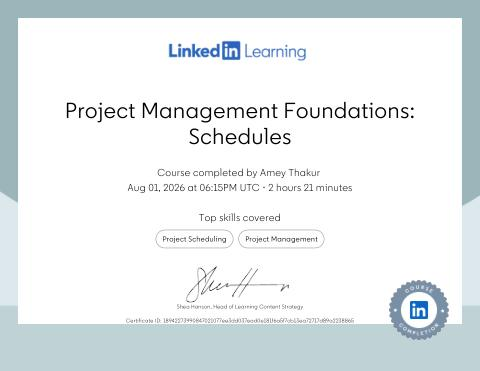  | **Project Management Foundations: Schedules** | [LinkedIn Learning](Linkedin%20Learning/Project%20Management%20Foundations_%20Schedules%20(LinkedIn%20Learning).pdf)   [PMI](Linkedin%20Learning/Project%20Management%20Foundations_%20Schedules%20(PMI).pdf) |
  | 5 |  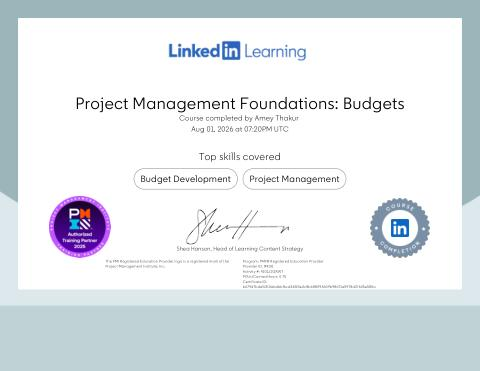 | **Project Management Foundations: Budgets** | [LinkedIn Learning](Linkedin%20Learning/Project%20Management%20Foundations_%20Budgets%20(LinkedIn%20Learning).pdf)   [PMI](Linkedin%20Learning/Project%20Management%20Foundations_%20Budgets%20(PMI).pdf) |
  | 6 |   | **Project Management Foundations: Teams** | [LinkedIn Learning](Linkedin%20Learning/Project%20Management%20Foundations_%20Teams%20(LinkedIn%20Learning).pdf)   [PMI](Linkedin%20Learning/Project%20Management%20Foundations_%20Teams%20(PMI).pdf) |
  | 7 |  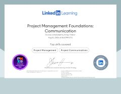 | **Project Management Foundations: Communication** | [LinkedIn Learning](Linkedin%20Learning/Project%20Management%20Foundations_%20Communication%20(LinkedIn%20Learning).pdf)   [PMI](Linkedin%20Learning/Project%20Management%20Foundations_%20Communication%20(PMI).pdf) |
  | 8 | 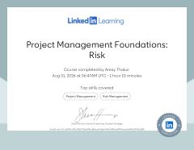  | **Project Management Foundations: Risk** | [LinkedIn Learning](Linkedin%20Learning/Project%20Management%20Foundations_%20Risk%20(LinkedIn%20Learning).pdf)   [PMI](Linkedin%20Learning/Project%20Management%20Foundations_%20Risk%20(PMI).pdf) |
  | 9 |   | **Managing Project Stakeholders** | [LinkedIn Learning](Linkedin%20Learning/Managing%20Project%20Stakeholders%20(LinkedIn%20Learning).pdf)   [PMI](Linkedin%20Learning/Managing%20Project%20Stakeholders%20(PMI).pdf) |
  | 10 |   | **Modern Project Management in Microsoft 365** | [LinkedIn Learning](Linkedin%20Learning/Modern%20Project%20Management%20in%20Microsoft%20365%20(LinkedIn%20Learning).pdf)   [PMI](Linkedin%20Learning/Modern%20Project%20Management%20in%20Microsoft%20365%20(PMI).pdf) |

#### Career Essentials in Software Development Professional Certificate &ndash; [Professional Certificate](Linkedin%20Learning/Career%20Essentials%20in%20Software%20Development%20by%20Microsoft%20and%20LinkedIn.pdf)

  | # | Preview | Topic | Certification |
  | :---: | :---: | :--- | :---: |
  | 1 | 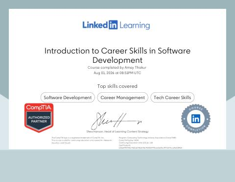    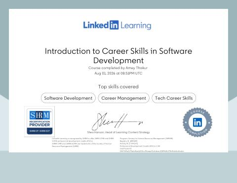 | **Introduction to Career Skills in Software Development** | [LinkedIn Learning](Linkedin%20Learning/Introduction%20to%20Career%20Skills%20in%20Software%20Development%20(LinkedIn%20Learning).pdf)   [PMI](Linkedin%20Learning/Introduction%20to%20Career%20Skills%20in%20Software%20Development%20(PMI).pdf)   [HRCI](Linkedin%20Learning/Introduction%20to%20Career%20Skills%20in%20Software%20Development%20(HRCI).pdf)   [SHRM](Linkedin%20Learning/Introduction%20to%20Career%20Skills%20in%20Software%20Development%20(SHRM).pdf)   [NASBA](Linkedin%20Learning/Introduction%20to%20Career%20Skills%20in%20Software%20Development%20(NASBA).pdf) |
  | 2 |  | **Programming Foundations: Fundamentals** | [Certificate](Linkedin%20Learning/Programming%20Foundations_%20Fundamentals.pdf) |
  | 3 | 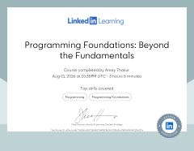 | **Programming Foundations: Beyond the Fundamentals** | [Certificate](Linkedin%20Learning/Programming%20Foundations_%20Beyond%20the%20Fundamentals.pdf) |
  | 4 |  | **Programming Foundations: Object-Oriented Design** | [Certificate](Linkedin%20Learning/Programming%20Foundations_%20Object-Oriented%20Design.pdf) |
#### Career Essentials in Sustainable Tech Professional Certificate &ndash; [Professional Certificate](Linkedin%20Learning/Career%20Essentials%20in%20Sustainable%20Tech%20by%20Microsoft%20and%20LinkedIn.pdf)

  | # | Preview | Topic | Certification |
  | :---: | :---: | :--- | :---: |
  | 1 | 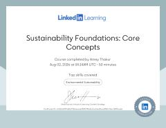  | **Sustainability Foundations: Core Concepts** | [LinkedIn Learning](Linkedin%20Learning/Sustainability%20Foundations_%20Core%20Concepts%20(LinkedIn%20Learning).pdf)   [PMI](Linkedin%20Learning/Sustainability%20Foundations_%20Core%20Concepts%20(PMI).pdf) |
  | 2 |   | **Sustainability as an Innovation Opportunity** | [LinkedIn Learning](Linkedin%20Learning/Sustainability%20as%20an%20Innovation%20Opportunity%20(LinkedIn%20Learning).pdf)   [PMI](Linkedin%20Learning/Sustainability%20as%20an%20Innovation%20Opportunity%20(PMI).pdf) |
  | 3 |  | **Including Sustainability in Your Cloud Strategy** | [Certificate](Linkedin%20Learning/Including%20Sustainability%20in%20Your%20Cloud%20Strategy.pdf) |
  | 4 |  | **Microsoft Cloud for Sustainability: ESG and the Future of Business** | [Certificate](Linkedin%20Learning/Microsoft%20Cloud%20for%20Sustainability_%20ESG%20and%20the%20Future%20of%20Business.pdf) |
  | 5 | 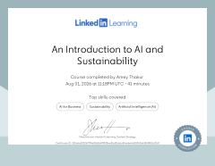 | **An Introduction to AI and Sustainability** | [Certificate](Linkedin%20Learning/An%20Introduction%20to%20AI%20and%20Sustainability.pdf) |
  | 6 |   | **Introduction to ESG: Environmental, Social, and Governance** | [LinkedIn Learning](Linkedin%20Learning/Introduction%20to%20ESG_%20Environmental,%20Social,%20and%20Governance%20(LinkedIn%20Learning).pdf)   [PMI](Linkedin%20Learning/Introduction%20to%20ESG_%20Environmental,%20Social,%20and%20Governance%20(PMI).pdf) |
  | 7 |  | **Performing a Sustainability Audit with Microsoft Sustainability Manager** | [Certificate](Linkedin%20Learning/Performing%20a%20Sustainability%20Audit%20with%20Microsoft%20Sustainability%20Manager.pdf) |

#### Career Essentials in System Administration Professional Certificate &ndash; [Professional Certificate](Linkedin%20Learning/Career%20Essentials%20in%20System%20Administration%20by%20Microsoft%20and%20LinkedIn.pdf)

  | # | Preview | Topic | Certification |
  | :---: | :---: | :--- | :---: |
  | 1 |  | **Career Essentials in System Administration by Microsoft and LinkedIn** | [Certificate](Linkedin%20Learning/Career%20Essentials%20in%20System%20Administration%20by%20Microsoft%20and%20LinkedIn.pdf) |

#### Generative AI for Customer Service with Microsoft 365 Copilot Professional Certificate &ndash; [Professional Certificate](Linkedin%20Learning/Generative%20AI%20for%20Customer%20Service%20with%20Microsoft%20365%20Copilot%20Professional%20Certificate.pdf)

  | # | Preview | Topic | Certification |
  | :---: | :---: | :--- | :---: |
  | 1 |   | **Using AI for Customer Service Managers** | [LinkedIn Learning](Linkedin%20Learning/Using%20AI%20for%20Customer%20Service%20Managers%20(LinkedIn%20Learning).pdf)   [PMI](Linkedin%20Learning/Using%20AI%20for%20Customer%20Service%20Managers%20(PMI).pdf) |
  | 2 |  | **Generative AI for Sales and Services Professionals** | [Certificate](Linkedin%20Learning/Generative%20AI%20for%20Sales%20and%20Services%20Professionals.pdf) |
  | 3 |  | **Customer Journey Mapping with Generative AI** | [Certificate](Linkedin%20Learning/Customer%20Journey%20Mapping%20with%20Generative%20AI.pdf) |
  | 4 |  | **What Is Copilot? An Overview of Microsoft's AI Tools** | [Certificate](Linkedin%20Learning/What%20Is%20Copilot_%20An%20Overview%20of%20Microsoft's%20AI%20Tools.pdf) |
  | 5 |  | **Learning Microsoft 365 Copilot for Work** | [Certificate](Linkedin%20Learning/Learning%20Microsoft%20365%20Copilot%20for%20Work.pdf) |
  | 6 | 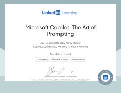 | **Microsoft Copilot: The Art of Prompting** | [Certificate](Linkedin%20Learning/Microsoft%20Copilot_%20The%20Art%20of%20Prompting.pdf) |
  | 7 | 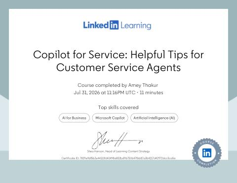 | **Copilot for Service: Helpful Tips for Customer Service Agents** | [Certificate](Linkedin%20Learning/Copilot%20for%20Service_%20Helpful%20Tips%20for%20Customer%20Service%20Agents.pdf) |

#### Generative AI for Marketing with Microsoft 365 Copilot Professional Certificate &ndash; [Professional Certificate](Linkedin%20Learning/Generative%20AI%20for%20Marketing%20with%20Microsoft%20365%20Copilot%20Professional%20Certificate.pdf)

  | # | Preview | Topic | Certification |
  | :---: | :---: | :--- | :---: |
  | 1 |   | **Generative AI for Digital Marketers** | [LinkedIn Learning](Linkedin%20Learning/Generative%20AI%20for%20Digital%20Marketers%20(LinkedIn%20Learning).pdf)   [PMI](Linkedin%20Learning/Generative%20AI%20for%20Digital%20Marketers%20(PMI).pdf) |
  | 2 |  | **The Communicator's Guide to AI: Tools and Mindsets for Modern PR and Media** | [Certificate](Linkedin%20Learning/The%20Communicator's%20Guide%20to%20AI_%20Tools%20and%20Mindsets%20for%20Modern%20PR%20and%20Media.pdf) |
  | 3 |  | **Learning Microsoft 365 Copilot for Work (2025)** | [Certificate](Linkedin%20Learning/Learning%20Microsoft%20365%20Copilot%20for%20Work%20(2025).pdf) |
  | 4 |  | **Microsoft Copilot: The Art of Prompt Writing** | [Certificate](Linkedin%20Learning/Microsoft%20Copilot_%20The%20Art%20of%20Prompt%20Writing.pdf) |
  | 5 |  | **Copilot in PowerPoint: From Prompt to Presentation** | [Certificate](Linkedin%20Learning/Copilot%20in%20PowerPoint_%20From%20Prompt%20to%20Presentation.pdf) |
  | 6 |   | **Excel with Copilot: AI-Driven Data Analysis** | [LinkedIn Learning](Linkedin%20Learning/Excel%20with%20Copilot_%20AI-Driven%20Data%20Analysis%20(LinkedIn%20Learning).pdf)   [PMI](Linkedin%20Learning/Excel%20with%20Copilot_%20AI-Driven%20Data%20Analysis%20(PMI).pdf) |
  | 7 | 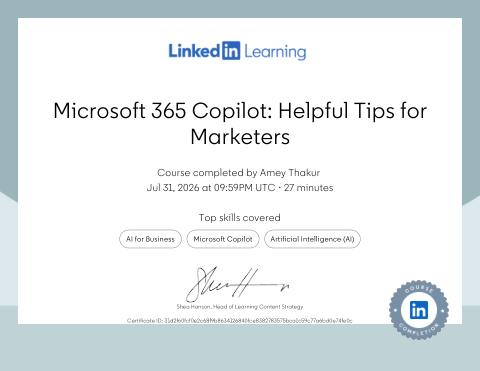 | **Microsoft 365 Copilot: Helpful Tips for Marketers** | [Certificate](Linkedin%20Learning/Microsoft%20365%20Copilot_%20Helpful%20Tips%20for%20Marketers.pdf) |

#### Generative AI for Sales with Microsoft 365 Copilot Professional Certificate &ndash; [Professional Certificate](Linkedin%20Learning/Generative%20AI%20for%20Sales%20with%20Microsoft%20365%20Copilot%20Professional%20Certificate.pdf)

  | # | Preview | Topic | Certification |
  | :---: | :---: | :--- | :---: |
  | 1 |  | **Sales Strategy: Using AI and Automation to Sell More** | [Certificate](Linkedin%20Learning/Sales%20Strategy_%20Using%20AI%20and%20Automation%20to%20Sell%20More.pdf) |
  | 2 |  | **How to Generate Marketing Leads with AI** | [Certificate](Linkedin%20Learning/How%20to%20Generate%20Marketing%20Leads%20with%20AI.pdf) |
  | 3 |  | **Learning Microsoft 365 Copilot for Work** | [Certificate](Linkedin%20Learning/Learning%20Microsoft%20365%20Copilot%20for%20Work.pdf) |
  | 4 |   | **Excel with Copilot: AI-Driven Data Analysis** | [LinkedIn Learning](Linkedin%20Learning/Excel%20with%20Copilot_%20AI-Driven%20Data%20Analysis%20(LinkedIn%20Learning).pdf)   [PMI](Linkedin%20Learning/Excel%20with%20Copilot_%20AI-Driven%20Data%20Analysis%20(PMI).pdf) |
  | 5 |  | **Copilot in PowerPoint: From Prompt to Presentation** | [Certificate](Linkedin%20Learning/Copilot%20in%20PowerPoint_%20From%20Prompt%20to%20Presentation.pdf) |
  | 6 |  | **Microsoft 365 Copilot: Helpful Tips for Sales Professionals** | [Certificate](Linkedin%20Learning/Microsoft%20365%20Copilot_%20Helpful%20Tips%20for%20Sales%20Professionals.pdf) |

#### Human Skills in the Age of AI Professional Certificate &ndash; [Professional Certificate](Linkedin%20Learning/Human%20Skills%20in%20the%20Age%20of%20AI%20by%20Microsoft%20and%20LinkedIn.pdf)

  | # | Preview | Topic | Certification |
  | :---: | :---: | :--- | :---: |
  | 1 | 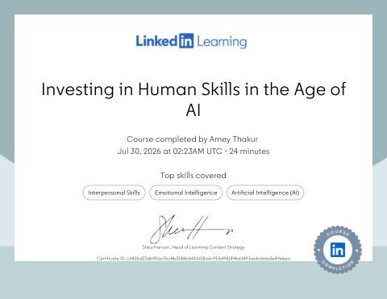  | **Investing in Human Skills in the Age of AI** | [LinkedIn Learning](Linkedin%20Learning/Investing%20in%20Human%20Skills%20in%20the%20Age%20of%20AI%20(LinkedIn%20Learning).pdf)   [PMI](Linkedin%20Learning/Investing%20in%20Human%20Skills%20in%20the%20Age%20of%20AI%20(PMI).pdf) |
  | 2 | 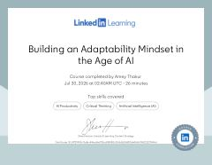  | **Building an Adaptability Mindset in the Age of AI** | [LinkedIn Learning](Linkedin%20Learning/Building%20an%20Adaptability%20Mindset%20in%20the%20Age%20of%20AI%20(LinkedIn%20Learning).pdf)   [PMI](Linkedin%20Learning/Building%20an%20Adaptability%20Mindset%20in%20the%20Age%20of%20AI%20(PMI).pdf) |
  | 3 |  | **Amplify Your Communication Skills with Generative AI** | [Certificate](Linkedin%20Learning/Amplify%20Your%20Communication%20Skills%20with%20Generative%20AI.pdf) |
  | 4 | 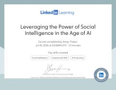  | **Leveraging the Power of Social Intelligence in the Age of AI** | [LinkedIn Learning](Linkedin%20Learning/Leveraging%20the%20Power%20of%20Social%20Intelligence%20in%20the%20Age%20of%20AI%20(LinkedIn%20Learning).pdf)   [PMI](Linkedin%20Learning/Leveraging%20the%20Power%20of%20Social%20Intelligence%20in%20the%20Age%20of%20AI%20(PMI).pdf) |
  | 5 |   | **Amplify Your Critical Thinking with Generative AI** | [LinkedIn Learning](Linkedin%20Learning/Amplify%20Your%20Critical%20Thinking%20with%20Generative%20AI%20(LinkedIn%20Learning).pdf)   [PMI](Linkedin%20Learning/Amplify%20Your%20Critical%20Thinking%20with%20Generative%20AI%20(PMI).pdf) |
  | 6 |   | **Strengthen Your Decision-Making with Generative AI** | [LinkedIn Learning](Linkedin%20Learning/Strengthen%20Your%20Decision-Making%20with%20Generative%20AI%20(LinkedIn%20Learning).pdf)   [PMI](Linkedin%20Learning/Strengthen%20Your%20Decision-Making%20with%20Generative%20AI%20(PMI).pdf) |
  | 7 |  | **Integrating Generative AI into the Creative Process** | [Certificate](Linkedin%20Learning/Integrating%20Generative%20AI%20into%20the%20Creative%20Process.pdf) |

#### Microsoft 365 Copilot Essentials Professional Certificate &ndash; [Professional Certificate](Linkedin%20Learning/Microsoft%20365%20Copilot%20Essentials%20Professional%20Certificate%20by%20Microsoft%20and%20LinkedIn.pdf)

  | # | Preview | Topic | Certification |
  | :---: | :---: | :--- | :---: |
  | 1 |  | **Microsoft Copilot Essentials by Microsoft Press** | [Certificate](Linkedin%20Learning/Microsoft%20Copilot%20Essentials%20by%20Microsoft%20Press.pdf) |
#### Microsoft Azure AI Essentials Professional Certificate &ndash; [Professional Certificate](Linkedin%20Learning/Microsoft%20Azure%20AI%20Essentials%20Professional%20Certificate%20by%20Microsoft%20and%20LinkedIn.pdf)

  | # | Preview | Topic | Certification |
  | :---: | :---: | :--- | :---: |
  | 1 |  | **Microsoft Azure AI Essentials: Workloads and Machine Learning on Azure** | [Certificate](Linkedin%20Learning/Microsoft%20Azure%20AI%20Essentials_%20Workloads%20and%20Machine%20Learning%20on%20Azure.pdf) |

#### Microsoft Azure Essentials Professional Certificate &ndash; [Professional Certificate](Linkedin%20Learning/Microsoft%20Azure%20Essentials%20Professional%20Certificate%20by%20Microsoft%20and%20LinkedIn.pdf)

  | # | Preview | Topic | Certification |
  | :---: | :---: | :--- | :---: |
  | 1 |  | **Microsoft Azure Essentials by Microsoft Press** | [Certificate](Linkedin%20Learning/Microsoft%20Azure%20Essentials%20by%20Microsoft%20Press.pdf) |

#### Microsoft Copilot for Productivity Professional Certificate &ndash; [Professional Certificate](Linkedin%20Learning/Microsoft%20Copilot%20for%20Productivity%20by%20Microsoft%20and%20LinkedIn.pdf)

  | # | Preview | Topic | Certification |
  | :---: | :---: | :--- | :---: |
  | 1 |  | **Learning Microsoft 365 Copilot for Work (2025)** | [Certificate](Linkedin%20Learning/Learning%20Microsoft%20365%20Copilot%20for%20Work%20(2025).pdf) |
  | 2 |  | **Microsoft Copilot: The Art of Prompt Writing** | [Certificate](Linkedin%20Learning/Microsoft%20Copilot_%20The%20Art%20of%20Prompt%20Writing.pdf) |
  | 3 |   | **Copilot in Teams: AI-Powered Collaboration (2024)** | [LinkedIn Learning](Linkedin%20Learning/Copilot%20in%20Teams_%20AI-Powered%20Collaboration%20(2024)%20(LinkedIn%20Learning).pdf)   [PMI](Linkedin%20Learning/Copilot%20in%20Teams_%20AI-Powered%20Collaboration%20(2024)%20(PMI).pdf) |
  | 4 |  | **Copilot in Outlook: Maximize Your Workday Efficiency** | [Certificate](Linkedin%20Learning/Copilot%20in%20Outlook_%20Maximize%20Your%20Workday%20Efficiency.pdf) |
  | 5 | 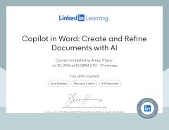 | **Copilot in Word: Create and Refine Documents with AI** | [Certificate](Linkedin%20Learning/Copilot%20in%20Word_%20Create%20and%20Refine%20Documents%20with%20AI.pdf) |
  | 6 |   | **Excel with Copilot: AI-Driven Data Analysis** | [LinkedIn Learning](Linkedin%20Learning/Excel%20with%20Copilot_%20AI-Driven%20Data%20Analysis%20(LinkedIn%20Learning).pdf)   [PMI](Linkedin%20Learning/Excel%20with%20Copilot_%20AI-Driven%20Data%20Analysis%20(PMI).pdf) |
  | 7 |  | **Copilot in PowerPoint: From Prompt to Presentation** | [Certificate](Linkedin%20Learning/Copilot%20in%20PowerPoint_%20From%20Prompt%20to%20Presentation.pdf) |
#### Microsoft Security Essentials Professional Certificate &ndash; [Professional Certificate](Linkedin%20Learning/Microsoft%20Security%20Essentials%20Professional%20Certificate%20by%20Microsoft%20and%20LinkedIn.pdf)

  | # | Preview | Topic | Certification |
  | :---: | :---: | :--- | :---: |
  | 1 |  | **Microsoft Security Essentials: Concepts, Solutions, and AI-Powered Protection** | [Certificate](Linkedin%20Learning/Microsoft%20Security%20Essentials_%20Concepts,%20Solutions,%20and%20AI-Powered%20Protection.pdf) |

#### Responsible AI in a Global Context Professional Certificate &ndash; [Professional Certificate](Linkedin%20Learning/Responsible%20AI%20in%20a%20Global%20Context%20Professional%20Certificate%20by%20the%20United%20Nations%20University.pdf)

  | # | Preview | Topic | Certification |
  | :---: | :---: | :--- | :---: |
  | 1 | 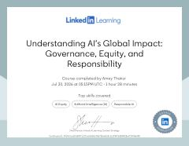 | **Understanding AI's Global Impact: Governance, Equity, and Responsibility** | [Certificate](Linkedin%20Learning/Understanding%20AI's%20Global%20Impact_%20Governance,%20Equity,%20and%20Responsibility.pdf) |
  | 2 |  | **Responsible AI: Global Risks, Governance, and Human Oversight** | [Certificate](Linkedin%20Learning/Responsible%20AI_%20Global%20Risks,%20Governance,%20and%20Human%20Oversight.pdf) |
  | 3 | 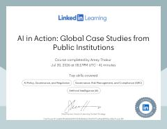 | **AI in Action: Global Case Studies from Public Institutions** | [Certificate](Linkedin%20Learning/AI%20in%20Action_%20Global%20Case%20Studies%20from%20Public%20Institutions.pdf) |

### &nbsp;Moz
#### Search Engine Optimization Professional Certificate &ndash; [Professional Certificate](Linkedin%20Learning/Search%20Engine%20Optimization%20Professional%20Certificate%20by%20Moz.pdf)

  | # | Preview | Topic | Certification |
  | :---: | :---: | :--- | :---: |
  | 1 | 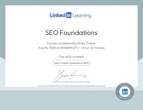 | **SEO Foundations** | [Certificate](Linkedin%20Learning/SEO%20Foundations.pdf) |
  | 2 | 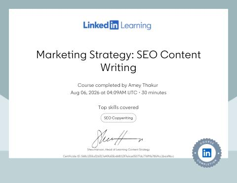 | **Marketing Strategy: SEO Content Writing** | [Certificate](Linkedin%20Learning/Marketing%20Strategy_%20SEO%20Content%20Writing.pdf) |
  | 3 |  | **Technical SEO** | [Certificate](Linkedin%20Learning/Technical%20SEO.pdf) |
  | 4 | 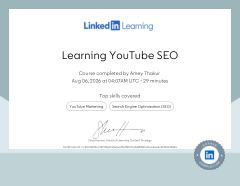 | **Learning YouTube SEO** | [Certificate](Linkedin%20Learning/Learning%20YouTube%20SEO.pdf) |
  | 5 | 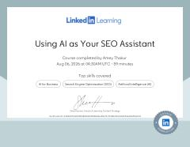 | **Using AI as Your SEO Assistant** | [Certificate](Linkedin%20Learning/Using%20AI%20as%20Your%20SEO%20Assistant.pdf) |

### &nbsp;Mozilla
#### JavaScript Foundations Professional Certificate &ndash; [Professional Certificate](Linkedin%20Learning/JavaScript%20Foundations%20Professional%20Certificate%20by%20Mozilla.pdf)

  | # | Preview | Topic | Certification |
  | :---: | :---: | :--- | :---: |
  | 1 |  | **Learning the JavaScript Language** | [Certificate](Linkedin%20Learning/Learning%20the%20JavaScript%20Language.pdf) |
  | 2 | 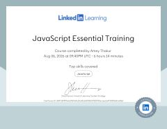 | **JavaScript Essential Training** | [Certificate](Linkedin%20Learning/JavaScript%20Essential%20Training.pdf) |

### &nbsp;PagerDuty
#### DevOps Professional Certificate &ndash; [Professional Certificate](Linkedin%20Learning/DevOps%20Professional%20Certificate%20by%20PagerDuty%20and%20LinkedIn.pdf)

  | # | Preview | Topic | Certification |
  | :---: | :---: | :--- | :---: |
  | 1 | 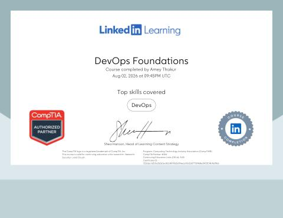 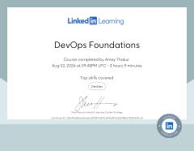  | **DevOps Foundations** | [CompTIA](Linkedin%20Learning/DevOps%20Foundations%20(CompTIA).pdf)   [LinkedIn Learning](Linkedin%20Learning/DevOps%20Foundations%20(LinkedIn%20Learning).pdf)   [PMI](Linkedin%20Learning/DevOps%20Foundations%20(PMI).pdf) |
  | 2 |  | **DevOps Foundations: Infrastructure as Code** | [Certificate](Linkedin%20Learning/DevOps%20Foundations_%20Infrastructure%20as%20Code.pdf) |
  | 3 |  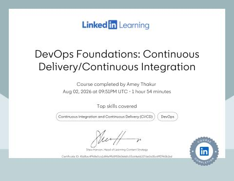 | **DevOps Foundations: Continuous Delivery/Continuous Integration** | [CompTIA](Linkedin%20Learning/DevOps%20Foundations_%20Continuous%20Delivery_Continuous%20Integration%20(CompTIA).pdf)   [LinkedIn Learning](Linkedin%20Learning/DevOps%20Foundations_%20Continuous%20Delivery_Continuous%20Integration%20(LinkedIn%20Learning).pdf) |

### &nbsp;SS&C Blue Prism
#### SS&C Blue Prism Robotic Process Automation Professional Certificate &ndash; [Professional Certificate](Linkedin%20Learning/SS&C%20Blue%20Prism%20Robotic%20Process%20Automation%20Professional%20Certificate.pdf)

  | # | Preview | Topic | Certification |
  | :---: | :---: | :--- | :---: |
  | 1 |  | **Introducing Robotic Process Automation** | [Certificate](Linkedin%20Learning/Introducing%20Robotic%20Process%20Automation.pdf) |
  | 2 |  | **Process Mining for Robotic Process Automation** | [Certificate](Linkedin%20Learning/Process%20Mining%20for%20Robotic%20Process%20Automation.pdf) |
  | 3 |  | **Process Discovery for Robotic Process Automation** | [Certificate](Linkedin%20Learning/Process%20Discovery%20for%20Robotic%20Process%20Automation.pdf) |
  | 4 |  | **Intelligent Automation Foundations** | [Certificate](Linkedin%20Learning/Intelligent%20Automation%20Foundations.pdf) |

### &nbsp;ServiceNow
#### ServiceNow IT Leadership Professional Certificate &ndash; [Professional Certificate](Linkedin%20Learning/ServiceNow%20IT%20Leadership%20Professional%20Certificate.pdf)

  | # | Preview | Topic | Certification |
  | :---: | :---: | :--- | :---: |
  | 1 |  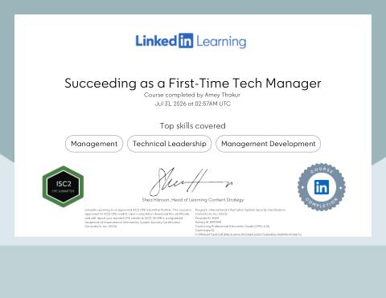 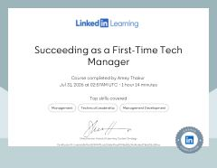  | **Succeeding as a First-Time Tech Manager** | [CompTIA](Linkedin%20Learning/Succeeding%20as%20a%20First-Time%20Tech%20Manager%20(CompTIA).pdf)   [ISC2](Linkedin%20Learning/Succeeding%20as%20a%20First-Time%20Tech%20Manager%20(ISC2).pdf)   [LinkedIn Learning](Linkedin%20Learning/Succeeding%20as%20a%20First-Time%20Tech%20Manager%20(LinkedIn%20Learning).pdf)   [PMI](Linkedin%20Learning/Succeeding%20as%20a%20First-Time%20Tech%20Manager%20(PMI).pdf) |
  | 2 | 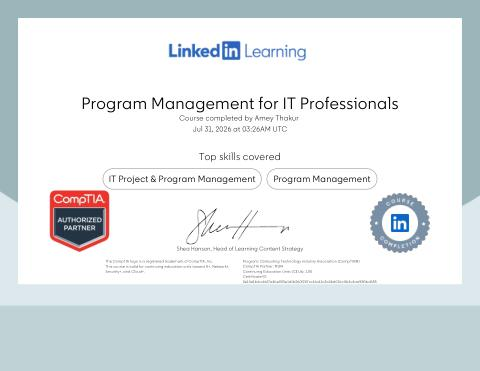  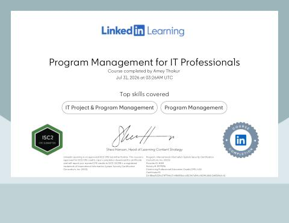   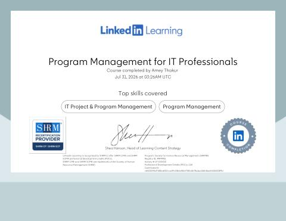 | **Program Management for IT Professionals** | [CompTIA](Linkedin%20Learning/Program%20Management%20for%20IT%20Professionals%20(CompTIA).pdf)   [HRCI](Linkedin%20Learning/Program%20Management%20for%20IT%20Professionals%20(HRCI).pdf)   [ISC2](Linkedin%20Learning/Program%20Management%20for%20IT%20Professionals%20(ISC2).pdf)   [LinkedIn Learning](Linkedin%20Learning/Program%20Management%20for%20IT%20Professionals%20(LinkedIn%20Learning).pdf)   [PMI](Linkedin%20Learning/Program%20Management%20for%20IT%20Professionals%20(PMI).pdf)   [SHRM](Linkedin%20Learning/Program%20Management%20for%20IT%20Professionals%20(SHRM).pdf) |
  | 3 |   | **Introduction to IT Architecture** | [CompTIA](Linkedin%20Learning/Introduction%20to%20IT%20Architecture%20(CompTIA).pdf)   [LinkedIn Learning](Linkedin%20Learning/Introduction%20to%20IT%20Architecture%20(LinkedIn%20Learning).pdf) |
  | 4 |  | **Creating Your IT Strategy** | [Certificate](Linkedin%20Learning/Creating%20Your%20IT%20Strategy.pdf) |

### &nbsp;Snowflake
#### Data Engineering Professional Certificate &ndash; [Professional Certificate](Linkedin%20Learning/Data%20Engineering%20Professional%20Certificate%20by%20Snowflake.pdf)

  | # | Preview | Topic | Certification |
  | :---: | :---: | :--- | :---: |
  | 1 |  | **Intro to Snowflake for Devs, Data Scientists, Data Engineers** | [Certificate](Linkedin%20Learning/Intro%20to%20Snowflake%20for%20Devs,%20Data%20Scientists,%20Data%20Engineers.pdf) |
  | 2 | 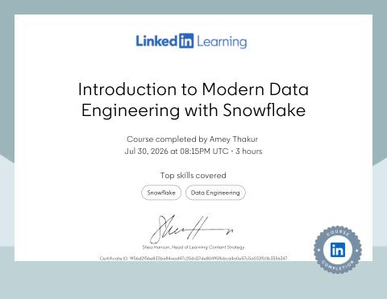 | **Introduction to Modern Data Engineering with Snowflake** | [Certificate](Linkedin%20Learning/Introduction%20to%20Modern%20Data%20Engineering%20with%20Snowflake.pdf) |
  | 3 | 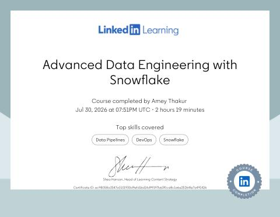 | **Advanced Data Engineering with Snowflake** | [Certificate](Linkedin%20Learning/Advanced%20Data%20Engineering%20with%20Snowflake.pdf) |

#### Generative AI Professional Certificate &ndash; [Professional Certificate](Linkedin%20Learning/Generative%20AI%20Professional%20Certificate%20by%20Snowflake.pdf)

  | # | Preview | Topic | Certification |
  | :---: | :---: | :--- | :---: |
  | 1 |  | **Intro to Snowflake for Devs, Data Scientists, Data Engineers** | [Certificate](Linkedin%20Learning/Intro%20to%20Snowflake%20for%20Devs,%20Data%20Scientists,%20Data%20Engineers.pdf) |
  | 2 | 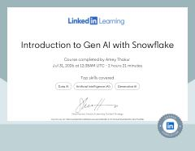 | **Introduction to Gen AI with Snowflake** | [Certificate](Linkedin%20Learning/Introduction%20to%20Gen%20AI%20with%20Snowflake.pdf) |
  | 3 |  | **Building Generative AI Apps to Talk to Your Data** | [Certificate](Linkedin%20Learning/Building%20Generative%20AI%20Apps%20to%20Talk%20to%20Your%20Data.pdf) |
  | 4 |  | **Building AI Agents with Snowflake** | [Certificate](Linkedin%20Learning/Building%20AI%20Agents%20with%20Snowflake.pdf) |

### &nbsp;TestMu AI
#### TestMu AI Test Automation Professional Certificate &ndash; [Professional Certificate](Linkedin%20Learning/TestMu%20AI%20Test%20Automation%20Professional%20Certificate.pdf)

  | # | Preview | Topic | Certification |
  | :---: | :---: | :--- | :---: |
  | 1 |  | **Test Automation Foundations** | [Certificate](Linkedin%20Learning/Test%20Automation%20Foundations.pdf) |
  | 2 | 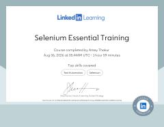 | **Selenium Essential Training** | [Certificate](Linkedin%20Learning/Selenium%20Essential%20Training.pdf) |

#### TestMu AI Software Testing Professional Certificate &ndash; [Professional Certificate](Linkedin%20Learning/TestMu%20AI%20Software%20Testing%20Professional%20Certificate.pdf)

  | # | Preview | Topic | Certification |
  | :---: | :---: | :--- | :---: |
  | 1 |  | **Programming Foundations: Software Testing/QA** | [Certificate](Linkedin%20Learning/Programming%20Foundations_%20Software%20Testing_QA.pdf) |
  | 2 | 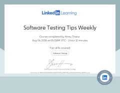 | **Software Testing Tips Weekly** | [Certificate](Linkedin%20Learning/Software%20Testing%20Tips%20Weekly.pdf) |
  | 3 | 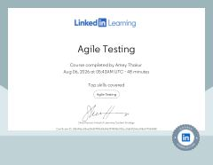 | **Agile Testing** | [Certificate](Linkedin%20Learning/Agile%20Testing.pdf) |
  | 4 |  | **Succeeding in Software Testing** | [Certificate](Linkedin%20Learning/Succeeding%20in%20Software%20Testing.pdf) |

### &nbsp;Toastmasters International
#### Public Speaking Skills Professional Certificate &ndash; [Professional Certificate](Linkedin%20Learning/Public%20Speaking%20Skills%20Professional%20Certificate%20by%20Toastmasters%20International.pdf)

  | # | Preview | Topic | Certification |
  | :---: | :---: | :--- | :---: |
  | 1 |   | **Public Speaking Foundations** | [LinkedIn Learning](Linkedin%20Learning/Public%20Speaking%20Foundations%20(LinkedIn%20Learning).pdf)   [PMI](Linkedin%20Learning/Public%20Speaking%20Foundations%20(PMI).pdf) |
  | 2 |  | **Writing and Delivering Speeches** | [Certificate](Linkedin%20Learning/Writing%20and%20Delivering%20Speeches.pdf) |
  | 3 | 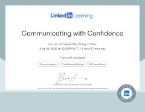  | **Communicating with Confidence** | [LinkedIn Learning](Linkedin%20Learning/Communicating%20with%20Confidence%20(LinkedIn%20Learning).pdf)   [PMI](Linkedin%20Learning/Communicating%20with%20Confidence%20(PMI).pdf) |
  | 4 |   | **Body Language for Leaders and Managers** | [LinkedIn Learning](Linkedin%20Learning/Body%20Language%20for%20Leaders%20and%20Managers%20(LinkedIn%20Learning).pdf)   [PMI](Linkedin%20Learning/Body%20Language%20for%20Leaders%20and%20Managers%20(PMI).pdf) |
  | 5 |   | **Establishing Credibility as a Speaker** | [LinkedIn Learning](Linkedin%20Learning/Establishing%20Credibility%20as%20a%20Speaker%20(LinkedIn%20Learning).pdf)   [PMI](Linkedin%20Learning/Establishing%20Credibility%20as%20a%20Speaker%20(PMI).pdf) |
  | 6 |  | **Presenting Technical Information with Stories** | [Certificate](Linkedin%20Learning/Presenting%20Technical%20Information%20with%20Stories.pdf) |
  | 7 |  | **Impromptu Speaking** | [Certificate](Linkedin%20Learning/Impromptu%20Speaking.pdf) |

### &nbsp;Wolfram Research
#### Machine Learning Statistical Foundations Professional Certificate &ndash; [Professional Certificate](Linkedin%20Learning/Machine%20Learning%20Statistical%20Foundations%20Professional%20Certificate%20by%20Wolfram%20Research.pdf)

  | # | Preview | Topic | Certification |
  | :---: | :---: | :--- | :---: |
  | 1 |  | **Artificial Intelligence Foundations: Machine Learning** | [Certificate](Linkedin%20Learning/Artificial%20Intelligence%20Foundations_%20Machine%20Learning.pdf) |
  | 2 |  | **Machine Learning Foundations: Linear Algebra** | [Certificate](Linkedin%20Learning/Machine%20Learning%20Foundations_%20Linear%20Algebra.pdf) |
  | 3 | 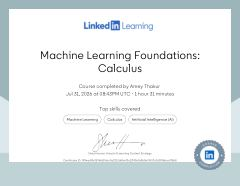 | **Machine Learning Foundations: Calculus** | [Certificate](Linkedin%20Learning/Machine%20Learning%20Foundations_%20Calculus.pdf) |
  | 4 |  | **Machine Learning Foundations: Probability** | [Certificate](Linkedin%20Learning/Machine%20Learning%20Foundations_%20Probability.pdf) |
  | 5 |  | **Machine Learning Foundations: Statistics** | [Certificate](Linkedin%20Learning/Machine%20Learning%20Foundations_%20Statistics.pdf) |
  | 6 |  | **Built-in Machine Learning in the Wolfram Language** | [Certificate](Linkedin%20Learning/Built-in%20Machine%20Learning%20in%20the%20Wolfram%20Language.pdf) |

#### Statistics Foundations Professional Certificate &ndash; [Professional Certificate](Linkedin%20Learning/Statistics%20Foundations%20Professional%20Certificate%20by%20Wolfram%20Research.pdf)

  | # | Preview | Topic | Certification |
  | :---: | :---: | :--- | :---: |
  | 1 |  | **Statistics Foundations 1: The Basics** | [Certificate](Linkedin%20Learning/Statistics%20Foundations%201_%20The%20Basics.pdf) |
  | 2 |  | **Statistics Foundations 2: Probability** | [Certificate](Linkedin%20Learning/Statistics%20Foundations%202_%20Probability.pdf) |
  | 3 |  | **Statistics Foundations 3: Using Data Sets** | [Certificate](Linkedin%20Learning/Statistics%20Foundations%203_%20Using%20Data%20Sets.pdf) |
  | 4 | 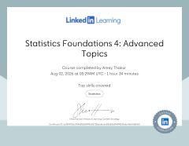 | **Statistics Foundations 4: Advanced Topics** | [Certificate](Linkedin%20Learning/Statistics%20Foundations%204_%20Advanced%20Topics.pdf) |
  | 5 |  | **Excel Statistics Essential Training: 1** | [Certificate](Linkedin%20Learning/Excel%20Statistics%20Essential%20Training_%201.pdf) |
  | 6 |  | **Excel Statistics Essential Training: 2** | [Certificate](Linkedin%20Learning/Excel%20Statistics%20Essential%20Training_%202.pdf) |
  | 7 | 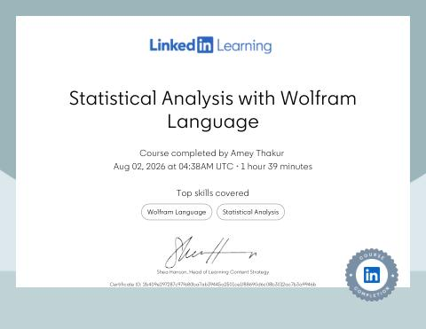 | **Statistical Analysis with Wolfram Language** | [Certificate](Linkedin%20Learning/Statistical%20Analysis%20with%20Wolfram%20Language.pdf) |

### &nbsp;Zendesk
#### Zendesk Customer Service Professional Certificate &ndash; [Professional Certificate](Linkedin%20Learning/Zendesk%20Customer%20Service%20Professional%20Certificate.pdf)

  | # | Preview | Topic | Certification |
  | :---: | :---: | :--- | :---: |
  | 1 | 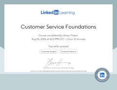  | **Customer Service Foundations** | [LinkedIn Learning](Linkedin%20Learning/Customer%20Service%20Foundations%20(LinkedIn%20Learning).pdf)   [PMI](Linkedin%20Learning/Customer%20Service%20Foundations%20(PMI).pdf) |
  | 2 |  | **Customer Service: Problem-Solving and Troubleshooting** | [Certificate](Linkedin%20Learning/Customer%20Service_%20Problem-Solving%20and%20Troubleshooting.pdf) |
  | 3 |  | **Building Rapport with Customers** | [Certificate](Linkedin%20Learning/Building%20Rapport%20with%20Customers.pdf) |
  | 4 | 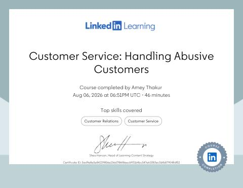 | **Customer Service: Handling Abusive Customers** | [Certificate](Linkedin%20Learning/Customer%20Service_%20Handling%20Abusive%20Customers.pdf) |
  | 5 |  | **Creating Positive Conversations with Challenging Customers** | [Certificate](Linkedin%20Learning/Creating%20Positive%20Conversations%20with%20Challenging%20Customers.pdf) |
  | 6 |  | **Serving Customers Using Social Media** | [Certificate](Linkedin%20Learning/Serving%20Customers%20Using%20Social%20Media.pdf) |

---

### &nbsp;LTCE Webinar

#### Technical Seminars

| # | Preview | Topic | Certification |
| :---: | :---: | :--- | :---: |
| 1 | 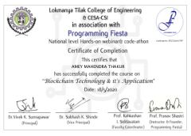 | **Blockchain Technology and its Applications** | [Certificate](LTCE%20Webinar/LTCE%20Webinar%20Blockchain%20Technology.pdf) |
| 2 |  | **Future Prediction using Machine Learning Algorithm** | [Certificate](LTCE%20Webinar/LTCE%20Webinar%20Future%20Prediction%20using%20Machine%20Learning%20Algorithm.pdf) |
| 3 | 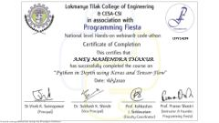 | **Python in Depth using Keras & TensorFlow** | [Certificate](LTCE%20Webinar/LTCE%20Webinar%20Python%20in%20Depth%20using%20Keras%20_%20Tensorflow.pdf) |

---

### &nbsp;MathWorks

#### &nbsp;MATLAB Academy

| # | Preview | Topic | Certification |
| :---: | :---: | :--- | :---: |
| 1 |  | **MATLAB Onramp** | [Certificate](MathWorks/MATLAB%20Onramp.pdf) |
| 2 |  | **Machine Learning Onramp** | [Certificate](MathWorks/Machine%20Learning%20Onramp.pdf) |
| 3 |  | **Deep Learning Onramp** | [Certificate](MathWorks/Deep%20Learning%20Onramp.pdf) |
 
---

### &nbsp;Microsoft

#### &nbsp;Microsoft Training

| # | Preview | Topic | Certification |
| :---: | :---: | :--- | :---: |
| 1 | 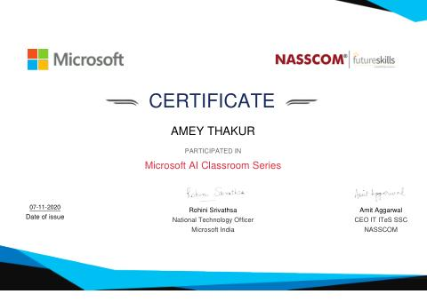 | **Microsoft AI Classroom Series** | [Certificate](Microsoft/Microsoft%20AI%20Classroom%20Series.pdf) |

---

### &nbsp;NVIDIA Deep Learning Institute

#### &nbsp;NVIDIA Training

| # | Preview | Topic | Certification |
| :---: | :---: | :--- | :---: |
| 1 | 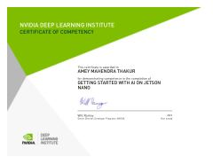 | **Getting Started with AI on Jetson** | [Certificate](Nvidia%20Deep%20Learning%20Institute/NVIDIA%20GETTING%20STARTED%20WITH%20AI%20ON%20JETSON.pdf) |
| 2 |  | **Getting Started with DeepStream for Video Analytics on Jetson Nano** | [Certificate](Nvidia%20Deep%20Learning%20Institute/NVIDIA%20GETTING%20STARTED%20WITH%20DEEPSTREAM%20FOR%20VIDEO%20ANALYTICS%20ON%20JETSON%20NANO.pdf) |

---

### &nbsp;OpenAI Academy

| # | Preview | Topic | Certification | Verification |
| :---: | :---: | :--- | :---: | :---: |
| 1 | 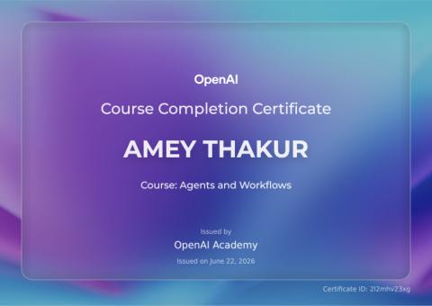 | **Agents and Workflows** | [Certificate](https://github.com/Amey-Thakur/ACHIEVEMENTS/blob/main/OpenAI%20Academy/Certificate%20-%20Agents%20and%20Workflows.pdf) | [Verify](https://academy.openai.com/home/certificate/2l2mhv23xg) |
| 2 | 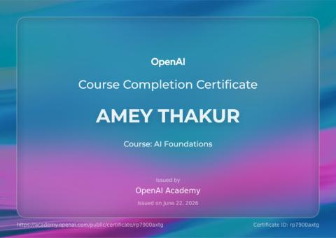 | **AI Foundations** | [Certificate](https://github.com/Amey-Thakur/ACHIEVEMENTS/blob/main/OpenAI%20Academy/Certificate%20-%20AI%20Foundations.pdf) | [Verify](https://academy.openai.com/home/certificate/rp7900axtg) |
| 3 |  | **Applied AI Foundations** | [Certificate](https://github.com/Amey-Thakur/ACHIEVEMENTS/blob/main/OpenAI%20Academy/Certificate%20-%20Applied%20AI%20Foundations.pdf) | [Verify](https://academy.openai.com/home/certificate/mn561u3v7q) |

---

## Project Engineering & Applied Research Portfolio

> [!TIP]
> **Project Engineering & Applied Research Hub**:
> - **[Advancing Ideas @ AmeyArc_](https://amey-thakur.github.io/)** — Research space for technical notes and scholarly reflections.
> - **[Engineering Project Demonstrations](https://youtube.com/playlist?list=PLGOc13Pt03SZ9INe4gyxoZnA4zAXssiLn)** — Official Engineering Projects YouTube Playlist.
> - **[AWS Cloud Practitioner Tutorials](https://youtube.com/playlist?list=PLGOc13Pt03SZuZA2eS79J4EUtBBgR0JCs)** — Comprehensive AWS Architectural Guide.

| # | Project | Source Code | Demonstration |
| :---: | :--- | :---: | :---: |
| 1 | **Quadtree Visualizer (Capstone)** | [Repository](https://github.com/Amey-Thakur/QUADTREE-VISUALIZER) | [YouTube](https://youtu.be/8un0Qu8ibNk) |
| 2 | **AWS Certified Cloud Practitioner** | [Repository](https://github.com/Amey-Thakur/AWS-CERTIFIED-CLOUD-PRACTITIONER-CLF-C01) | [YouTube](https://youtube.com/playlist?list=PLGOc13Pt03SZuZA2eS79J4EUtBBgR0JCs) |
| 3 | **Text Summarizer** | [Repository](https://github.com/Amey-Thakur/TEXT-SUMMARIZER) | [YouTube](https://youtu.be/2drrqsSB1Bc) |
| 4 | **Online Chess Game** | [Repository](https://github.com/Amey-Thakur/ONLINE-CHESS-GAME) | [YouTube](https://youtu.be/CCbrTQwYyE8) |
| 5 | **K-Means Stock Trading** | [Repository](https://github.com/Amey-Thakur/OPTIMIZING-STOCK-TRADING-STRATEGY-WITH-K-MEANS-CLUSTERING) | [YouTube](https://youtu.be/Q82a93hjxJE) |
| 6 | **White-Box Cartoonization** | [Repository](https://github.com/Amey-Thakur/WHITE-BOX-CARTOONIZATION) | [YouTube](https://youtu.be/8VNc8p6AKmw) |
| 7 | **Digital Bookstore** | [Repository](https://github.com/Amey-Thakur/DIGITAL-BOOKSTORE) | [YouTube](https://youtu.be/JuUix8olOC8) |
| 8 | **Car Rental System** | [Repository](https://github.com/Amey-Thakur/CAR-RENTAL-SYSTEM) | — |
| 9 | **Chat Room** | [Repository](https://github.com/Amey-Thakur/CHAT-ROOM) | [YouTube](https://youtu.be/Aem0k2Dl9fU) |
| 10 | **8086 ASM** | [Repository](https://github.com/Amey-Thakur/8086-ASSEMBLY-LANGUAGE-PROGRAMS) | — |
| 11 | **COVID-19 Web Scraper** | [Repository](https://github.com/Amey-Thakur/COVID19-WEB-SCRAPER) | — |
| 12 | **Interest Calculator** | [Repository](https://github.com/Amey-Thakur/SIMPLE-AND-COMPOUND-INTEREST-CALCULATOR) | — |
| 13 | **AR Stack Game** | [Repository](https://github.com/Amey-Thakur/AR-STACK-GAME) | — |
| 14 | **Hangman Word Game** | [Repository](https://github.com/Amey-Thakur/HANGMAN-WORD-GAME) | [YouTube](https://youtu.be/JsT9KYKPUgs) |
| 15 | **ResearchGate Archive** | [Repository](https://github.com/Amey-Thakur/RESEARCHGATE) | — |
| 16 | **Deepfake Audio Synthesis** | [Repository](https://github.com/Amey-Thakur/DEEPFAKE-AUDIO) | [YouTube](https://youtu.be/i3wnBcbHDbs) |
| 17 | **Sentiment Analyzer** | [Repository](https://github.com/Amey-Thakur/SENTIMENT-ANALYZER) | — |
| 18 | **Depression Detection** | [Repository](https://github.com/Amey-Thakur/DEPRESSION-DETECTION-USING-TWEETS) | — |
| 19 | **Stock Trading Strategy RL** | [Repository](https://github.com/Amey-Thakur/OPTIMIZING-STOCK-TRADING-STRATEGY-WITH-REINFORCEMENT-LEARNING) | [YouTube](https://youtu.be/Q82a93hjxJE) |
| 20 | **Reinforcement Learning Strategy** | [Repository](https://github.com/Amey-Thakur/Optimizing-Stock-Trading-Using-Reinforcement-Learning-DST) | — |
| 21 | **Kaggle Courses** | [Repository](https://github.com/Amey-Thakur/KAGGLE-COURSES) | — |
| 22 | **House Price Prediction** | [Repository](https://github.com/Amey-Thakur/BANGALORE-HOUSE-PRICE-PREDICTION) | [YouTube](https://youtu.be/HaiXYHBPHVg) |
| 23 | **Unsupervised ML** | [Repository](https://github.com/Amey-Thakur/TSF-UNSUPERVISED-MACHINE-LEARNING) | — |
| 24 | **Supervised ML** | [Repository](https://github.com/Amey-Thakur/TSF-SUPERVISED-MACHINE-LEARNING) | [YouTube](https://youtu.be/qsO9GyGNWf0) |
| 25 | **React Todo App** | [Repository](https://github.com/Amey-Thakur/REACT-TODO-APP) | — |
| 26 | **Tic-Tac-Toe in Angular** | [Repository](https://github.com/Amey-Thakur/TIC-TAC-TOE-ANGULAR-FRAMEWORK) | [YouTube](https://youtu.be/zCKgLImSjeo) |
| 27 | **JavaScript Frameworks** | [Repository](https://github.com/Amey-Thakur/JAVASCRIPT-FRAMEWORKS) | — |
| 28 | **Hangman in Django** | [Repository](https://github.com/Amey-Thakur/HANGMAN-GAME-IN-DJANGO-PYTHON) | — |
| 29 | **Hadoop** | [Repository](https://github.com/Amey-Thakur/HADOOP) | — |
| 30 | **30 Days of Ruby** | [Repository](https://github.com/Amey-Thakur/RUBY) | — |
| 31 | **Hangman in Ruby** | [Repository](https://github.com/Amey-Thakur/HANGMAN-IN-RUBY) | — |
| 32 | **Tic-Tac-Toe in Ruby** | [Repository](https://github.com/Amey-Thakur/TIC-TAC-TOE-IN-RUBY) | — |
| 33 | **Ruby on Rails FriendsApp** | [Repository](https://github.com/Amey-Thakur/RUBY-ON-RAILS-FRIENDSAPP) | — |
| 34 | **RailsFriends** | [Repository](https://github.com/Amey-Thakur/RAILSFRIENDS) | — |
| 35 | **Python Shorts** | [Repository](https://github.com/Amey-Thakur/PYTHON-SHORTS) | — |
| 36 | **Python Crash Course** | [Repository](https://github.com/Amey-Thakur/PYTHON-CRASH-COURSE) | — |
| 37 | **30 Days of R** | [Repository](https://github.com/Amey-Thakur/R) | — |
| 38 | **50 Days of Julia** | [Repository](https://github.com/Amey-Thakur/JULIA) | — |
| 39 | **The Math Game** | [Repository](https://github.com/Amey-Thakur/THE-MATH-GAME) | — |
| 40 | **Math Sprint Game** | [Repository](https://github.com/Amey-Thakur/MATH-SPRINT-GAME) | — |
| 41 | **Rock Paper Scissors** | [Repository](https://github.com/Amey-Thakur/ROCK-PAPER-SCISSORS) | — |
| 42 | **ATVM Interface** | [Repository](https://github.com/Amey-Thakur/ATVM-INTERFACE) | — |
| 43 | **Flappy Bird** | [Repository](https://github.com/Amey-Thakur/FLAPPY-BIRD-USING-PYGAME) | — |
| 44 | **Pong Game** | [Repository](https://github.com/Amey-Thakur/PONG-GAME) | — |
| 45 | **Android Studio Flashlight** | [Repository](https://github.com/Amey-Thakur/ANDROID-STUDIO-FLASHLIGHT-APP) | [YouTube](https://youtu.be/83z8sHEzDC0) |
| 46 | **Android Studio Calculator** | [Repository](https://github.com/Amey-Thakur/ANDROID-STUDIO-CALCULATOR) | [YouTube](https://youtu.be/g0uc8xAfdFk) |
| 47 | **Search Space Explore Extent** | [Repository](https://github.com/Amey-Thakur/SEARCH-SPACE-EXPLORE-EXTENT) | — |
| 48 | **Lunar Design Studio** | [Repository](https://github.com/Amey-Thakur/LUNAR-DESIGN-STUDIO) | — |
| 49 | **Achievements** | [Repository](https://github.com/Amey-Thakur/ACHIEVEMENTS) | — |
| 50 | **Zero-Shot Video Generation** | [Repository](https://github.com/Amey-Thakur/ZERO-SHOT-VIDEO-GENERATION) | [YouTube](https://youtu.be/za9hId6UPoY) |
| 51 | **Adaptive Cruise Control** | [Repository](https://github.com/Amey-Thakur/ADAPTIVE-CRUISE-CONTROL) | — |
| 52 | **Binary Pulse Amplitude Modulation (BPAM)** | [Repository](https://github.com/Amey-Thakur/DIGITAL-COMMUNICATIONS/tree/main/Project/Task%202%20-%20Pulse%20Amplitude%20Modulation%20%28PAM%29) | — |
| 53 | **M-ary Pulse Amplitude Modulation (MPAM)** | [Repository](https://github.com/Amey-Thakur/DIGITAL-COMMUNICATIONS/tree/main/Project/Task%202%20-%20Pulse%20Amplitude%20Modulation%20%28PAM%29) | — |
| 54 | **Phase Shift Keying (PSK)** | [Repository](https://github.com/Amey-Thakur/DIGITAL-COMMUNICATIONS/tree/main/Project/Task%203%20-%20Phase%20Shift%20Keying%20%28PSK%29) | — |
| 55 | **Quadrature Amplitude Modulation (QAM)** | [Repository](https://github.com/Amey-Thakur/DIGITAL-COMMUNICATIONS/tree/main/Project/Task%204%20-%20Quadrature%20Amplitude%20Modulation%20%28MQAM%29) | — |
| 56 | **Offset QPSK (OQPSK)** | [Repository](https://github.com/Amey-Thakur/DIGITAL-COMMUNICATIONS/tree/main/Project/Task%205%20-%20Offset%20Quadrature%20Phase%20Shift%20Keying%20%28OQPSK%29) | — |
| 57 | **Convolutional Neural Network (CNN)** | [Repository](https://github.com/Amey-Thakur/COMPUTATIONAL-INTELLIGENCE/blob/main/MATLAB/Convolutional_Neural_Network.m) | — |
| 58 | **Self-Organizing Maps (SOM)** | [Repository](https://github.com/Amey-Thakur/COMPUTATIONAL-INTELLIGENCE/blob/main/MATLAB/Self_Organizing_Maps_Kohonen.m) | — |
| 59 | **Radial Basis Function Network (RBFN)** | [Repository](https://github.com/Amey-Thakur/COMPUTATIONAL-INTELLIGENCE/blob/main/MATLAB/Radial_Basis_Function_Network.m) | — |
| 60 | **Radial Basis Function Optimization (RBFO)** | [Repository](https://github.com/Amey-Thakur/COMPUTATIONAL-INTELLIGENCE/blob/main/MATLAB/Radial_Basis_Function_Optimization.m) | — |
| 61 | **Learning Vector Quantization (LVQ)** | [Repository](https://github.com/Amey-Thakur/COMPUTATIONAL-INTELLIGENCE/blob/main/MATLAB/Learning_Vector_Quantization.m) | — |
| 62 | **Bidirectional Associative Memory (BAM)** | [Repository](https://github.com/Amey-Thakur/COMPUTATIONAL-INTELLIGENCE/blob/main/MATLAB/Bidirectional_Associative_Memory.m) | — |
| 63 | **Generalized Hopfield Network (GHN)** | [Repository](https://github.com/Amey-Thakur/COMPUTATIONAL-INTELLIGENCE/blob/main/MATLAB/Generalized_Hopfield_Step_Function.m) | — |
| 64 | **Fuzzy Logic & Reasoning (FLR)** | [Repository](https://github.com/Amey-Thakur/COMPUTATIONAL-INTELLIGENCE/blob/main/MATLAB/Fuzzy_Logic_and_Reasoning.m) | — |
| 65 | **Fuzzy Reasoning System (FRS)** | [Repository](https://github.com/Amey-Thakur/COMPUTATIONAL-INTELLIGENCE/blob/main/MATLAB/Fuzzy_Reasoning_System.m) | — |
| 66 | **Fuzzy Set Theory (FST)** | [Repository](https://github.com/Amey-Thakur/COMPUTATIONAL-INTELLIGENCE/blob/main/MATLAB/Fuzzy_Set_Theory.m) | — |
| 67 | **Fuzzy Set Operations (FSO)** | [Repository](https://github.com/Amey-Thakur/COMPUTATIONAL-INTELLIGENCE/blob/main/MATLAB/Fuzzy_Set_Theory_Operations.m) | — |
| 68 | **Genetic Algorithm Optimization (GAO)** | [Repository](https://github.com/Amey-Thakur/COMPUTATIONAL-INTELLIGENCE/blob/main/MATLAB/Genetic_Algorithm_Optimization.m) | — |
| 69 | **Genetic Algorithm Implementation (GAI)** | [Repository](https://github.com/Amey-Thakur/COMPUTATIONAL-INTELLIGENCE/blob/main/MATLAB/Genetic_Algorithm_Implementation.m) | — |
| 70 | **Genetic Algorithm Variant I (GAV-I)** | [Repository](https://github.com/Amey-Thakur/COMPUTATIONAL-INTELLIGENCE/blob/main/MATLAB/Genetic_Algorithm_Variant_I.m) | — |
| 71 | **Genetic Algorithm Variant II (GAV-II)** | [Repository](https://github.com/Amey-Thakur/COMPUTATIONAL-INTELLIGENCE/blob/main/MATLAB/Genetic_Algorithm_Variant_II.m) | — |
| 72 | **Binary to Decimal Conversion (B2D)** | [Repository](https://github.com/Amey-Thakur/COMPUTATIONAL-INTELLIGENCE/blob/main/MATLAB/Binary_to_Decimal_Conversion.m) | — |
| 73 | **Decimal to Binary Conversion (D2B)** | [Repository](https://github.com/Amey-Thakur/COMPUTATIONAL-INTELLIGENCE/blob/main/MATLAB/Decimal_to_Binary_Conversion.m) | — |
| 74 | **Project Management Software Evaluation** | [Repository](https://github.com/Amey-Thakur/ENGINEERING-PROJECT-MANAGEMENT/blob/main/Assignments/EPM%20Assignment%201/A%20Comparative%20Evaluation%20of%20Project%20Management%20Software%20for%20Engineering%20Projects%20%5BAmey%20Thakur%20-%20110107589%5D.pdf) | — |
| 75 | **Global Green Books Case Study** | [Repository](https://github.com/Amey-Thakur/ENGINEERING-PROJECT-MANAGEMENT/blob/main/Assignments/EPM%20Assignment%202/Driving%20Success%20through%20Project%20Management%20Implementation%20-%20A%20Case%20Study%20Analysis%20of%20Global%20Green%20Books%20Publishing.pdf) | — |
| 76 | **E-KYC Platform Implementation** | [Repository](https://github.com/Amey-Thakur/ENGINEERING-PROJECT-MANAGEMENT/blob/main/Assignments/EPM%20Assignment%203/EPM%20Assignment%203%20-%20Case%20study%20and%20case%20study%20reviews.pdf) | — |
| 77 | **Efficient Home Insulation (UN SDG)** | [Repository](https://github.com/Amey-Thakur/ENGINEERING-TECHNICAL-COMMUNICATIONS?tab=readme-ov-file#iv-the-major-team-project-suite--capstone-engineering-design) | — |
| 78 | **VIP - Community Service Learning (ACWR)** | [Repository](https://github.com/Amey-Thakur/VIP-CSL-FALL-2023) | — |

---

### &nbsp;Quizzes

| # | Preview | Assessment | Organizing Body | Certified Artifact |
| :---: | :---: | :--- | :---: | :---: |
| 1 | 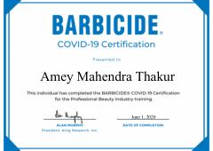 | **BARBICIDE Covid-19 Certification** | BARBICIDE | [Certificate](https://github.com/Amey-Thakur/ACHIEVEMENTS/blob/main/Quizzes/BARBICIDE%20Covid-19%20Certification.pdf) |
| 2 | 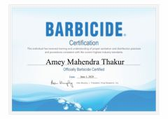 | **BARBICIDE Doctorate Course** | BARBICIDE | [Certificate](https://github.com/Amey-Thakur/ACHIEVEMENTS/blob/main/Quizzes/BARBICIDE%20Doctorate%20Course.pdf) |
| 3 | 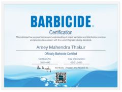 | **BARBICIDE Professional** | BARBICIDE | [Certificate](https://github.com/Amey-Thakur/ACHIEVEMENTS/blob/main/Quizzes/BARBICIDE.pdf) |
| 4 | 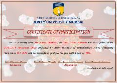 | **Covid-19 Quiz** | Amity University | [Certificate](https://github.com/Amey-Thakur/ACHIEVEMENTS/blob/main/Quizzes/Covid-19%20Quiz%20by%20Amity%20University.pdf) |
| 5 | 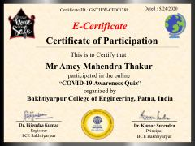 | **Covid-19 Quiz** | BCEP | [Certificate](https://github.com/Amey-Thakur/ACHIEVEMENTS/blob/main/Quizzes/Covid-19%20Quiz%20by%20BCEP.pdf) |
| 6 | 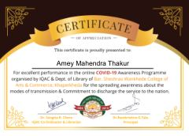 | **Covid-19 Quiz** | BSWCAAC | [Certificate](https://github.com/Amey-Thakur/ACHIEVEMENTS/blob/main/Quizzes/Covid-19%20Quiz%20by%20BSWCAAC.pdf) |
| 7 | 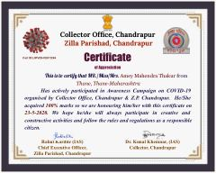 | **Covid-19 Quiz** | COCZP | [Certificate](https://github.com/Amey-Thakur/ACHIEVEMENTS/blob/main/Quizzes/Covid-19%20Quiz%20by%20COCZP.pdf) |
| 8 | 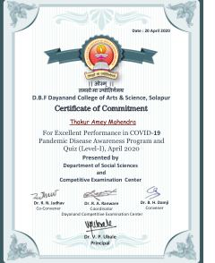 | **Covid-19 Quiz (Level-1)** | DBFD | [Certificate](https://github.com/Amey-Thakur/ACHIEVEMENTS/blob/main/Quizzes/Covid-19%20Quiz%20by%20DBFD%20(Level-1).pdf) |
| 9 | 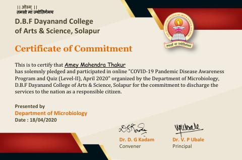 | **Covid-19 Quiz (Level-2)** | DBFD | [Certificate](https://github.com/Amey-Thakur/ACHIEVEMENTS/blob/main/Quizzes/Covid-19%20Quiz%20by%20DBFD%20(Level-2).pdf) |
| 10 |  | **Covid-19 Quiz (Level-3)** | DBFD | [Certificate](https://github.com/Amey-Thakur/ACHIEVEMENTS/blob/main/Quizzes/Covid-19%20Quiz%20by%20DBFD%20(Level-3).pdf) |
| 11 | 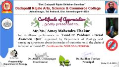 | **Covid-19 Quiz** | DRASCC | [Certificate](https://github.com/Amey-Thakur/ACHIEVEMENTS/blob/main/Quizzes/Covid-19%20Quiz%20by%20DRASCC.pdf) |
| 12 |  | **Covid-19 Quiz** | DRGCOP | [Certificate](https://github.com/Amey-Thakur/ACHIEVEMENTS/blob/main/Quizzes/Covid-19%20Quiz%20by%20DRGCOP.pdf) |
| 13 |  | **Covid-19 Quiz** | Headline Network | [Certificate](https://github.com/Amey-Thakur/ACHIEVEMENTS/blob/main/Quizzes/Covid-19%20Quiz%20by%20Headline%20Network.pdf) |
| 14 |  | **Covid-19 Quiz** | KBPCV | [Certificate](https://github.com/Amey-Thakur/ACHIEVEMENTS/blob/main/Quizzes/Covid-19%20Quiz%20by%20KBPCV.pdf) |
| 15 |  | **Covid-19 Quiz** | PDEAMMC | [Certificate](https://github.com/Amey-Thakur/ACHIEVEMENTS/blob/main/Quizzes/Covid-19%20Quiz%20by%20PDEAMMC.pdf) |
| 16 | 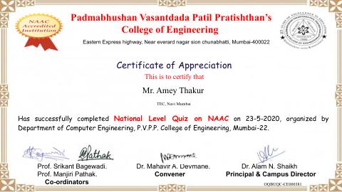 | **Covid-19 Quiz** | PVPPCOE | [Certificate](https://github.com/Amey-Thakur/ACHIEVEMENTS/blob/main/Quizzes/Covid-19%20Quiz%20by%20PVPPCOE.pdf) |
| 17 | 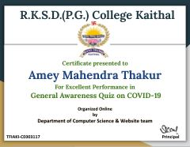 | **Covid-19 Quiz** | RKSD | [Certificate](https://github.com/Amey-Thakur/ACHIEVEMENTS/blob/main/Quizzes/Covid-19%20Quiz%20by%20RKSD.pdf) |
| 18 |  | **Covid-19 Quiz** | Rai University | [Certificate](https://github.com/Amey-Thakur/ACHIEVEMENTS/blob/main/Quizzes/Covid-19%20Quiz%20by%20Rai%20University.pdf) |
| 19 | 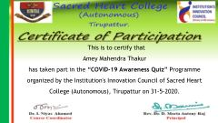 | **Covid-19 Quiz** | SHC | [Certificate](https://github.com/Amey-Thakur/ACHIEVEMENTS/blob/main/Quizzes/Covid-19%20Quiz%20by%20SHC.pdf) |
| 20 | 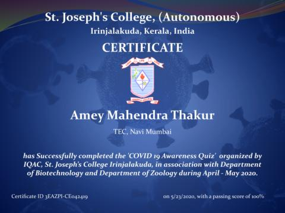 | **Covid-19 Quiz** | SJCIK | [Certificate](https://github.com/Amey-Thakur/ACHIEVEMENTS/blob/main/Quizzes/Covid-19%20Quiz%20by%20SJCIK.pdf) |
| 21 |  | **Covid-19 Quiz** | SMM | [Certificate](https://github.com/Amey-Thakur/ACHIEVEMENTS/blob/main/Quizzes/Covid-19%20Quiz%20by%20SMM.pdf) |
| 22 | 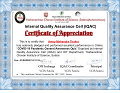 | **Covid-19 Quiz** | YCIOSS | [Certificate](https://github.com/Amey-Thakur/ACHIEVEMENTS/blob/main/Quizzes/Covid-19%20Quiz%20by%20YCIOSS.pdf) |
| 23 | 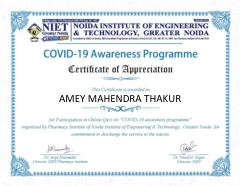 | **Covid-19 Achievement** | CNIET | [Certificate](https://github.com/Amey-Thakur/ACHIEVEMENTS/blob/main/Quizzes/Covid-19%20by%20CNIET.pdf) |
| 24 | 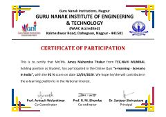 | **E-Learning Quiz** | GNIET, Nagpur | [Certificate](https://github.com/Amey-Thakur/ACHIEVEMENTS/blob/main/Quizzes/E-Learning%20Quiz%20by%20GNIET%2C%20Nagpur.pdf) |
| 25 |  | **Environmental Science Quiz** | BASPONCCB | [Certificate](https://github.com/Amey-Thakur/ACHIEVEMENTS/blob/main/Quizzes/Environmental%20Science%20Quiz%20by%20BASPONCCB.pdf) |
| 26 | 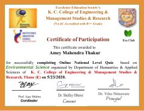 | **Environmental Science Quiz** | KCCOE | [Certificate](https://github.com/Amey-Thakur/ACHIEVEMENTS/blob/main/Quizzes/Environmental%20Science%20Quiz%20by%20KCCOE.pdf) |
| 27 |  | **Aromatic Hydrocarbons Quiz** | Fergusson College Pune | [Certificate](https://github.com/Amey-Thakur/ACHIEVEMENTS/blob/main/Quizzes/Fergusson%20College%20Pune%20Aromatic%20Hydrocarbons%20Quiz.pdf) |
| 28 |  | **Mole Concept Quiz** | Fergusson College Pune | [Certificate](https://github.com/Amey-Thakur/ACHIEVEMENTS/blob/main/Quizzes/Fergusson%20College%20Pune%20Mole%20Concept%20Quiz.pdf) |
| 29 |  | **Stereochemistry Quiz** | Fergusson College Pune | [Certificate](https://github.com/Amey-Thakur/ACHIEVEMENTS/blob/main/Quizzes/Fergusson%20College%20Pune%20Stereochemistry%20Quiz.pdf) |
| 30 |  | **Fruits & Veggies 101 Quiz** | Certify_em | [Certificate](https://github.com/Amey-Thakur/ACHIEVEMENTS/blob/main/Quizzes/Fruits%20_%20Veggies%20101%20Quiz%20by%20Certify_em.pdf) |
| 31 |  | **Guess The Logo** | Synod | [Certificate](https://github.com/Amey-Thakur/ACHIEVEMENTS/blob/main/Quizzes/Guess%20The%20Logo%20by%20Synod.pdf) |
| 32 | 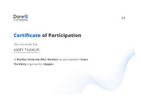 | **Guess The Meme Quiz** | Mappen | [Certificate](https://github.com/Amey-Thakur/ACHIEVEMENTS/blob/main/Quizzes/Guess%20The%20Meme%20Quiz%20by%20Mappen.pdf) |
| 33 | 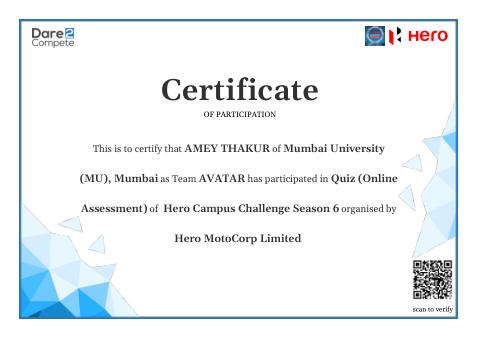 | **Hero Campus Challenge Season 6** | Hero MotoCorp | [Certificate](https://github.com/Amey-Thakur/ACHIEVEMENTS/blob/main/Quizzes/Hero%20Campus%20Challenge%20Season%206.pdf) |
| 34 | 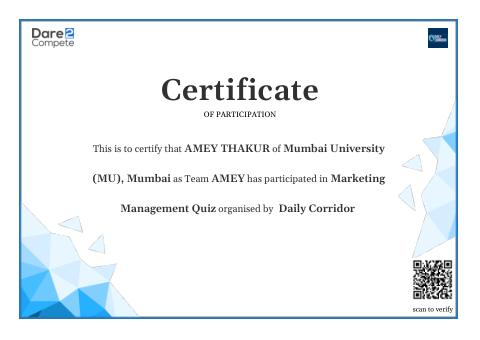 | **Marketing Management Quiz** | Daily Corridor | [Certificate](https://github.com/Amey-Thakur/ACHIEVEMENTS/blob/main/Quizzes/Marketing%20Management%20Quiz%20by%20Daily%20Corridor.pdf) |
| 35 | 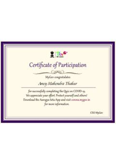 | **MyGov COVID-19 Quiz** | MyGov India | [Certificate](https://github.com/Amey-Thakur/ACHIEVEMENTS/blob/main/Quizzes/MyGov%20COVID-19%20Quiz.pdf) |
| 36 |  | **MyGov Chandigarh Quiz** | MyGov India | [Certificate](https://github.com/Amey-Thakur/ACHIEVEMENTS/blob/main/Quizzes/MyGov%20Chandigarh%20Quiz.pdf) |
| 37 | 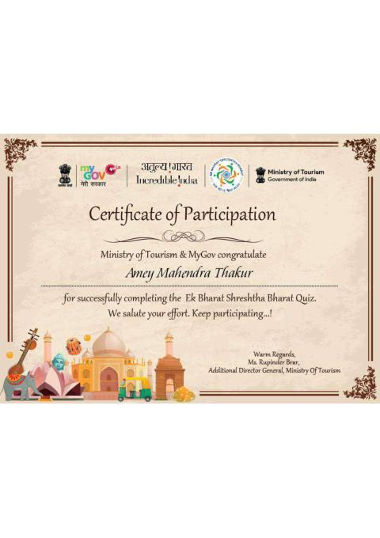 | **MyGov Dadra and Nagar Haveli Quiz** | MyGov India | [Certificate](https://github.com/Amey-Thakur/ACHIEVEMENTS/blob/main/Quizzes/MyGov%20Dadra%20and%20Nagar%20Haveli%20Quiz.pdf) |
| 38 |  | **MyGov Quiz on Andaman and Nicobar** | MyGov India | [Certificate](https://github.com/Amey-Thakur/ACHIEVEMENTS/blob/main/Quizzes/MyGov%20Quiz%20on%20Andaman%20and%20Nicobar.pdf) |
| 39 | 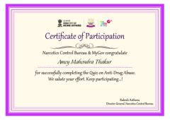 | **MyGov Quiz on Anti-Drug Abuse** | MyGov India | [Certificate](https://github.com/Amey-Thakur/ACHIEVEMENTS/blob/main/Quizzes/MyGov%20Quiz%20on%20Anti-Drug%20Abuse.pdf) |
| 40 |  | **MyGov Quiz on Lakshadweep** | MyGov India | [Certificate](https://github.com/Amey-Thakur/ACHIEVEMENTS/blob/main/Quizzes/MyGov%20Quiz%20on%20Lakshadweep.pdf) |
| 41 |  | **MyGov The Ayush Sanjivani Quiz** | MyGov India | [Certificate](https://github.com/Amey-Thakur/ACHIEVEMENTS/blob/main/Quizzes/MyGov%20The%20Ayush%20Sanjivani%20Quiz.pdf) |
| 42 | 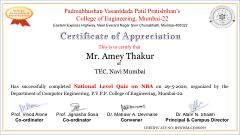 | **NBA Quiz** | PVPPCOE | [Certificate](https://github.com/Amey-Thakur/ACHIEVEMENTS/blob/main/Quizzes/NBA%20Quiz%20by%20PVPPCOE.pdf) |
| 43 | 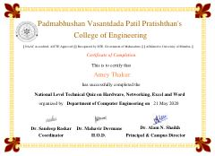 | **NLTQ PVPPCOE** | PVPPCOE | [Certificate](https://github.com/Amey-Thakur/ACHIEVEMENTS/blob/main/Quizzes/NLTQ%20PVPPCOE%20Certificate.pdf) |
| 44 | 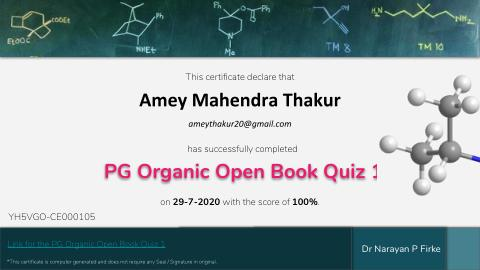 | **PG Organic Open Book Quiz 1** | Dr Narayan Firke | [Certificate](https://github.com/Amey-Thakur/ACHIEVEMENTS/blob/main/Quizzes/PG%20Organic%20Open%20Book%20Quiz%201%20by%20Dr%20Narayan%20Firke.pdf) |
| 45 |  | **Physics Quiz** | DBFDC | [Certificate](https://github.com/Amey-Thakur/ACHIEVEMENTS/blob/main/Quizzes/Physics%20Quiz%20by%20DBFDC.pdf) |
| 46 |  | **QUIZOPHILE** | DYPIEMR | [Certificate](https://github.com/Amey-Thakur/ACHIEVEMENTS/blob/main/Quizzes/QUIZOPHILE%20by%20DYPIEMR.pdf) |
| 47 | 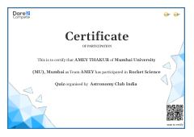 | **Rocket Science Quiz** | Astronomy Club India | [Certificate](https://github.com/Amey-Thakur/ACHIEVEMENTS/blob/main/Quizzes/Rocket%20Science%20by%20Astronomy%20Club%20India.pdf) |
| 48 |  | **TECHNICAL QUIZ** | IETE | [Certificate](https://github.com/Amey-Thakur/ACHIEVEMENTS/blob/main/Quizzes/TECHNICAL%20QUIZ%20BY%20IETE.pdf) |
| 49 | 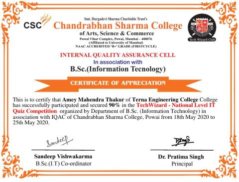 | **TechWizard - National Level IT** | TechWizard | [Certificate](https://github.com/Amey-Thakur/ACHIEVEMENTS/blob/main/Quizzes/TechWizard%20-%20National%20Level%20IT.pdf) |
| 50 | 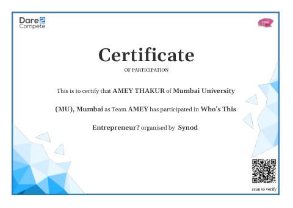 | **Who's This Entrepreneur** | Synod | [Certificate](https://github.com/Amey-Thakur/ACHIEVEMENTS/blob/main/Quizzes/Who_s%20This%20Entrepreneur%20by%20Synod.pdf) |
| 51 |  | **World Health Day Quiz** | WHO | [Certificate](https://github.com/Amey-Thakur/ACHIEVEMENTS/blob/main/Quizzes/World%20Health%20Day%20Quiz.pdf) |
| 52 |  | **Advance Infection Control for COVID-19** | intelycare | [Certificate](https://github.com/Amey-Thakur/ACHIEVEMENTS/blob/main/Quizzes/intelycare%20Advance%20Infection%20Control%20for%20COVID-19.pdf) |
| 53 |  | **COVID-19 for Nursing Professionals** | intelycare | [Certificate](https://github.com/Amey-Thakur/ACHIEVEMENTS/blob/main/Quizzes/intelycare%20COVID-19%20for%20Nursing%20Professionals.pdf) |
| 54 | 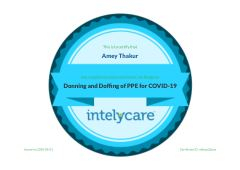 | **Donning and Doffing of PPE for COVID-19** | intelycare | [Certificate](https://github.com/Amey-Thakur/ACHIEVEMENTS/blob/main/Quizzes/intelycare%20Donning%20and%20Doffing%20of%20PPE%20for%20COVID-19.pdf) |

---

### Research Papers
 
> [!TIP]
> **Follow My Research @**
> 
> [arXiv](https://arxiv.org/a/thakur_a_3.html) | [Google Scholar](https://scholar.google.com/citations?user=0inooPgAAAAJ) | [ORCID](https://orcid.org/0000-0001-5644-1575) | [ResearchGate](https://www.researchgate.net/profile/Amey-Thakur) | [viXra](https://vixra.org/author/amey_thakur)

#### 1. Adversarial Open Domain Adaption Framework (AODA): Sketch-to-Photo Synthesis

| Feature | Scholarly Asset |
| :--- | :--- |
| **Journal** | IJEAST 2021 | Volume 6 Issue 2 |
| **Published Article** | [DOI: 10.33564/IJEAST.2021.v06i02.037](http://dx.doi.org/10.33564/IJEAST.2021.v06i02.037) |
| **Preprint (arXiv)** | [arXiv: 2108.04351](https://arxiv.org/abs/2108.04351) |
| **ResearchGate** | [Publication Portal](https://www.researchgate.net/publication/353158066_Adversarial_Open_Domain_Adaption_Framework_AODA_Sketch-to-Photo_Synthesis) |
| **Authors** | **Amey Thakur**, Mega Satish |

#### 2. A Comparative Study on Distributed File Systems

| Feature | Scholarly Asset |
| :--- | :--- |
| **Presentation** | [DOI: 10.13140/RG.2.2.31450.82887](http://dx.doi.org/10.13140/RG.2.2.31450.82887) |
| **ResearchGate** | [Publication Portal](https://www.researchgate.net/publication/354322981_A_Comparative_Study_on_Distributed_File_Systems) |
| **Project Portal** | [ResearchGate Project](https://www.researchgate.net/project/A-Comparative-Study-on-Distributed-File-Systems) |
| **Authors** | **Amey Thakur**, Mega Satish & Hasan Rizvi |

#### 3. Bangalore House Price Prediction

| Feature | Scholarly Asset |
| :--- | :--- |
| **Journal** | IRJET | Volume 8 Issue 9 |
| **Published Article** | [IRJET Portal](https://www.irjet.net/archives/V8/i9/IRJET-V8I934.pdf) |
| **Preprint (viXra)** | [viXra: 2110.0026](https://vixra.org/abs/2110.0026) |
| **ResearchGate** | [Publication Portal](https://www.researchgate.net/publication/354403038_BANGALORE_HOUSE_PRICE_PREDICTION) |
| **Source Code** | [GitHub Repository](https://github.com/Amey-Thakur/BANGALORE-HOUSE-PRICE-PREDICTION) |
| **Credential** | [IRJET Certificate](https://github.com/Amey-Thakur/ACHIEVEMENTS/blob/main/Research%20Papers/Bangalore%20House%20Price%20Prediction/IRJET%20-%20Bangalore%20House%20Price%20Prediction.jpg)  |
| **Authors** | **Amey Thakur**, Mega Satish |

#### 4. QuadTree Visualizer

| Feature | Scholarly Asset |
| :--- | :--- |
| **Journal** | IJERT | Volume 11 Issue 04 |
| **Published Article** | [DOI: 10.17577/IJERTV11IS040156](https://doi.org/10.17577/IJERTV11IS040156) |
| **ResearchGate** | [Publication Portal](https://www.researchgate.net/publication/360242672_QuadTree_Visualizer) |
| **Source Code** | [GitHub Repository](https://github.com/Amey-Thakur/QUADTREE-VISUALIZER) |
| **Demonstration** | [YouTube Video](https://youtu.be/8un0Qu8ibNk) |
| **Authors** | **Amey Thakur**, Mega Satish & Hasan Rizvi |

#### 5. Text Summarizer

| Feature | Scholarly Asset |
| :--- | :--- |
| **Journal** | IJRASET | Volume 10 Issue IV |
| **Published Article** | [DOI: 10.22214/ijraset.2022.40066](http://dx.doi.org/10.22214/ijraset.2022.40066) |
| **Presentation** | [DOI: 10.13140/RG.2.2.17259.67360](http://dx.doi.org/10.13140/RG.2.2.17259.67360) |
| **ResearchGate** | [Publication Portal](https://www.researchgate.net/publication/358130954_Text_Summarizer_Using_Julia) |
| **Source Code** | [GitHub Repository](https://github.com/Amey-Thakur/TEXT-SUMMARIZER) |
| **Demonstration** | [YouTube Video](https://youtu.be/2drrqsSB1Bc) |
| **Authors** | **Amey Thakur**, Mega Satish |

#### 6. Optimizing Stock Trading Strategy With Reinforcement Learning

| Feature | Scholarly Asset |
| :--- | :--- |
| **Technical Report** | [Publication Portal](https://www.researchgate.net/publication/358141909_Optimizing_Stock_Trading_Strategy_With_Reinforcement_Learning) |
| **Publication DOI** | [DOI: 10.13140/RG.2.2.13054.05440](http://dx.doi.org/10.13140/RG.2.2.13054.05440) |
| **Source Code** | [GitHub Repository](https://github.com/Amey-Thakur/OPTIMIZING-STOCK-TRADING-STRATEGY-WITH-REINFORCEMENT-LEARNING) |
| **Demonstration** | [YouTube Video](https://youtu.be/Q82a93hjxJE) |
| **Authors** | **Amey Thakur** |

#### 7. White-Box Cartoonization Using An Extended GAN Framework

| Feature | Scholarly Asset |
| :--- | :--- |
| **Journal** | IJEAST 2021 | Volume 5 Issue 12 |
| **Published Article** | [DOI: 10.33564/IJEAST.2021.v05i12.049](http://dx.doi.org/10.33564/IJEAST.2021.v05i12.049) |
| **Preprint** | [ResearchGate Portal](https://www.researchgate.net/publication/353171089_White-Box_Cartoonization_Using_An_Extended_GAN_Framework) |
| **Presentation** | [DOI: 10.13140/RG.2.2.22496.40964](http://dx.doi.org/10.13140/RG.2.2.22496.40964) |
| **Source Code** | [GitHub Repository](https://github.com/Amey-Thakur/WHITE-BOX-CARTOONIZATION) |
| **Demonstration** | [YouTube Video](https://youtu.be/8VNc8p6AKmw) |
| **Authors** | **Amey Thakur**, Mega Satish & Hasan Rizvi |

#### 8. Neuro-Fuzzy: Artificial Neural Networks & Fuzzy Logic

| Feature | Scholarly Asset |
| :--- | :--- |
| **Journal** | IJRASET | Volume 9 Issue IX |
| **Published Article** | [DOI: 10.22214/ijraset.2021.37930](http://dx.doi.org/10.22214/ijraset.2021.37930) |
| **Presentation** | [DOI: 10.13140/RG.2.2.14965.09444](http://dx.doi.org/10.13140/RG.2.2.14965.09444) |
| **ResearchGate** | [Publication Portal](https://www.researchgate.net/publication/354402722_Neuro-Fuzzy_Artificial_Neural_Networks_Fuzzy_Logic) |
| **Authors** | **Amey Thakur**, Karan Dhiman & Mayuresh Phansikar |

#### 9. Generative Adversarial Networks

| Feature | Scholarly Asset |
| :--- | :--- |
| **Journal** | IJRASET | Volume 9 Issue IX |
| **Published Article** | [DOI: 10.22214/ijraset.2021.37723](http://dx.doi.org/10.22214/ijraset.2021.37723) |
| **ResearchGate** | [Publication Portal](https://www.researchgate.net/publication/354167462_Generative_Adversarial_Networks) |
| **Authors** | **Amey Thakur**, Mega Satish |

#### 10. Fundamentals of Neural Networks

| Feature | Scholarly Asset |
| :--- | :--- |
| **Journal** | IJRASET | Volume 9 Issue VIII |
| **Published Article** | [DOI: 10.22214/ijraset.2021.37362](http://dx.doi.org/10.22214/ijraset.2021.37362) |
| **ResearchGate** | [Publication Portal](https://www.researchgate.net/publication/353827517_Fundamentals_of_Neural_Networks) |
| **Authors** | **Amey Thakur**, Archit Konde |

#### 11. Pizza Ordering Chatbot Using Amazon Lex

| Feature | Scholarly Asset |
| :--- | :--- |
| **Journal** | IJRASET | Volume 10 Issue III |
| **Published Article** | [DOI: 10.22214/ijraset.2022.40861](https://doi.org/10.22214/ijraset.2022.40861) |
| **Presentation** | [DOI: 10.13140/RG.2.2.19606.01607](http://dx.doi.org/10.13140/RG.2.2.19606.01607) |
| **ResearchGate** | [Project Portal](https://www.researchgate.net/project/Pizza-Ordering-Chatbot-Using-Amazon-Lex) |
| **Source Code** | [GitHub Repository](https://github.com/Amey-Thakur/CLOUD-COMPUTING-LAB) |
| **Authors** | **Amey Thakur**, Mega Satish |

#### 12. Digital Bookstore

| Feature | Scholarly Asset |
| :--- | :--- |
| **Journal** | IJRASET | Volume 9 Issue VII |
| **Published Article** | [DOI: 10.22214/ijraset.2021.36609](http://dx.doi.org/10.22214/ijraset.2021.36609) |
| **Source Code** | [GitHub Repository](https://github.com/Amey-Thakur/DIGITAL-BOOKSTORE) |
| **Demonstration** | [YouTube Video](https://youtu.be/JuUix8olOC8) |
| **Authors** | **Amey Thakur**, Mega Satish |

#### 13. Chat Room using HTML, PHP, CSS, JS, AJAX

| Feature | Scholarly Asset |
| :--- | :--- |
| **Published Article** | [FIGSHARE DOI: 10.6084/M9.FIGSHARE.14869167](http://dx.doi.org/10.6084/M9.FIGSHARE.14869167) |
| **Preprint** | [ResearchGate Portal](https://www.researchgate.net/publication/353063550_Chat_Room_Using_HTML_PHP_CSS_JS_AJAX) |
| **Presentation** | [DOI: 10.13140/RG.2.2.16257.38248](http://dx.doi.org/10.13140/RG.2.2.16257.38248) |
| **Source Code** | [GitHub Repository](https://github.com/Amey-Thakur/CHAT-ROOM) |
| **Demonstration** | [YouTube Video](https://youtu.be/Aem0k2Dl9fU) |
| **Authors** | **Amey Thakur**, Karan Dhiman |

#### 14. Car Rental Database System

| Feature | Scholarly Asset |
| :--- | :--- |
| **Journal** | IJRASET | Volume 9 Issue VII |
| **Published Article** | [DOI: 10.22214/ijraset.2021.36339](http://dx.doi.org/10.22214/ijraset.2021.36339) |
| **Source Code** | [GitHub Repository](https://github.com/Amey-Thakur/CAR-RENTAL-SYSTEM) |
| **Authors** | **Amey Thakur** |

#### 15. Hangman Word Game

| Feature | Scholarly Asset |
| :--- | :--- |
| **Published Article** | [DOI: 10.13140/RG.2.2.26806.22082](http://dx.doi.org/10.13140/RG.2.2.26806.22082) |
| **Source Code** | [GitHub Repository](https://github.com/Amey-Thakur/HANGMAN-WORD-GAME) |
| **Demonstration** | [YouTube Video](https://youtu.be/JsT9KYKPUgs) |
| **Authors** | **Amey Thakur**, Mega Satish & Saakshi Deokar |

#### 16. Clock Synchronization in Distributed Systems

| Feature | Scholarly Asset |
| :--- | :--- |
| **Journal** | IRJET | Volume 9 Issue 3 |
| **Published Article** | [IRJET Portal](https://www.irjet.net/archives/V9/i3/IRJET-V9I3350.pdf) |
| **Preprint (viXra)** | [viXra: 2204.0094](http://viXra.org/abs/2204.0094) |
| **Presentation** | [DOI: 10.13140/RG.2.2.31450.82887](http://dx.doi.org/10.13140/RG.2.2.31450.82887) |
| **Credential** | [IRJET Certificate](https://github.com/Amey-Thakur/ACHIEVEMENTS/blob/main/Research%20Papers/Clock%20Synchronization%20in%20Distributed%20Systems/IRJET%20-%20Clock%20Synchronization%20in%20Distributed%20Systems.jpg)  |
| **Authors** | **Amey Thakur**, Mega Satish |

#### 17. Online Chess Game

| Feature | Scholarly Asset |
| :--- | :--- |
| **Technical Report** | [Publication Portal](http://dx.doi.org/10.13140/RG.2.2.28183.85920) |
| **Presentation** | [DOI: 10.13140/RG.2.2.21472.97284](http://dx.doi.org/10.13140/RG.2.2.21472.97284) |
| **Source Code** | [GitHub Repository](https://github.com/Amey-Thakur/ONLINE-CHESS-GAME) |
| **Demonstration** | [YouTube Video](https://youtu.be/CCbrTQwYyE8) |
| **Authors** | **Amey Thakur**, Mega Satish |

---

### &nbsp;Simplilearn

| # | Preview | Topic | Certification |
| :---: | :---: | :--- | :---: |
| 1 | 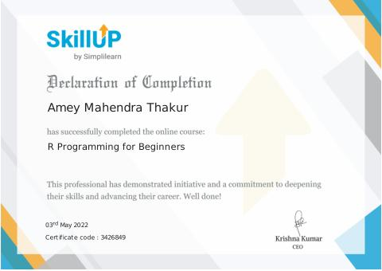 | **R Programming for Beginners** | [Certificate](https://github.com/Amey-Thakur/ACHIEVEMENTS/blob/main/Simplilearn/R%20Programming%20for%20Beginners%20-%20Skillup%20by%20Simplilearn.pdf) |
| 2 |  | **Data Science with R programming** | [Certificate](https://github.com/Amey-Thakur/ACHIEVEMENTS/blob/main/Simplilearn/Data%20Science%20with%20R%20programming%20-%20Skillup%20by%20Simplilearn.pdf) |

---

### &nbsp;Sports & Athletic Achievements

#### 🏸 Badminton
| # | Preview | Event | Achievement | Certification |
| :---: | :---: | :--- | :---: | :---: |
| 1 |  | **Badminton Summer Camp** | Finisher | [Certificate](https://github.com/Amey-Thakur/ACHIEVEMENTS/blob/main/Sports/Badminton/2010%20Badminton%20Camp.pdf) |

#### 🏀 Basketball

> [!IMPORTANT]
> [🥉](# "Achievement Unlocked: SFA Mumbai 2015 Bronze Medalist") **Award: Sports For All (SFA) Mumbai 2015 Bronze Medalist**

| # | Preview | Event | Achievement | Certification |
| :---: | :---: | :--- | :---: | :---: |
| 1 |  | **Billabong High Interschool** | Team SKS | [Certificate](https://github.com/Amey-Thakur/ACHIEVEMENTS/blob/main/Sports/Basketball/2015%20Interschool%20Basketball%20Tournament.pdf) |
| 2 | 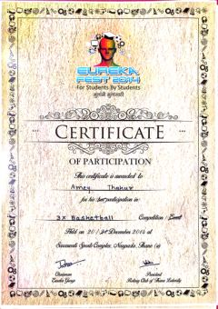 | **Eureka 3X Basketball** | Team SKS | [Certificate](https://github.com/Amey-Thakur/ACHIEVEMENTS/blob/main/Sports/Basketball/2014%20Eureka%203X%20Basketball.pdf) |
| 3 |  | **Saraswati Handball** | 1st Place | [Certificate](https://github.com/Amey-Thakur/ACHIEVEMENTS/blob/main/Sports/Saraswati%20Secondary%20School/2014%208th%20C%20Handball.pdf) |
| 4 | 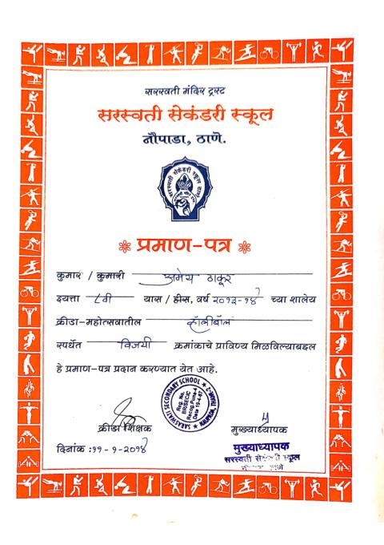 | **Saraswati Volleyball** | 1st Place | [Certificate](https://github.com/Amey-Thakur/ACHIEVEMENTS/blob/main/Sports/Saraswati%20Secondary%20School/2014%208th%20C%20Volleyball.pdf) |
| 5 | 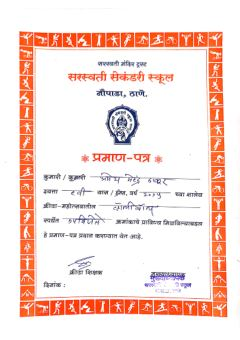 | **Saraswati Volleyball (2015)** | 2nd Place | [Certificate](https://github.com/Amey-Thakur/ACHIEVEMENTS/blob/main/Sports/Saraswati%20Secondary%20School/2015%209th%20D%20Volleyball.pdf) |
| 6 | 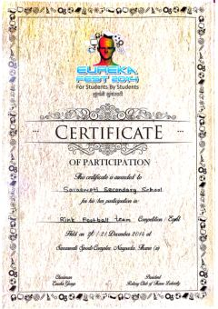 | **Rink Football** | TEAM SKS | [Certificate](https://github.com/Amey-Thakur/ACHIEVEMENTS/blob/main/Sports/Eureka/2014%20Eureka%20Rink%20Football.pdf) |
| 7 | 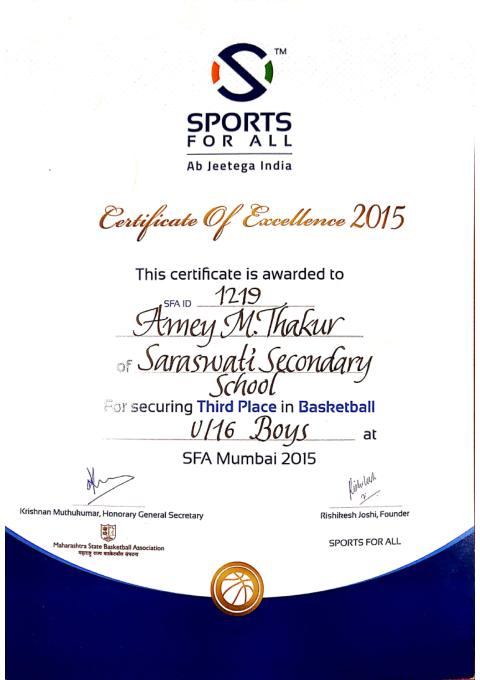 | **SFA Mumbai 2015** | 3rd Place | [Bronze Medal](https://github.com/Amey-Thakur/ACHIEVEMENTS/blob/main/Sports/Basketball/2015%20SFA.pdf) |

#### 📺 Tournament Coverage (SFA Mumbai)
| # | Matchup | Coverage | Portal |
| :---: | :--- | :---: | :---: |
| 1 | **Saraswati vs S.V.K.M.C.N.M** | U16 R1 | [YouTube Video](https://www.youtube.com/watch?v=wn2XlUVHnP4) |
| 2 | **Saraswati vs Podar Khar** | U16 Boys | [YouTube Video](https://www.youtube.com/watch?v=_vIuCSwDCVQ) |
| 3 | **P.G Garodia vs Saraswati** | Semi-Final | [YouTube Video](https://www.youtube.com/watch?v=MzYH0ijp_2o) |
| 4 | **Saraswati vs Amolakh Amichand** | 3rd Place | [YouTube Video](https://www.youtube.com/watch?v=J8T7OOXbEY4) |

#### 🛼 Skating
| # | Preview | Event | Achievement | Certification |
| :---: | :---: | :--- | :---: | :---: |
| 1 |  | **IIIRD SKATE INDIA** | District Finisher | [Certificate](https://github.com/Amey-Thakur/ACHIEVEMENTS/blob/main/Sports/Skating/2012%20District%20Level%20Skating%20Competition.pdf) |
| 2 |  | **Aryan Roller Skating** | Rank 1 & 2 | [Certificate](https://github.com/Amey-Thakur/ACHIEVEMENTS/blob/main/Sports/Skating/2012%20Aryan%20Roller%20Skating%20Competition.pdf) |
| 3 | 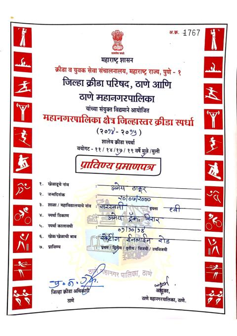 | **District Skating (2014)** | 2nd Place | [Certificate](https://github.com/Amey-Thakur/ACHIEVEMENTS/blob/main/Sports/Skating/2014%20District%20Level%20Skating%20Competition.pdf) |
| 4 |  | **SKATE INDIA (2013)** | Finisher | [Certificate](https://github.com/Amey-Thakur/ACHIEVEMENTS/blob/main/Sports/Skating/2013%20District%20Level%20Skating%20Competition.pdf) |

#### 🧠 Technical Sports
| # | Preview | Event | Achievement | Certification |
| :---: | :---: | :--- | :---: | :---: |
| 1 | 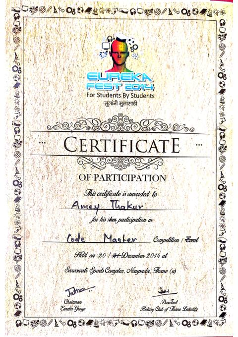 | **Eureka Fest: Code Master** | Finisher | [Certificate](https://github.com/Amey-Thakur/ACHIEVEMENTS/blob/main/Sports/Eureka/2014%20Eureka%20Code%20Master.pdf) |

---

### &nbsp;Stanford University

| # | Preview | Topic | Certification |
| :---: | :---: | :--- | :---: |
| 1 | 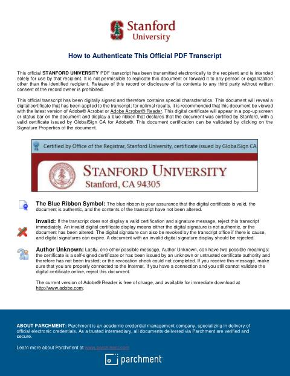 | **Introduction to Internet of Things**   XEE100 - 014 | [Certificate](https://github.com/Amey-Thakur/ACHIEVEMENTS/blob/main/Stanford%20University/IOT%20Course%20Record%20of%20Completion%20by%20Standford%20University.pdf) |

---

### &nbsp;Stanford University School of Medicine

| # | Preview | Topic | Certification |
| :---: | :---: | :--- | :---: |
| 1 | 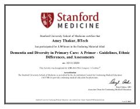 | **Dementia and Diversity in Primary Care: A Primer**   Accredited by ACCME® \| 1.50 AMA PRA Category 1 Credit(s)™ | [Certificate](https://github.com/Amey-Thakur/ACHIEVEMENTS/blob/main/Stanford%20University%20School%20of%20Medicine/Dementia%20and%20Diversity%20in%20Primary%20Care%20by%20Stanford%20University%20School%20of%20Medicine.pdf) |
| 2 | 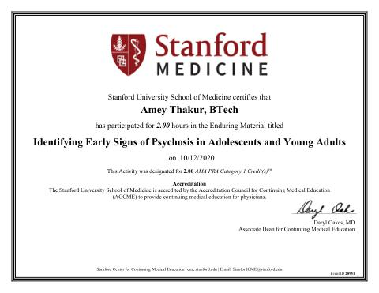 | **Identifying Early Signs of Psychosis in Adolescents and Young Adults**   Accredited by ACCME® \| 2.00 AMA PRA Category 1 Credit(s)™ | [Certificate](https://github.com/Amey-Thakur/ACHIEVEMENTS/blob/main/Stanford%20University%20School%20of%20Medicine/Identifying%20Early%20Signs%20of%20Psychosis%20in%20Adolescents%20and%20Young%20Adults%20by%20Stanford%20University%20School%20of%20Medicine.pdf) |

---

### &nbsp;Terna Engineering College

| # | Preview | Topic | Certification |
| :---: | :---: | :--- | :---: |
| 1 |  | **Entrepreneurship Awareness Drive** | [Certificate](https://github.com/Amey-Thakur/ACHIEVEMENTS/blob/main/Terna%20Engineering%20College/Entrepreneurship%20Awareness%20Drive.pdf) |
| 2 | 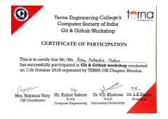 | **Git and Github Workshop** | [Certificate](https://github.com/Amey-Thakur/ACHIEVEMENTS/blob/main/Terna%20Engineering%20College/Git%20and%20Github%20Workshop.pdf) |
| 3 |  | **Mindful Gurukul** | [Certificate](https://github.com/Amey-Thakur/ACHIEVEMENTS/blob/main/Terna%20Engineering%20College/Mindful%20Gurukul.pdf) |
| 4 |  | **Project Planning Management with Microsoft Project** | [Certificate](https://github.com/Amey-Thakur/ACHIEVEMENTS/blob/main/Terna%20Engineering%20College/Project%20Planning%20Management%20with%20Microsoft%20Project.pdf) |

---

### &nbsp;Udemy

| # | Preview | Topic | Certification |
| :---: | :---: | :--- | :---: |
| 1 | 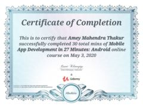 | **Mobile App Development** | [Certificate](https://github.com/Amey-Thakur/ACHIEVEMENTS/blob/main/Udemy/Udemy%20Mobile%20App%20Development.pdf) |

---

### &nbsp;University of Cambridge

| # | Preview | Topic | Certification |
| :---: | :---: | :--- | :---: |
| 1 |  | **ESOL Examinations**   YLE FLYERS \| 12 SHIELDS | [Certificate](https://github.com/Amey-Thakur/ACHIEVEMENTS/blob/main/University%20of%20Cambridge/ESOL%20Examination.pdf) |

---

### &nbsp;VIA Institute on Character

| # | Preview | Topic | Year | Certification |
| :---: | :---: | :--- | :---: | :---: |
| 1 | 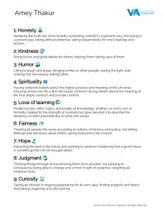 | **Strengths Profile** | 2020 | [Certificate](https://github.com/Amey-Thakur/ACHIEVEMENTS/blob/main/VIA%20Institute%20on%20Character/Strengths%20Profile%20-%20Amey%20Thakur%20(2020).pdf) |
| 2 |  | **Strengths Profile** | 2021 | [Certificate](https://github.com/Amey-Thakur/ACHIEVEMENTS/blob/main/VIA%20Institute%20on%20Character/Strengths%20Profile%20-%20Amey%20Thakur%20(2021).pdf) |
| 3 | 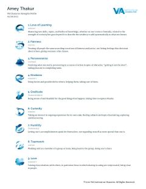 | **Strengths Profile** | 2022 | [Certificate](https://github.com/Amey-Thakur/ACHIEVEMENTS/blob/main/VIA%20Institute%20on%20Character/Strengths%20Profile%20-%20Amey%20Thakur%20(2022).pdf) |

---

### 🤝🏻 The Evolution of Trust

> [!TIP]
> People no longer trust each other. Why? And how can we fix it? An interactive guide to the game theory of trust: 
> https://ncase.me/trust

---

  <a href="#-my-certifications-and-achievements" title="Amey Thakur: Returning to the Roadmap of Excellence">↑ Back to Top</a>

---

<i>Every idea I open-source is a spark handed to someone I may never meet. That is the whole point.</i>

<b>— Amey Thakur</b>

<i>Namaskar</i> 🙏🏻

